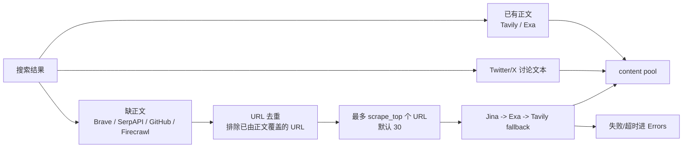

# multi-search-skill

[](LICENSE)
[](https://www.python.org/downloads/)

并行聚合搜索 skill：一条命令同时调用 Web 搜索、Google SERP、代码仓库、Twitter/X 讨论，并按需要补抓网页正文，最后输出适合 agent 阅读的 Markdown。

当前默认行为：`default` 跑 Brave、Tavily、Exa、Firecrawl、SerpAPI、GitHub、Twitter/X；默认额外抓取最多 30 个缺正文 URL。Tavily / Exa 已带回的正文会直接复用，不重复抓、不消耗 `scrape_top`。

## 快速开始

```powershell
git clone https://github.com/inorilzy/multi-search-skill.git
cd multi-search-skill
python search.py --doctor
python search.py "epub to markdown"
```

核心搜索只依赖 Python 3.10+ 标准库。Twitter/X 需要额外安装：

```powershell
python -m pip install twikit-ng
```

Windows 初始化辅助脚本：

```powershell
./scripts/check-env.ps1
./scripts/init.ps1 -InstallUv  # 需要时安装 uv 并创建 .venv
./scripts/init.ps1             # 已有 uv 时初始化
```

## 搜索源、注册和免费额度

免费额度来自当前公开页面或常见免费层，可能被服务商调整；以各平台控制台为准。

| 源 | 用途 | 注册地址 | 免费额度 / 说明 | 本地请求上限 |
|---|---|---|---|---:|
| Brave Search | Web 搜索，snippet，额外抓取优先源 | https://brave.com/search/api/ | 约 1,000 次/月；通常需要邮箱 + 信用卡 | 20 |
| Tavily | Web 搜索 + answer，可带 raw markdown，也是抓取后端 | https://tavily.com | 约 1,000 次/月；邮箱注册 | 20 |
| Exa | 搜索 + `contents.text`，也是抓取后端 | https://exa.ai | 约 1,000 次/月；邮箱注册 | 100 |
| Firecrawl | Web metadata search | https://firecrawl.dev | 约 1,000 次/月；本 skill 不使用 Firecrawl scrape 后端 | 10 |
| SerpAPI Google Light | Google SERP | https://serpapi.com/users/sign_up?plan=free | 250 次/月；`google_light` 默认更省 | 100 |
| GitHub Repos | 仓库搜索 | https://github.com/settings/tokens | REST API 常见免费额度：未认证约 60 req/hour，token 约 5,000 req/hour；也可 fallback 到已登录 `gh` CLI | 100 |
| Twitter/X | 社交讨论、推文和 top replies | https://x.com | 无官方搜索 API 免费层；使用 `twikit-ng` + cookies，受账号状态和限流影响 | 20 |
| Jina Reader | 额外网页正文抓取 | https://r.jina.ai/docs | 匿名可用，约 20 rpm；key 是固定额度，可作为匿名限流后的 fallback | scrape only |

## 路由

| Route | Sources | 适合场景 |
|---|---|---|
| `default` | Brave + Tavily + Exa + Firecrawl + SerpAPI + GitHub + Twitter/X | 普通搜索、需要覆盖面 |
| `lite` | Tavily + Exa | 更快、更偏正文质量 |
| `discussion` | Twitter/X | 看讨论、反馈、踩坑 |
| 单源 | `brave` / `tavily` / `exa` / `firecrawl` / `serpapi` / `github` / `twitter` | 控 quota 或调试 |

缺 key 的源会显示 error row，不会静默消失。GitHub 没 token 时可用 `gh auth login` 后 fallback。Twitter/X 依赖、cookies、认证或限流失败时只影响 Twitter/X，其它源继续输出。

## Keys

把 key 放到 `~/.search-keys.json`，不要提交到仓库：

```json
{
  "brave": "BSAxxxx",
  "tavily": ["tvly-key1", "tvly-key2"],
  "exa": ["exa-key1", "exa-key2"],
  "jina": [
    {"key": "jina_xxx_optional_1", "exhausted": false}
  ],
  "firecrawl": "fc-xxxx",
  "serpapi": "xxxx",
  "github": "ghp_xxxx",
  "twitter": {"auth_token": "...", "ct0": "..."}
}
```

环境变量会覆盖同名配置：

```text
BRAVE_SEARCH_API_KEY / BRAVE_API_KEY
TAVILY_API_KEY
EXA_API_KEY
JINA_API_KEY / JINA_KEY
FIRECRAWL_API_KEY
SERPAPI_API_KEY / SERPAPI_KEY
GITHUB_TOKEN / GH_TOKEN
TWITTER_COOKIES_PATH
```

多数 key 字段支持 string 或 string array。Jina 支持 `{ "key": "...", "exhausted": true|false }`；只有余额接口确认 `wallet.total_balance <= 0` 时才会自动标记 exhausted。需要手动软删除 Jina key：

```powershell
python -m scripts.mark_exhausted <jina-key>
```

## 抓取流程



关键规则：

- `scrape_top` 只计算额外抓取的缺正文 URL；已有正文不占额度。
- 默认抓取后端是 Jina / Exa / Tavily。Jina 先匿名，匿名限流后才用 Jina key。
- Exa / Tavily key 池按 URL offset 轮换；遇到 401 / 403 / 429 / quota / rate-limit 会试下一个 key。
- 每个候选 URL 只走一次完整 fallback 链；失败或 `scrape_timeout` 后记录 Errors，不自动补位。
- GitHub repo 根 URL 抓取时会改写到 raw README。

## 常用命令

```powershell
# 默认全源 + 最多 30 个缺正文 URL 额外抓取
python search.py "epub to markdown"

# 快速正文源
python search.py "agent memory" --type lite

# Twitter/X 讨论
python search.py "Claude Code feedback" --type discussion

# 关闭额外抓取
python search.py "latest Rust features" --no-scrape

# 只额外抓 3 个缺正文 URL
python search.py "rust async runtime" --scrape-top 3

# 单源搜索
python search.py "vector database" --type github
python search.py "WebGPU compute" --type serpapi

# 中文技术查询可以手动加英文扩展查询
python search.py "agent 编排最佳实践" --expand "agent orchestration best practices multi-agent" --type lite
```

## 配置和参数

非敏感默认值放在 [multi-search-config.json](multi-search-config.json)，CLI 参数优先级更高。

最常用参数：

| 参数 | 默认 | 说明 |
|---|---:|---|
| `--type` | `default` | 路由或单源 |
| `--count N` | per-source | 全局 count，会按各源上限 clamp |
| `--timeout N` | 60 | 搜索阶段整批 deadline |
| `--scrape-top N` | 30 | 额外抓取缺正文 URL 数，上限 30；传 0 关闭 |
| `--no-scrape` | false | 关闭额外抓取 |
| `--scrape-timeout N` | 60 | 抓取阶段整批 deadline |
| `--scrape-concurrency N` | 5 | 抓取 worker 数 |
| `--brief` | false | 只输出标题和 URL |
| `--verbose` | false | 展示 provider answer 和普通 snippet |
| `--config PATH` | repo config | 指定配置文件 |

单源 count 参数：`--brave-count`、`--tavily-count`、`--exa-count`、`--firecrawl-count`、`--serpapi-count`、`--github-count`、`--twitter-count`。

## 输出

输出包含：

- `Sources (raw hits)`：各源原始命中数。
- `Source Status`：OK / PARTIAL / ERROR。
- `URL Inventory`：去重后的 URL 和共识权重。
- `Errors`：缺 key、依赖问题、timeout、provider exception、抓取失败。
- `Ranked Results`：按共识权重排序后的结果。
- `Scraped Content`：正文内容，统一包在 untrusted block 里。

Provider 参考文档保存在 [docs/](docs/)，agent 说明在 [SKILL.md](SKILL.md)。

## 安全

- 不要提交 `~/.search-keys.json`、`.env` 或真实 provider key。
- provider error 输出前会尽量 scrub 可能出现的 key 值。
- 第三方抓取正文始终按 untrusted data 处理。

## License

[MIT](LICENSE)
