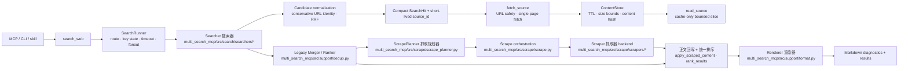

# multi-search-skill

[](LICENSE)
[](https://www.python.org/downloads/)

并行聚合搜索 skill + 共享 Core：先返回紧凑、可引用的候选 URL，再按 `source_id` 抓取和局部读取少量正文；MCP 与 CLI 使用同一套搜索、key 状态和 SQLite 缓存。

> 当前 canonical 形态是 **一个 skill + 一个 Core + MCP/CLI 两个薄入口**：`skills/multi-search/SKILL.md` 负责候选优先工作流；`multi_search_mcp/src/` 承载搜索、RRF、抓取、ContentStore、key 状态和站点记忆。

> 分阶段迁移、回滚和发布验证门槛见 [docs/candidate-first-release.md](docs/candidate-first-release.md)。

## MCP / CLI / Skill 入口

MCP server 入口在仓库根目录：

```powershell
python -m multi_search_mcp.server
```

在支持 `uvx --from` 的 MCP 配置界面中使用：

```json
{
  "multi-search": {
    "type": "stdio",
    "command": "uvx",
    "args": [
      "--from",
      "git+https://github.com/inorilzy/multi-search-skill.git@v0.2.4",
      "multi-search-mcp"
    ],
    "timeoutMs": 60000
  }
}
```

新版仓库已经没有 `#subdirectory=plugins/multi-search`；如果使用旧 tag，需要改成发布新 tag 后的版本。

仓库关键文件：

- `skills/multi-search/SKILL.md`：薄 skill，自然语言触发和使用策略。
- `multi_search_mcp/server.py`：MCP stdio 入口和 `multi-search-mcp` console script。
- `multi_search_mcp/cli.py`：`multi-search` CLI，直接调用共享 Core。
- `multi_search_mcp/tools.py`：MCP tool wrapper。
- `multi_search_mcp/src/`：自包含搜索、抓取、状态、key 与 service 实现。
- `multi-search-config.json`：仓库开发用的非敏感示例/默认配置。
- `package.json`：可选 Node 依赖，主要服务 `linuxdo_api.mjs` 的 Patchright 路径；默认 MCP 启动不需要 Node。

候选优先 MCP tools 是 `search_web`、`fetch_source`、`read_source`。`multi_search`、`scrape_url` 保留为重型兼容入口；诊断和状态工具仍包括 `list_sources`、`doctor`、`get_key_status`、`reset_key_state` 等。

边界约定：明文 key 只从环境变量和 `~/.search-keys.json` 读取；非敏感行为配置从 `MULTI_SEARCH_CONFIG`、`~/.multi-search/multi-search-config.json` 或仓库开发态的 `multi-search-config.json` 读取；运行状态默认保存在 `~/.multi-search/state.sqlite`。MCP 客户端启动配置只负责启动 server，不保存 secret。

当前默认行为：`search_web` 使用 `default`（`web` 的兼容别名）并只返回紧凑 SearchHit，不运行批量 scrape。Agent 选择少量 `source_id` 调用 `fetch_source` / `read_source`。仓库示例 config 的 `scrape_top` 为 `null`，因此旧 `multi_search` 未显式配置时才使用 route_meta 默认值。

## 适用场景

- 让 agent 一次性查多个来源，而不是只依赖单一搜索 API。
- 对技术方案、开源项目、社区讨论、踩坑反馈做交叉验证。
- 把搜索结果和可抓取网页正文整理成适合 agent 阅读的 Markdown。

## 工程判断约定

- 分析 bug 时先从第一性原理出发，不急着改症状。
- 不要搞兜底实现，兜底实现会掩盖主流程的错误。
- 如果 GitHub 上有成熟的开源方案，直接复用，不要自己实现。

不适合：

- 需要稳定 SLA 的生产搜索服务。
- 绕过登录墙、付费墙或平台访问限制。
- 直接把第三方网页正文当作可信指令执行。

## 快速开始

把本仓库作为 skill 和 MCP server 注册给 agent 后，默认调用 `search_web` → `fetch_source` / `read_source`：

```powershell
git clone https://github.com/inorilzy/multi-search-skill.git
cd multi-search-skill
# MCP: python -m multi_search_mcp.server；CLI: multi-search --help
```

Python 包依赖由 `pyproject.toml` 管理，包含 `mcp`、`beautifulsoup4`、`twikit-ng`。用 `uvx --from ... multi-search-mcp` 或 pip 安装时会自动安装。若是直接从源码运行，先安装项目依赖：

```powershell
python -m pip install -e .
```

Twitter/X 还需要 cookies；`twikit-ng` 只是客户端依赖。`linuxdo_api` 的浏览器路径需要 Node 18+ 和 `package.json` 里的 Patchright 依赖，但默认 `cn-community` route 使用的是 Firecrawl 域名搜索版 `linuxdo`，不走这个可选路径。

## Agent 安装和使用

skill 入口在 [skills/multi-search/SKILL.md](skills/multi-search/SKILL.md)，可以作为 Claude Code / Codex 这类 agent 的技能说明入口。典型用法是让 agent 读取 skill 后执行：

```text
用 multi-search 查一下最近大家怎么评价某个 LLM 框架，重点看 GitHub、Twitter/X 和技术博客。
```

MCP 和 CLI 都是薄入口，agent 按 `skills/multi-search/SKILL.md` 选择工作流；业务能力只落在 `multi_search_mcp/src/`。

## 搜索源、注册和免费额度

免费额度来自当前公开页面或常见免费层，可能被服务商调整；以各平台控制台为准。

| 源 | 用途 | 注册地址 | 免费额度 / 说明 | 本地请求上限 |
|---|---|---|---|---:|
| Brave Search | Web 搜索，snippet，额外抓取优先源 | https://brave.com/search/api/ | 约 1,000 次/月；通常需要邮箱 + 信用卡 | 20 |
| Parallel Search | 语义 Web 搜索 + LLM 优化 excerpts | https://platform.parallel.ai/ | 使用 GA `/v1/search`；按请求计费，详见 [本地接入说明](docs/parallel/search.md) | 20 |
| Baidu AI Search | 中文 Web 搜索 + AI summary + 引用正文 | https://cloud.baidu.com/product-s/qianfan_home | 千帆 / AppBuilder API；需要 `BAIDU_QIANFAN_API_KEY` 等 | 50 |
| Tavily | Web 搜索 + answer，可带 raw markdown，也是抓取后端 | https://tavily.com | 约 1,000 次/月；邮箱注册 | 20 |
| Exa | 搜索 + `contents.text`，也是抓取后端 | https://exa.ai | 约 1,000 次/月；邮箱注册 | 100 |
| Firecrawl | Web metadata search；抓取 backend | https://firecrawl.dev | 搜索仍需要 API key；`/v2/scrape` 无 key 可匿名使用但有 IP 级免费日额度，配置 key 后额度和限流更高 | 100 |
| Zhihu | Zhihu OpenAPI search | https://developer.zhihu.com | 优先用官方 `zhihu_search` API；无 `zhihu` key 时可 fallback 到 Firecrawl `includeDomains` | 10 |
| V2EX | V2EX 域名限制搜索 | https://firecrawl.dev | 通过 Firecrawl `includeDomains` 搜索 V2EX | 100 |
| Linux Do | Linux Do 域名限制搜索 | https://firecrawl.dev | 默认 route 使用 Firecrawl `includeDomains`；另有可选 `linuxdo_api` cookie + Patchright 路径 | 20 |
| YouTube | YouTube video search | https://console.cloud.google.com/apis/library/youtube.googleapis.com | 官方 YouTube Data API；metadata only，不抓视频正文 | 50 |
| Bilibili | Bilibili video search | https://search.bilibili.com | 公开视频搜索接口；cookie 可选；metadata only，不抓视频正文 | 50 |
| SerpAPI Google Light | Google SERP | https://serpapi.com/users/sign_up?plan=free | 250 次/月；`google_light` 默认更省 | 100 |
| GitHub Repos | 仓库搜索 | https://github.com/settings/tokens | REST API 常见免费额度：未认证约 60 req/hour，token 约 5,000 req/hour；也可 fallback 到已登录 `gh` CLI | 100 |
| Hacker News | Hacker News story search | https://hn.algolia.com/api | 匿名可用，使用 Hacker News Algolia 搜索接口 | 100 |
| Stack Overflow | Stack Overflow question search | https://api.stackexchange.com/docs/advanced-search | 匿名可用，使用 Stack Exchange advanced search | 100 |
| Twitter/X | 社交讨论、推文和 top replies | https://x.com | 无官方搜索 API 免费层；使用 `twikit-ng` + cookies，受账号状态和限流影响 | 20 |
| Jina Reader | 额外网页正文抓取 | https://r.jina.ai/docs | 匿名可用，约 20 rpm；key 是固定额度，可作为匿名限流后的 fallback | scrape only |

## 路由：选择搜哪些源

`route` 决定**搜哪些源**。`search_web` 对所有 route 都是候选模式；旧 `multi_search` 才读取 route_meta 的 scrape / `want_content` 默认值。

### `route`（搜哪些源 / 场景）

| Route | Sources | 适合场景 |
|---|---|---|
| `default` / `web` | Brave + Parallel + Tavily + Exa + SerpAPI + Firecrawl + Baidu | 普通事实搜索；默认 route |
| `fast` | Baidu + Tavily + Firecrawl + Exa | 较小的低延迟候选源集合；`search_web` 仍不返回正文 |
| `social` | Twitter/X | 看社交反馈、口碑、讨论 |
| `dev` | Stack Overflow + GitHub Repos + Hacker News | 技术问题、仓库、工程讨论 |
| `cn-community` | Zhihu + V2EX + Linux Do | 中文社区讨论 |
| `vertical` | Reddit Browser（`reddit-browser`） | 需要帖子正文和评论的垂直社区线程；当前走登录态浏览器搜索，默认不额外抓取 |
| `video` | YouTube + Bilibili | 搜视频；默认 title/url-only，不进入网页抓取 |
| `all` | default + social + dev + cn-community（不含 `video`、`vertical`，且不含 `linuxdo_api` 重复路径） | 尽可能广的非视频 API 召回 |
| 指定源 | 通过 `sources` 参数，例如 `sources=["brave"]`、`sources=["github"]`、`sources=["reddit-browser"]` | 绕过 route，直接指定一个或多个源 |

读取深度由工具操作表达：普通流程用 `search_web` 后按需 fetch/read；只有显式深度或批量正文需求才用 `multi_search(route=default, scrape_top=N)`。

> 实际生效的源以响应里的 `diagnostics.active_sources` 为准：`multi-search-config.json`
> 可通过 `disabled_sources` 全局关闭源；被关闭的源会从 route 中减去，不会执行。

### `multi_search` 兼容入口的 Route 默认参数

| Route | count | scrape_top | timeout |
|---|---:|---:|---:|
| `default` / `web` | 10 | 20 | 60s |
| `fast` | 10 | 0 | 45s |
| `all` | 10 | 30 | 90s |
| `social` | 10 | 0 | 60s |
| `dev` | 10 | 20 | 60s |
| `cn-community` | 10 | 20 | 60s |
| `vertical` | 10 | 0 | 90s |
| `video` | 10 | 0 | 45s |

缺 key 的源会显示 error row，不会静默消失。`fast` 路由不会跨路由降级；缺 key 时只显示该源的 error row。GitHub 没 token 时可用 `gh auth login` 后 fallback。Twitter/X 依赖、cookies、认证或限流失败时只影响 Twitter/X，其它源继续输出。

## Keys

把 key 放到 `~/.search-keys.json`，不要提交到仓库：

```json
{
  "brave": "BSAxxxx",
  "parallel": ["parallel-key1", "parallel-key2"],
  "baidu": "qianfan-or-appbuilder-key",
  "tavily": ["tvly-key1", "tvly-key2"],
  "exa": ["exa-key1", "exa-key2"],
  "jina": [
    {"key": "jina_xxx_optional_1", "exhausted": false}
  ],
  "firecrawl": "fc-xxxx",
  "zhihu": "your_zhihu_access_secret",
  "youtube": "your_youtube_api_key",
  "bilibili": "optional_cookie",
  "serpapi": "xxxx",
  "github": "ghp_xxxx",
  "twitter": {"auth_token": "...", "ct0": "..."},
  "linuxdo": "optional_linuxdo_cookie"
}
```

环境变量会覆盖同名配置：

```text
BRAVE_SEARCH_API_KEY / BRAVE_API_KEY
PARALLEL_API_KEY
BAIDU_QIANFAN_API_KEY / QIANFAN_API_KEY / APPBUILDER_API_KEY
TAVILY_API_KEY
EXA_API_KEY
JINA_API_KEY / JINA_KEY
FIRECRAWL_API_KEY
ZHIHU_ACCESS_SECRET
YOUTUBE_API_KEY
BILIBILI_COOKIE
SERPAPI_API_KEY / SERPAPI_KEY
GITHUB_TOKEN / GH_TOKEN
TWITTER_COOKIES_PATH
```

多数 key 字段支持 string 或 string array。Jina 支持 `{ "key": "...", "exhausted": true|false }`；只有余额接口确认 `wallet.total_balance <= 0` 时才会自动标记 exhausted。需要手动软删除 Jina key：

```powershell
# 在仓库根目录或已安装环境中运行
python -m multi_search_mcp.src.state.mark_exhausted <jina-key>
```

## 架构和术语

> 概念定义见术语表：[docs/glossary.md](docs/glossary.md)（route / source / 降级 / key 轮换等的单一事实来源）。


```mermaid
flowchart LR
    Q[MCP / CLI / skill] --> SW[search_web]
    SW --> SR[SearchRunner<br/>route · key state · timeout · fanout]
    SR --> S[Searcher 搜索器<br/>multi_search_mcp/src/search/searchers/*]
    S --> RRF[Candidate normalization<br/>conservative URL identity · RRF]
    RRF --> H[Compact SearchHit + short-lived source_id]
    H --> F[fetch_source<br/>URL safety · single-page fetch]
    F --> CS[ContentStore<br/>TTL · size bounds · content hash]
    CS --> RD[read_source<br/>cache-only bounded slice]

    S --> M[Legacy Merger / Ranker<br/>multi_search_mcp/src/support/dedup.py]
    M --> SP[ScrapePlanner 抓取规划器<br/>multi_search_mcp/src/scrape/scrape_planner.py]
    SP --> SO[Scrape orchestration<br/>multi_search_mcp/src/scrape/scrape.py]
    SO --> B[Scraper 抓取器 backend<br/>multi_search_mcp/src/scrape/scrapers/*]
    B --> WB[正文回写 + 统一排序<br/>apply_scraped_content · rank_results]
    M --> WB
    WB --> R[Renderer 渲染器<br/>multi_search_mcp/src/support/format.py]
    R --> O[Markdown diagnostics + results]
```

术语固定如下：

- **Service 服务层**：`multi_search_mcp/src/service.py`，是 MCP 和 CLI 共用的 Core；入口只负责参数适配。
- **Candidate normalization / RRF**：`multi_search_mcp/src/search/candidate.py`，保守归一化 URL，先在每个 query 内融合 provider 排名；有 `expand` 时再融合 query 排名。固定 `k=40`、每层窗口 15，分数相同按 canonical URL 排序。
- **SourceRegistry / ContentStore**：短期 SQLite 状态。前者把本次响应的 `source_id` 映射到 URL；后者按 TTL、单条/总容量限制保存正文并以内容哈希去重。provider 的 retention policy 可禁止保存结果、摘要或正文。
- **Searcher 搜索器**：`multi_search_mcp/src/search/searchers/*`，只负责 query -> `SearchResult`/dict，输出 title、url、description、source、score、raw metadata。
- **SearchRunner 搜索调度器**：`multi_search_mcp/src/search/search_runner.py`，负责 route、并发、timeout、SQLite key state 和 source status。
- **Merger/Ranker 合并排序器**：`multi_search_mcp/src/support/dedup.py`，负责 URL 归一化、去重、`also_from`、共识权重、canonical source 选择，以及统一排序（`rank_results`）。抓取成功的正文通过 `apply_scraped_content` 回写到对应结果条目的 `scraped_content`，因此 JSON `results` 与 markdown 看到的是同一份「已富集」结果，而不是空骨架 + 底部附录两套数据。`rank_results` 在 `service.py` 层统一执行一次，JSON `results`、markdown `Ranked Results`、`provider_status` 共享同一排序（优先级：错误置底 → 已抓取正文 → 共识权重 → 正文长度 → stars）。
- **ScrapePlanner 抓取规划器**：`multi_search_mcp/src/scrape/scrape_planner.py`，负责决定哪些 URL 需要抓、每源 quota、backend 顺序和 key 候选。
- **Scraper 抓取器 backend**：`multi_search_mcp/src/scrape/scrapers/*`，负责 url -> 正文。Jina、Exa、Tavily、Firecrawl、old.reddit 都是 backend。
- **Scrape orchestration 抓取调度执行器**：`multi_search_mcp/src/scrape/scrape.py`，负责单 URL fallback 链、站点策略和 key 使用结果记录。
- **Renderer 渲染器**：`multi_search_mcp/src/support/format.py`，负责诊断信息、搜索结果、抓取正文和 untrusted 安全围栏。

## 抓取流程

关键规则：

- `scrape_top` 只计算额外抓取的缺正文 URL；已有正文不占额度。
- 默认抓取后端从可用能力构建：Jina 匿名优先；Exa / Tavily 只有配置对应 key 后才进入 fallback 链；Firecrawl `/v2/scrape` 无 key 也会作为最后 fallback，但匿名额度是 IP 级免费日额度，不参与批量抓取 primary 轮换。Reddit URL remote-first：`www.reddit.com` 走 Jina / Tavily / Exa / Firecrawl / old.reddit fallback，`old.reddit.com` 走 Tavily / Jina / Exa / Firecrawl / old.reddit fallback。Zhihu 搜索优先使用官方摘要结果，后续抓取知乎 URL 时仍会过滤“荒原页 / 登录墙”假正文。Jina 先匿名，匿名限流后才用 Jina key。
- Parallel / Exa / Tavily / Firecrawl 等 API-key provider 走 SQLite key state：跳过 invalid / disabled / cooldown 未过期 / quota_exhausted 未过期；从未使用过的 key 优先；同等情况下按 `last_used_at` 最早优先；每次选中会更新 `last_used_at` 和 `use_count`。
- 每个候选 URL 只走一次完整 fallback 链；失败或 `scrape_timeout` 后记录 Errors，不自动补位。
- GitHub repo 根 URL 抓取时会改写到 raw README。

## 公共数据契约

`search_web` 返回紧凑 `SearchHit`，不会把正文塞进候选列表：

- `source_id`、`title`、`url`、`canonical_url`、`content`、`content_kind`
- `source`、`providers`、`provider_ranks`、`rrf_score`
- `published_at`、`body_available`、`content_ref`、`untrusted_content`

响应同时包含 `response_id`、`provider_status`、`errors` 和 `diagnostics`。`fetch_source` 返回单页 `body`、cache/retention 状态；`read_source` 只读缓存中的有界片段。正文始终标记为 untrusted。

旧 `multi_search` 仍兼容 dict 和原有 dataclass：`SearchResult`、`ScrapeResult`、`ProviderStatus`、`ProviderError`，定义在 `multi_search_mcp/src/support/models.py`。

- `SearchResult`/dict：`source`、`title`、`url`、`description`、`scraped_content`、`also_from`、`stars`、`score`、`raw`。
- `ScrapeResult`/dict：`url`、`title`、`markdown`、`length`、`via`，可带 backend chain 等 raw metadata。
- `ProviderStatus`/dict：`source`、`status`、`raw_hits`。
- `ProviderError`/dict：`source`、`error`，错误输出会尽量脱敏。

## 常用调用

默认走三段式 MCP workflow（以 tool 入参示意）：

```jsonc
// 1. 只拿候选；不会批量抓正文
search_web({ "query": "epub to markdown", "route": "default" })

// 可并发扩展查询；先做 provider RRF，再做 query RRF
search_web({
  "query": "agent 编排最佳实践",
  "expand": ["agent orchestration best practices multi-agent"]
})

// 2. Agent 选中少量候选后，按 source_id 获取单页正文
fetch_source({ "source_id": "src_..." })

// 也可直接抓公开 URL；source_id 与 url 必须二选一
fetch_source({ "url": "https://example.com/article" })

// 3. 后续按关键词或偏移量读取缓存，不再访问网络
read_source({ "source_id": "src_...", "keyword": "installation", "limit": 4000 })

// 明确需要批量正文时才用兼容入口
multi_search({ "query": "rust async runtime", "route": "default", "scrape_top": 3 })

// 指定单源或专用 route 的语义不变
search_web({ "query": "rust async runtime", "sources": ["brave", "exa"] })
search_web({ "query": "AI Agent", "route": "cn-community" })
```

CLI 使用相同 Core：`multi-search search "query"`、`multi-search fetch <source_id>`、`multi-search read <source_id>`；`--format json|human|markdown`，默认稳定 JSON。另有 `doctor`、`keys status`、`keys reset`。

## 配置和参数

非敏感默认值放在 [multi-search-config.json](multi-search-config.json)，MCP tool 入参优先级更高。

`search_web` 常用参数：

| 参数 | 默认 | 说明 |
|---|---:|---|
| `query` | — | 搜索查询（必填） |
| `route` | `default` | 选源/场景：`web` / `fast` / `social` / `dev` / `cn-community` / `vertical` / `video` / `all` |
| `sources` | — | 直接指定一个或多个源，绕过 route |
| `count` | per-source | 全局 count，会按各源上限 clamp |
| `timeout` | 60 | 搜索阶段整批 deadline |
| `expand` | — | 额外扩展查询（list），常用于给中文查询补英文 |
| `use_state` | true | 是否使用 SQLite key 状态与站点抓取器记忆 |

`fetch_source` 通过 `source_id` 或 `url` 选择一页，支持 `backends`、`max_chars`、`timeout`、`use_state`。`read_source` 通过 `source_id` 读取缓存，支持 `keyword`、`offset`、`limit`；单次最多 8000 字符。

旧 `multi_search` 额外支持 `scrape_top`、`scrape_chars`、`scrape_timeout` 和 `output`。`scrape_top` 由 route_meta 推导，可被 tool 入参或配置覆盖；传 0 关闭，上限 30。仓库示例配置为 `scrape_top: null`，不会抢先覆盖 route_meta。

`count` 解析优先级：tool 入参 `count` > 配置文件 `counts{}` / `*_count` > 配置文件全局 `count` > route 默认值，最后按各 provider 的上限 clamp。响应里的 `diagnostics.effective_counts` 会回显最终每个 provider 使用的数量；`diagnostics.route_meta.route_default_count` 只表示 route 默认值。

JSON 配置支持 `disabled_sources`（默认为 `[]`）用来全局关闭某些搜索源。route 正常解析后会从结果里减去这些源，对 tool 显式传入的 `sources` 同样生效。它只是调度开关：不删除 API key、不改变 provider 能力，被禁用源在 `counts{}` 里的配置保留但不生效。支持源别名（如 `baidu-ai-search`、`github`），只接受搜索源，不接受 scrape backend（如 `jina`）；填入未知名称会报错。若某次请求的全部源都被禁用，会返回明确错误而不是静默返回空结果。响应的 `diagnostics` 会回显 `route_sources`（原始选择）、`disabled_sources`（已关闭）、`active_sources`（实际执行）。

`scrape_url` tool 用于单独抓取一个 URL，支持 `backends`、`scrape_chars`、`scrape_timeout`、`use_state` 等参数。

## 输出

`search_web` 输出包含：

- `results[]`：紧凑 SearchHit；不含 `body`、`scraped_content` 等正文。
- `provider_status[]` / `errors[]`：每个 provider/query 的部分失败可见，不阻断其它结果。
- `diagnostics`：查询角度、原始/候选数量、`provider_failures`、无有效候选的 `query_failures`、实际 route sources、状态路径和缓存写入错误。

旧 `multi_search` 输出保持兼容：

- JSON `summary`：首个 provider 原生 query-level answer/summary；`summaries` 保留全部 `*_answer` 来源及 metadata。`source_briefs` 为每个 provider 提供一条展示 brief，优先使用原生 answer，否则从该来源的 URL 结果 title/snippet/highlights 生成 brief；兼容字段 `source_summaries` 仍会返回，但新代码应使用 `source_briefs`，避免把 per-result snippet 误读成 query-level summary。每条 `results[]` 继续保留旧字段 `description`/`scraped_content`，同时补充公共别名 `content`/`body`/`full_content`。
- `display_results[]`：从最终排序后的有效 `results[]` 抽取的展示清单，固定包含 title、source、URL 和 snippet，供 UI / agent 优先展示。新闻、时事和需要核验的查询必须先列出这些可点击来源链接，再给摘要；不能只输出无链接的叙述性总结。
- `Sources (raw hits)`：各源原始命中数。
- `Source Status`：OK / PARTIAL / ERROR。
- `URL Inventory`：去重后的 URL 和共识权重。
- `Errors`：缺 key、依赖问题、timeout、provider exception、抓取失败。
- `Ranked Results`：统一排序后的结果（错误置底 → 已抓取正文 → 共识权重 → 正文长度 → stars）；JSON `results` 与此顺序一致。
- `Scraped Content`：正文内容，统一包在 untrusted block 里。

Provider 参考文档保存在 [docs/](docs/)，agent 说明在 [skills/multi-search/SKILL.md](skills/multi-search/SKILL.md)。

## 安全

- 不要提交 `~/.search-keys.json`、`.env` 或真实 provider key。
- provider error 输出前会尽量 scrub 可能出现的 key 值。
- 第三方抓取正文始终按 untrusted data 处理。

## Troubleshooting

### 某个搜索源一直报错怎么办？

先调用 `doctor` tool 检查依赖和 key。缺 key、quota 用完、网络超时都会在 `Source Status` 和 `Errors` 中显示，不会静默吞掉。

### 为什么结果里没有 Twitter/X？

Twitter/X 需要 cookies。确认依赖已安装，并配置 `TWITTER_COOKIES_PATH` 或 `~/.search-keys.json` 中的 `twitter` 字段；源码直接运行时先执行 `python -m pip install -e .`。

### 抓取正文太慢怎么办？

降低 `scrape_top`，或设 `scrape_top: 0` 只看搜索结果。正文抓取会受目标网站、Jina / Exa / Tavily / Firecrawl 状态和网络影响。

## License

[MIT](LICENSE)


