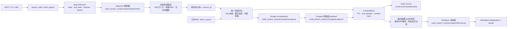

# multi-search-skill

[](LICENSE)
[](https://www.python.org/downloads/)

并行聚合搜索 skill + 共享 Core：搜索结果统一按 RRF 排序，取前 15 条后自动获取正文并返回预览；子代理只排除明确无关项，其余结果连同原始预览交给主 Agent 判断，再按需读取全文。MCP 与 CLI 使用同一套搜索、key 状态和 SQLite 缓存；已有 URL 可直接抓取。

> 当前 canonical 形态是 **一个 skill + 一个 Core + MCP/CLI 两个薄入口**：`skills/multi-search/SKILL.md` 负责工具选择和使用策略；`multi_search_mcp/src/` 承载搜索、RRF、抓取、ContentStore、key 状态和站点记忆。

> 分阶段迁移、回滚和发布验证门槛见 [docs/candidate-first-release.md](docs/candidate-first-release.md)。

## MCP / CLI / Skill 入口

MCP server 入口在仓库根目录：

```powershell
python -m multi_search_mcp.server
```

当前版本为 **0.4.0**（[发布说明](docs/candidate-first-release.md)）。在仓库根目录可直接运行 CLI，无需先启动 MCP server：

```powershell
uv run --locked multi-search --help
uv run --locked multi-search search "Python asyncio TaskGroup" --source hackernews --count 3 --format markdown
uv run --locked multi-search fetch --url "https://docs.python.org/3/library/asyncio-task.html" --full-content --format json
# 将 src_... 替换为搜索结果中的 source_id
uv run --locked multi-search fetch src_... --full-content --format json
uv run --locked multi-search read src_... --keyword "TaskGroup" --limit 2000
```

`uv run --locked` 使用项目虚拟环境并按锁文件同步依赖。已在激活的虚拟环境中安装项目时，也可以直接执行 `multi-search` 或 `python -m multi_search_mcp.cli`，子命令参数相同。

只使用独立 CLI 时，运行 `uv tool install "git+https://github.com/inorilzy/multi-search-skill.git@v0.4.0"`，之后在任意目录执行 `multi-search --help`。GitHub 安装、更新、参数示例和完整工作流统一见 [CLI-only 指南](skills/multi-search/references/cli.md)。本地开发安装使用 `uv tool install --force .`。

搜索全部活动源失败时 CLI 退出 `1`，JSON 仍保留完整错误；正常零匹配和部分成功退出 `0`。human/Markdown 同样展示错误。`doctor` 真正解析配置；显式配置路径不存在会报错。`doctor --network` 对 Hacker News/GitHub 公共 API 做总预算 5 秒的连接检查，结果以 `network_ok` / `network_checks` 为准，不代表所有源的 key 或搜索质量正常。

在支持 `uvx --from` 的 MCP 配置界面中使用固定版本 `v0.4.0`：

```json
{
  "multi-search": {
    "type": "stdio",
    "command": "uvx",
    "args": [
      "--from",
      "git+https://github.com/inorilzy/multi-search-skill.git@v0.4.0",
      "multi-search-mcp"
    ],
    "timeoutMs": 60000
  }
}
```

新版仓库已经没有 `#subdirectory=plugins/multi-search`；旧配置升级时使用上面的仓库根目录入口。

仓库关键文件：

- `skills/multi-search/SKILL.md`：薄 skill，自然语言触发和使用策略。
- `multi_search_mcp/server.py`：MCP stdio 入口和 `multi-search-mcp` console script。
- `multi_search_mcp/cli.py`：`multi-search` CLI，直接调用共享 Core。
- `multi_search_mcp/tools.py`：MCP tool wrapper。
- `multi_search_mcp/src/`：自包含搜索、抓取、状态、key 与 service 实现。
- `multi-search-config.json`：仓库开发用的非敏感示例/默认配置。

主要 MCP tools 是 `search_web`、`fetch_source`、`read_source`。`multi_search` 与 `search_web` 共用搜索和正文流程，保留兼容展示；`scrape_url` 可直接抓 URL。诊断和状态工具仍包括 `list_sources`、`doctor`、`get_key_status`、`reset_key_state` 等。

边界约定：明文 key 只从环境变量和 `~/.search-keys.json` 读取；非敏感行为配置从 `MULTI_SEARCH_CONFIG`、`~/.multi-search/multi-search-config.json` 或仓库开发态的 `multi-search-config.json` 读取；运行状态默认保存在 `~/.multi-search/state.sqlite`。MCP 客户端启动配置只负责启动 server，不保存 secret。

当前默认行为：`search_web` 使用 `default`（`web` 的兼容别名），全部有效候选参与 RRF，最终取前 15 条并获取正文。`results[].content` 保留摘要，正文预览只在 `scrapes[].markdown` 返回，按 `source_id` 关联，默认每篇最多 1200 字符。需要截断时，预览从与结果标题完全匹配的页面一级标题开始，没有匹配标题时可定位逐字匹配完整搜索摘要的段落（至少 32 个非空白字符，仅允许空白差异），仍无匹配则从正文开头开始；`preview_start/end` 标注原文字符区间（左闭右开），省略前文也标记 `truncated`。完整正文与缓存保持原样。支持委派时，由宿主配置的轻量子代理执行搜索，只排除明确无关项，保留全部相关或不确定候选及原始预览，不限定保留数量。主 Agent 看预览做最终筛选，按需调用 `fetch_source(source_id=..., full_content=True)` 读取全文；宿主没有子代理能力或用户要求直接执行时，由主 Agent 执行同一流程。Core 继续抓取最终 15 条并按策略缓存，选读不改变排序或抓取数量，也不引入服务端 AI 选择器、摘要或智能摘录。旧 `scrape_top` / `scrape_per_source` 参数不再裁剪最终正文列表。

## 适用场景

- 让 agent 一次性查多个来源，而不是只依赖单一搜索 API。
- 对技术方案、开源项目、社区讨论、踩坑反馈做交叉验证。
- 把搜索结果和可抓取网页正文整理成适合 agent 阅读的 Markdown。

## 工程判断约定

- 分析 bug 时先从第一性原理出发，不急着改症状。
- 不要搞兜底实现，兜底实现会掩盖主流程的错误。
- 如果 GitHub 上有成熟的开源方案，直接复用，不要自己实现。

不适合：

- 需要稳定 SLA 的生产搜索服务。
- 绕过登录墙、付费墙或平台访问限制。
- 直接把第三方网页正文当作可信指令执行。

## 快速开始

把本仓库作为 skill 和 MCP server 注册给 agent 后，调用 `search_web` 获取排序结果及预览，按 Skill 流程筛选后按需用 `fetch_source(source_id=..., full_content=True)` 读取已取得全文；已有 URL 直接用 `fetch_source(url=..., full_content=True)` 或 `scrape_url`：

```powershell
git clone https://github.com/inorilzy/multi-search-skill.git
cd multi-search-skill
# MCP: python -m multi_search_mcp.server；CLI: multi-search --help
```

Python 包依赖由 `pyproject.toml` 管理，包含 `mcp`、`beautifulsoup4`、`twikit-ng`、`curl-cffi`。用 `uvx --from ... multi-search-mcp` 或 pip 安装时会自动安装。若是直接从源码运行，先安装项目依赖：

```powershell
python -m pip install -e .
```

Twitter/X 还需要 cookies；`twikit-ng` 只是客户端依赖。

Reddit 帖子抓取使用专用适配器，复用 [eddrit 0.19.0](https://github.com/corenting/eddrit) 的 MIT 许可访客认证流程。`fetch_source`、`scrape_url` 和搜索后的正文抓取遇到 `reddit.com`（含子域）或 `redd.it` 时自动使用它，返回 `via`/`backend=reddit`；这些 URL 不进入通用后端链，即使抓取计划传入了通用 backends。其他域名沿用原有规则，Reddit 没有重新加入搜索源。

支持帖子/评论永久链接和 `redd.it/{post_id}`，正文与已加载评论输出为 Markdown，评论最多 100 条、8 层，并标注未展开部分。社区列表、wiki 和 `/s/` 分享跳转链接目前会明确报不支持。无需 Reddit 账号 Cookie、API key 或 Valkey；匿名 Token 仅缓存在进程内。网络使用 `HTTPS_PROXY`/`ALL_PROXY`，也兼容 eddrit 的 `PROXY`；不会自动配置本机代理。HTTP 拦截、限流或认证错误直接返回错误，不切换到通用 scraper。

## Agent 安装和使用

skill 入口在 [skills/multi-search/SKILL.md](skills/multi-search/SKILL.md)，可以作为 Claude Code / Codex 这类 agent 的技能说明入口。典型用法是让 agent 读取 skill 后执行：

```text
用 multi-search 查一下最近大家怎么评价某个 LLM 框架，重点看 GitHub、Twitter/X 和技术博客。
```

MCP 和 CLI 都是薄入口，agent 按 `skills/multi-search/SKILL.md` 选择工作流；业务能力只落在 `multi_search_mcp/src/`。

MCP 的四个耗时工具使用独立有界线程调度，支持及时处理其他请求和取消消息；容量与取消边界见 [MCP 入口调度](docs/mcp-dispatch.md)。

同步个人 Skill 时，将整个 `skills/multi-search/`（含 `references/`）复制到自己的 Skill 目录；先备份现有文件并保留个人定制，核对文件内容或 hash 后替换。只复制 `SKILL.md` 会缺少 CLI 指南。已加载的旧 Skill 需要在新任务中重新读取。

## 搜索源、注册和免费额度

当前注册 12 个搜索源；`all` 路由包含全部 12 个。Jina 仅负责抓取正文，不计入搜索源。

免费额度来自当前公开页面或常见免费层，可能被服务商调整；以各平台控制台为准。

| 源 | 用途 | 注册地址 | 免费额度 / 说明 | 本地请求上限 |
|---|---|---|---|---:|
| Brave Search | Web 搜索，snippet，额外抓取优先源 | https://brave.com/search/api/ | 约 1,000 次/月；通常需要邮箱 + 信用卡 | 20 |
| Parallel Search | 语义 Web 搜索 + LLM 优化 excerpts | https://platform.parallel.ai/ | 使用 GA `/v1/search`；按请求计费，详见 [本地接入说明](docs/parallel/search.md) | 20 |
| Baidu AI Search | 中文 Web 搜索 + AI summary + 引用摘要 | https://cloud.baidu.com/product-s/qianfan_home | 千帆 / AppBuilder API；需要 `BAIDU_QIANFAN_API_KEY` 等 | 50 |
| Tavily | Web 搜索 + answer，可带 raw markdown，也是抓取后端 | https://tavily.com | 约 1,000 次/月；邮箱注册 | 20 |
| Exa | 搜索 + `contents.text`，也是抓取后端 | https://exa.ai | 约 1,000 次/月；邮箱注册 | 100 |
| Firecrawl | Web metadata search；抓取 backend | https://firecrawl.dev | 搜索仍需要 API key；`/v2/scrape` 无 key 可匿名使用但有 IP 级免费日额度，配置 key 后额度和限流更高 | 100 |
| SerpAPI Google Light | Google SERP | https://serpapi.com/users/sign_up?plan=free | 250 次/月；`google_light` 默认更省 | 100 |
| GitHub Repos | 仓库搜索 | https://github.com/settings/tokens | REST API 常见免费额度：未认证约 60 req/hour，token 约 5,000 req/hour；也可 fallback 到已登录 `gh` CLI | 100 |
| Hacker News | Hacker News story search | https://hn.algolia.com/api | 匿名可用，使用 Hacker News Algolia 搜索接口 | 100 |
| Stack Overflow | Stack Overflow question search | https://api.stackexchange.com/docs/advanced-search | 匿名可用，使用 Stack Exchange advanced search | 100 |
| Twitter/X | 社交讨论、推文和 top replies | https://x.com | 无官方搜索 API 免费层；使用 `twikit-ng` + cookies，受账号状态和限流影响 | 20 |
| V2EX / SOV2EX | V2EX 专用索引搜索 | [SOV2EX API 文档](https://github.com/gexiao/sov2ex/blob/v2/API.md) | 第三方搜索 API，匿名可用，无需 Key、Cookie 或 Firecrawl | 50 |
| Jina Reader | 额外网页正文抓取 | https://r.jina.ai/docs | 匿名可用，约 20 rpm；key 是固定额度，可作为匿名限流后的 fallback | scrape only |

`v2ex` 直接请求 SOV2EX `/api/search`，默认按相关性排序（`sort=sumup`），每源默认召回 10 条，上限 50 条。SOV2EX 是第三方 V2EX 专用索引，不是 V2EX 官方 API；收录范围和更新速度取决于该服务。搜索阶段返回标题、URL 和清理后的高亮摘要，忽略 API 的 `_source.content`，主题 URL 指向 `https://www.v2ex.com/t/<id>`。最终入选 RRF 前 15 条后，再统一抓取原帖 URL 或复用此前 URL 抓取的正文缓存。

## 路由：选择搜哪些源

`route` 决定**搜哪些源**。`search_web` 与 `multi_search` 对所有 route 都先按 RRF 排序，最终取前 15 条并获取正文。

### `route`（搜哪些源 / 场景）

| Route | Sources | 适合场景 |
|---|---|---|
| `default` / `web` | Brave + Parallel + Tavily + Exa + SerpAPI + Firecrawl + Baidu | 普通事实搜索；默认 route |
| `fast` | Baidu + Tavily + Firecrawl + Exa | 较小的搜索源集合；排序后同样获取正文 |
| `social` | Twitter/X | 看社交反馈、口碑、讨论 |
| `dev` | Stack Overflow + GitHub Repos + Hacker News | 技术问题、仓库、工程讨论 |
| `all` | default + social + dev + v2ex（12 源） | 尽可能广的 API 召回 |
| 指定源 | 通过 `sources` 参数，例如 `sources=["brave"]`、`sources=["github"]` | 绕过 route，直接指定一个或多个源 |

搜索自动返回正文预览；Agent 选读来源后用 `fetch_source(full_content=True)` 获取已取得全文，`read_source` 用于定向查证缓存片段。已有 URL 无需搜索，直接用 `fetch_source` / `scrape_url`。

> 实际生效的源以响应里的 `diagnostics.active_sources` 为准：`multi-search-config.json`
> 可通过 `disabled_sources` 全局关闭源；被关闭的源会从 route 中减去，不会执行。

### 搜索阶段的 Route 默认参数

| Route | 每源 count | timeout |
|---|---:|---:|
| `default` / `web` | 10 | 60s |
| `fast` | 10 | 45s |
| `all` | 10 | 90s |
| `social` | 10 | 60s |
| `dev` | 10 | 60s |

缺 key 的源会显示 error row，不会静默消失。`fast` 路由不会跨路由降级；缺 key 时只显示该源的 error row。GitHub 没 token 时可用 `gh auth login` 后 fallback。Twitter/X 依赖、cookies、认证或限流失败时只影响 Twitter/X，其它源继续输出。

## Keys

把 key 放到 `~/.search-keys.json`，不要提交到仓库：

```json
{
  "brave": "BSAxxxx",
  "parallel": ["parallel-key1", "parallel-key2"],
  "baidu": "qianfan-or-appbuilder-key",
  "tavily": ["tvly-key1", "tvly-key2"],
  "exa": ["exa-key1", "exa-key2"],
  "jina": [
    {"key": "jina_xxx_optional_1", "exhausted": false}
  ],
  "firecrawl": "fc-xxxx",
  "serpapi": "xxxx",
  "github": "ghp_xxxx",
  "twitter": {"auth_token": "...", "ct0": "..."}
}
```

环境变量会覆盖同名配置：

```text
BRAVE_SEARCH_API_KEY / BRAVE_API_KEY
PARALLEL_API_KEY
BAIDU_QIANFAN_API_KEY / QIANFAN_API_KEY / APPBUILDER_API_KEY
TAVILY_API_KEY
EXA_API_KEY
JINA_API_KEY / JINA_KEY
FIRECRAWL_API_KEY
SERPAPI_API_KEY / SERPAPI_KEY
GITHUB_TOKEN / GH_TOKEN
TWITTER_COOKIES_PATH
```

多数 key 字段支持 string 或 string array。Jina 支持 `{ "key": "...", "exhausted": true|false }`；只有余额接口确认 `wallet.total_balance <= 0` 时才会自动标记 exhausted。需要手动软删除 Jina key：

```powershell
# 在仓库根目录或已安装环境中运行
python -m multi_search_mcp.src.state.mark_exhausted <jina-key>
```

## 架构和术语

> 概念定义见术语表：[docs/glossary.md](docs/glossary.md)（route / source / 降级 / key 轮换等的单一事实来源）。


```mermaid
flowchart LR
    Q[MCP / CLI / skill] --> SW[search_web / multi_search]
    SW --> SR[SearchRunner<br/>route · key state · timeout · fanout]
    SR --> S[Searcher 搜索器<br/>multi_search_mcp/src/search/searchers/*]
    S --> RRF[全部有效候选<br/>URL归一化 · 两级RRF · 无中间截断]
    RRF --> H[最终前15条 + source_id]
    H --> F[统一获取正文<br/>URL校验 · 缓存复用 · 并发抓取]
    U[已有URL: fetch_source] --> F
    F --> CS[ContentStore<br/>TTL · size bounds · content hash]
    CS --> RD[read_source<br/>cache-only bounded slice]

    F --> SO[Scrape orchestration<br/>multi_search_mcp/src/scrape/scrape.py]
    SO --> B[Scraper 抓取器 backend<br/>multi_search_mcp/src/scrape/scrapers/*]
    B --> CS
    CS --> WB[返回摘要与正文预览<br/>保持RRF顺序 · 失败显式记录]
    WB --> R[Renderer 渲染器<br/>multi_search_mcp/src/support/format.py]
    R --> O[Markdown diagnostics + results]
```

术语固定如下：

- **Service 服务层**：`multi_search_mcp/src/service.py`，是 MCP 和 CLI 共用的 Core；入口只负责参数适配。
- **Candidate normalization / RRF**：`multi_search_mcp/src/search/candidate.py`，保守归一化 URL，先在每个 query 内融合 provider 排名；有 `expand` 时再融合 query 排名。固定 `k=40`、无中间窗口，最后取前 15 条；分数相同按 canonical URL 排序。
- **SourceRegistry / ContentStore**：短期 SQLite 状态。前者把本次响应的 `source_id` 映射到 URL；后者按 TTL、单条/总容量限制保存正文并以内容哈希去重。provider 的 retention policy 可禁止保存结果、摘要或正文。

同 canonical URL、相同来源集合、显式后端顺序及凭据上下文的有效抓取正文可跨响应复用，每次响应仍生成独立 `source_id`。关联新 ID 不延长原正文 TTL；来源策略更严格时服从当前限制。不同来源上下文（包括 direct 与搜索来源）、provider 预取正文及旧的无复用元数据缓存不跨 ID 混用。凭据上下文只存 SHA-256 摘要；旧缓存仍可按原 ID 读取。SQLite 首次运行自动兼容增加 URL/scope 字段与索引。
- **Searcher 搜索器**：`multi_search_mcp/src/search/searchers/*`，只负责 query -> `SearchResult`/dict，输出 title、url、description、source、score、raw metadata。
- **SearchRunner 搜索调度器**：`multi_search_mcp/src/search/search_runner.py`，负责 route、并发、timeout、SQLite key state 和 source status。
- **统一排序与抓取**：两个公共搜索入口共用 RRF 结果；`run_ranked_fetch_stage` 获取最终列表正文，按输入顺序回填。正文长度、抓取成功与否和 stars 不再改变排名；`support/dedup.py` 中的旧排序辅助函数不参与公共搜索排序。
- **抓取后端选择**：`service._run_scrape_raw` 从共享 key manager 获取可用 key，`scrape/scrape.py` 维护 backend 顺序和逐次尝试；搜索最终列表不再按每源 quota 二次截取。旧 `run_scrape_stage`、planner 和正文回写链已删除，`multi_search` 仅包装共享流程的展示结果；`support/dedup.py` 保留格式化所需的 `rank_results` / `consensus_weight`。清理依据及公共契约验证见 [旧抓取链清理记录](docs/legacy-scrape-cleanup-2026-09-12.md)。
- **Scraper 抓取器 backend**：`multi_search_mcp/src/scrape/scrapers/*`，负责 url -> 正文。Jina、Exa、Tavily、Firecrawl 都是 backend。
- **Scrape orchestration 抓取调度执行器**：`multi_search_mcp/src/scrape/scrape.py`，负责单 URL fallback 链、站点策略和 key 使用结果记录。
- **Renderer 渲染器**：`multi_search_mcp/src/support/format.py`，负责诊断信息、搜索结果、抓取正文和 untrusted 安全围栏。

## 抓取流程

关键规则：

- 搜索阶段统一获取 RRF 最终前 15 条的正文；有效候选不足 15 条时全部获取。已有可用正文缓存时直接复用。
- `scrape_top` / `scrape_per_source` 仅保留兼容接收，不改变最终抓取列表；显式传入时 diagnostics 会说明其不再生效。
- 默认抓取后端从可用能力构建：Jina 匿名优先；Exa / Tavily 只有配置对应 key 后才进入 fallback 链；Firecrawl `/v2/scrape` 无 key 也会作为最后 fallback，但匿名额度是 IP 级免费日额度，不参与批量抓取 primary 轮换。抓取知乎 URL 时仍会过滤“荒原页 / 登录墙”假正文。Jina 先匿名，匿名限流后才用 Jina key。
- Parallel / Exa / Tavily / Firecrawl 等 API-key provider 走 SQLite key state：跳过 invalid / disabled / cooldown 未过期 / quota_exhausted 未过期；从未使用过的 key 优先；同等情况下按 `last_used_at` 最早优先；每次选中会更新 `last_used_at` 和 `use_count`。
- 每个候选 URL 只走一次完整 fallback 链；失败或 `scrape_timeout` 后记录 Errors，不自动补位。
- GitHub repo 根 URL 保持原地址，由抓取后端解析仓库页面；不猜测 README 的文件名或位置。

## 公共数据契约

`search_web` 与 `multi_search` 返回相同 RRF 顺序的搜索结果，摘要与正文分字段表达：

- `source_id`、`title`、`url`、`canonical_url`、`content`、`content_kind`
- `source`、`providers`、`provider_ranks`、`rrf_score`
- `published_at`、`body_available`、`content_ref`、`untrusted_content`
- 抓取成功时：`body_available`、`body_truncated`、`body_backend`；失败时：`body_error`。正文只在同一 `source_id` 的 `scrapes[].markdown` 中出现一次。

响应同时包含 `response_id`、`provider_status`、`scrapes`、`errors` 和 `diagnostics`。预览限制不截短已取得并允许缓存的正文。`fetch_source` 返回单页 `body`、cache/retention 状态；`full_content=True` 返回全部已取得文本。这里的全文受现有抓取限制约束，Reddit 包括已加载评论，不会因此加载未展开评论。缓存容量、TTL 和 retention 规则继续生效。`read_source` 只读缓存中的有界片段，用于定向查证。

抓取失败和 `body_error` 应显式保留。缓存缺失或过期但 `source_id` 有效时，`fetch_source(source_id=..., full_content=True)` 按原 ID 重新抓取。只有来源 ID 本身未知或失效时，Agent 才使用已观察到的 URL 显式调用 `fetch_source(url=..., full_content=True)`，后续使用返回的新 `source_id`。正文始终标记为 untrusted。

旧 `multi_search` 仍兼容 dict 和原有 dataclass：`SearchResult`、`ScrapeResult`、`ProviderStatus`、`ProviderError`，定义在 `multi_search_mcp/src/support/models.py`。

- `SearchResult`/dict：`source`、`title`、`url`、`description`、`scraped_content`、`also_from`、`stars`、`score`、`raw`。
- `ScrapeResult`/dict：`url`、`title`、`markdown`、`length`、`via`，可带 backend chain 等 raw metadata。
- `ProviderStatus`/dict：`source`、`status`、`raw_hits`。
- `ProviderError`/dict：`source`、`error`，错误输出会尽量脱敏。

## 常用调用

常用 MCP workflow（以 tool 入参示意）：

```jsonc
// 搜索、RRF最终前15条、自动获取正文
search_web({ "query": "epub to markdown", "route": "default" })

// 可并发扩展查询；先做 provider RRF，再做 query RRF
search_web({
  "query": "agent 编排最佳实践",
  "expand": ["agent orchestration best practices multi-agent"]
})

// 子代理只排除明确无关项，主 Agent 看保留的原始预览，再按需读取全文
fetch_source({ "source_id": "src_...", "full_content": true })

// 也可直接抓公开 URL；source_id 与 url 必须二选一
fetch_source({ "url": "https://example.com/article", "full_content": true })

// 定向查证缓存片段；默认阅读全文无需分页
read_source({ "source_id": "src_...", "keyword": "installation", "limit": 4000 })

// 兼容入口使用相同RRF和正文流程
multi_search({ "query": "rust async runtime", "route": "default" })

// 指定单源或专用 route 的语义不变
search_web({ "query": "rust async runtime", "sources": ["brave", "exa"] })
search_web({ "query": "python", "sources": ["v2ex"] })
```

CLI 使用相同 Core：`multi-search search "query"`、`multi-search fetch <source_id> --full-content`、`multi-search read <source_id>`；`--format json|human|markdown`，默认稳定 JSON。另有 `doctor`、`keys status`、`keys reset`。

## 配置和参数

非敏感默认值放在 [multi-search-config.json](multi-search-config.json)，MCP tool 入参优先级更高。

`search_web` 常用参数：

| 参数 | 默认 | 说明 |
|---|---:|---|
| `query` | — | 搜索查询（必填） |
| `route` | `default` | 选源/场景：`web` / `fast` / `social` / `dev` / `all` |
| `sources` | — | 直接指定一个或多个源，绕过 route |
| `count` | per-source | 每源召回数量，按各源上限 clamp；最终仍最多 15 条 |
| `timeout` | 60 | 搜索阶段整批 deadline |
| `expand` | — | 额外扩展查询（list），常用于给中文查询补英文 |
| `use_state` | true | 是否使用 SQLite key 状态与站点抓取器记忆 |

站点抓取记忆使用目标 URL 的标准 `hostname` 作为站点键：忽略 userinfo 和端口，主机名按小写处理；保留完整 IPv6 地址；继续去掉一个 `www.` 前缀，并保留 Reddit 的 host 分组和 GitHub 的路径分组。知乎只有精确的 `zhihu.com` 或真正的 `.zhihu.com` 子域会归入 `zhihu.com`，例如 `evilzhihu.com` 保持独立。`get_site_scraper_stats`、`set_site_scraper_preference` 和 `reset_site_scraper_stats` 的 `site` 参数使用该站点键；带 `site` 的 reset 只删除该键的统计和抓取尝试，省略时才清空全部站点。修复前由错误键聚合的历史行（例如截断的 IPv6 键）无法可靠还原归属，不自动猜测迁移或全表清理；需要处理时先查看统计，再用既有 reset 定向删除明确的旧键。

`fetch_source` 通过 `source_id` 或 `url` 选择一页，支持 `backends`、`max_chars`、`full_content`、`timeout`、`use_state`。`full_content` 默认 `False`，保留现有 `max_chars` 行为（默认 20000，显式值限制在 1–20000）；设为 `True` 时覆盖 `max_chars`，一次返回全部已取得文本。CLI 对应 `fetch --full-content`。`read_source` 通过 `source_id` 读取缓存，支持 `keyword`、`offset`、`limit`；单次最多 8000 字符，用于定向查证。

`multi_search` 额外支持 `scrape_chars`、`scrape_timeout` 和 `output`。`scrape_chars` 限制本次正文预览，默认 1200；`scrape_timeout` 限制正文阶段时间。旧 `scrape_top` / `scrape_per_source` 仍接受，但包括 0 在内都不再控制是否抓取或抓取数量，diagnostics 会明确说明。所有搜索入口都获取最终前 15 条正文。

`count` 解析优先级：tool 入参 `count` > 配置文件 `counts{}` / `*_count` > 配置文件全局 `count` > route 默认值，最后按各 provider 的上限 clamp。响应里的 `diagnostics.effective_counts` 会回显最终每个 provider 使用的数量；`diagnostics.route_meta.route_default_count` 只表示 route 默认值。

JSON 配置支持 `disabled_sources`（默认为 `[]`）用来全局关闭某些搜索源。route 正常解析后会从结果里减去这些源，对 tool 显式传入的 `sources` 同样生效。它只是调度开关：不删除 API key、不改变 provider 能力，被禁用源在 `counts{}` 里的配置保留但不生效。支持源别名（如 `baidu-ai-search`、`github`），只接受搜索源，不接受 scrape backend（如 `jina`）；填入未知名称会报错。若某次请求的全部源都被禁用，会返回明确错误而不是静默返回空结果。响应的 `diagnostics` 会回显 `route_sources`（原始选择）、`disabled_sources`（已关闭）、`active_sources`（实际执行）。

`scrape_url` tool 用于单独抓取一个 URL，支持 `backends`、`scrape_chars`、`scrape_timeout`、`use_state` 等参数；默认正文输出上限同为 1200 字符，可通过 `scrape_chars` 覆盖。

五个抓取后端（Jina、Exa、Tavily、Firecrawl、Reddit）在共享入口统一输出：

| 字段 | 含义 |
|---|---|
| `url` / `title` | 原始目标 URL 与标题；没有标题时使用 URL |
| `markdown` | 本次取得的正文或其预览；保留原有文本，不调用 AI 重写 |
| `length` | 取得正文的字符数，预览截断后仍保留原长度 |
| `via` | 本次使用的后端；未执行后端时为空 |
| `truncated` | 当前正文预览是否截断 |
| `error` | 仅失败时存在；失败正文为空、长度为 0 |

上游的 `text`、`raw_content`、JSON 等由各适配器解析，共享入口校验并归一化；非法或空正文明确报错。`search_web` 在抓取结果上附加 `source_id`。`fetch_source` 和 `read_source` 保留各自现有的单页、缓存读取协议。

## 输出

`search_web` 输出包含：

- `results[]`：RRF 最终前 15 条；`content` 是摘要，保留来源引用、排序和抓取状态，失败时提供 `body_error`。
- `scrapes[]`：按相同 RRF 顺序返回统一抓取结果，正文只在 `markdown` 字段出现，默认每篇最多 1200 字符。
- `provider_status[]` / `errors[]`：每个 provider/query 的部分失败可见，不阻断其它结果。
- `diagnostics`：查询角度、原始/候选数量、`provider_failures`、无有效候选的 `query_failures`、实际 route sources、正文成功数和失败信息、状态路径和缓存写入错误。

`multi_search` 保留兼容入口，正文输出统一为一份：

- `output="json"`：正文在 `scrapes[].markdown`；`output="markdown"` / `"both"`：正文仅在顶层 `markdown`，`scrapes[]` 保留来源引用、长度、后端、截断和错误等元数据。
- `scrape_url` 同样遵循此规则：json 模式的正文在 `result.markdown`；markdown/both 模式的正文仅在顶层 `markdown`，`result` 保留元数据。
- 调用方从旧的 `results[].body` 迁移至同一 `source_id` 的 `scrapes[].markdown`；展示模式消费顶层 `markdown`。CLI 和 Skill 已同步采用此约定。

- JSON `summary`：首个 provider 原生 query-level answer/summary；`summaries` 保留全部 `*_answer` 来源及 metadata。`source_briefs` 为每个 provider 提供一条展示 brief，优先使用原生 answer，否则从该来源的 URL 结果 title/snippet/highlights 生成 brief；兼容字段 `source_summaries` 仍会返回，但新代码应使用 `source_briefs`。`results[]` 与 `search_web` 共用摘要、排名及来源引用。
- `display_results[]`：从最终排序后的有效 `results[]` 抽取的展示清单，固定包含 title、source、URL 和 snippet，供 UI / agent 优先展示。新闻、时事和需要核验的查询必须先列出这些可点击来源链接，再给摘要；不能只输出无链接的叙述性总结。
- `Sources (raw hits)`：各源原始命中数。
- `Source Status`：OK / PARTIAL / ERROR。
- `URL Inventory`：去重后的 URL 和共识权重。
- `Errors`：缺 key、依赖问题、timeout、provider exception、抓取失败。
- `Ranked Results`：RRF 排序后的结果；JSON `results` 与此顺序一致，正文获取后不再重排。
- `Scraped Content`：正文内容，统一包在 untrusted block 里。

Provider 参考文档保存在 [docs/](docs/)，agent 说明在 [skills/multi-search/SKILL.md](skills/multi-search/SKILL.md)。

## 安全

- 不要提交 `~/.search-keys.json`、`.env` 或真实 provider key。
- provider error 输出前会尽量 scrub 可能出现的 key 值。
- 第三方抓取正文始终按 untrusted data 处理。

## Troubleshooting

### 某个搜索源一直报错怎么办？

先调用 `doctor` tool 检查依赖和 key。缺 key、quota 用完、网络超时都会在 `Source Status` 和 `Errors` 中显示，不会静默吞掉。

## 开发验证

`uv run --locked python scripts/run_tests.py` 使用临时 SQLite 运行全量回归。干净环境先非 editable 安装 `python -m pip install .`，再运行 `python scripts/smoke_install.py`，检查仓库外 CLI 入口、MCP stdio 握手与工具调用。GitHub Actions 对 Windows/Linux、Python 3.10/3.14 执行这两类检查。

### 为什么结果里没有 Twitter/X？

Twitter/X 需要 cookies。确认依赖已安装，并配置 `TWITTER_COOKIES_PATH` 或 `~/.search-keys.json` 中的 `twitter` 字段；源码直接运行时先执行 `python -m pip install -e .`。

### 抓取正文太慢怎么办？

搜索会自动获取最终前 15 条正文，旧 `scrape_top: 0` 不再关闭抓取。正文抓取会受目标网站、Jina / Exa / Tavily / Firecrawl 状态和网络影响；`scrape_timeout` 可限制正文阶段时间，超时会保留 RRF 结果并显式报告正文失败。已有 URL 时直接抓取，避免不必要的搜索。

## License

[MIT](LICENSE)


