# Multi-Search

Parallel aggregated search across **8 sources** in a single command, with optional
full-page scraping of top result URLs (Jina Reader → Firecrawl fallback).

## Sources Overview

| Icon | Source | Type | Key | In `--type all` | 详情自带? | 免费上限 |
|------|--------|------|-----|:-:|:-:|:-:|
| 🔍 | Brave | Web | `brave` | ✅ | ⚠️ +extra_snippets | 20/req |
| 🌐 | Tavily | Web (AI) + Answer | `tavily` | ✅ | ✅ raw_content (markdown) | 20/req |
| ✨ | Exa | Neural + Answer | `exa` | ✅ if key | ✅ summary + highlights | 100/req |
| 🔥 | Firecrawl | Web + 内联抓取 | `firecrawl` | ✅ if key | ✅ markdown + summary | 1 credit/result |
| 🔎 | SerpAPI | Google (`google_light`) | `serpapi` | ✅ if key | ❌ snippet | 250/月（free） |
|  | GitHub Repos | 仓库元数据 + README | `github` or `gh` CLI | ✅ | ✅ 抽 README (Jina) | 100/req |
| 🟠 | HackerNews | 技术社区 | None | ✅ | ❌ 标题 | Algolia 1000/req |
| 🏆 | Stack Overflow | Q&A | None | ✅ | ❌ 问题标题 | 100/req |
| 🐦 | Twitter / X | 社交实时 | cookies (twikit-ng) | ✅ if cookies | ✅ 推文全文 + 剧评论 | 免费无额度（限 IP）|

### 聚合策略

| 类 | 信源 | scrape 行为 |
|---|---|---|
| 🟢 **A. 自带全文** | Tavily / Exa / Firecrawl | 搜索时已带 `scraped_content`，**显式 SKIP** 抓取队列，零额外调用 |
| 🟠 **B. 仅 snippet，进抓取队列** | Brave / SerpAPI / HackerNews / StackOverflow / **GitHub Repos（抽 README）** | `--scrape-top` 优先抓这一层（PREFER 源） |
| 🐦 **Twitter·独立详情** | Twitter / X | `search_twitter` 已把推文 + 评论塞进 `scraped_content`，**SKIP** 抓取队列 |

## API Key Setup

Keys are loaded in priority order:
1. Env vars: `BRAVE_SEARCH_API_KEY`, `TAVILY_API_KEY`, `EXA_API_KEY`, `FIRECRAWL_API_KEY`, `SERPAPI_KEY`, `GITHUB_TOKEN`, `JINA_API_KEY`
2. `~/.search-keys.json`:
   ```json
   {
     "brave": "BSAxxxx",
     "tavily": ["tvly-key1", "tvly-key2"],
     "exa": ["exa-key1", "exa-key2", "exa-key3"],
     "firecrawl": "fc-xxxx",
     "serpapi": "xxxx",
     "github": "ghp_xxxx",
     "jina": ["jina_key1", "jina_key2"],
     "twitter": { "auth_token": "...", "ct0": "..." }
   }
   ```

> **多 key 池**：任何字段可以是 string 或 string 数组。多 key 时调用前由 `pick_key()` 随机轮换（jina 例外，按 URL index round-robin），降低单 key 配额耗尽风险。

GitHub token is **optional** — falls back to `gh` CLI if absent (must be `gh auth login`'d).
Sources without their required key are silently skipped in `--type all` mode.

Free key sources:
- **Brave**: https://brave.com/search/api/ (2000 queries/month)
- **Tavily**: https://tavily.com (1000 queries/month)
- **Exa**: https://exa.ai (free tier)
- **Firecrawl**: https://firecrawl.dev (free credits)
- **SerpAPI**: https://serpapi.com (250 queries/month with `google_light`)
- **Twitter / X**: 需要登录后导出浏览器 cookies。推荐直接在 `~/.search-keys.json` 加 `"twitter": {"auth_token":"...", "ct0":"..."}`；或者复用 `~/.mcp-twikit/cookies.json`（跳 mcp-twikit 共享会话，同格式）。需 `pip install twikit-ng`。

## Count & Timeout Control

各源有独立的默认值（基于免费版实测上限调优）。`--count N` 覆盖所有源；`--xxx-count N` 单独覆盖。

| Parameter | 默认 | 说明 |
|-----------|------|------|
| `--count N` | 不传则用各源独立默认 | 全局覆盖，brave/serpapi 自动 clamp |
| `--brave-count N` | **10** (上限 20) | Brave |
| `--tavily-count N` | **10** (上限 20) | Tavily |
| `--exa-count N` | **10** (上限 100) | Exa |
| `--serpapi-count N` | **10** (上限 20) | SerpAPI |
| `--serpapi-engine` | `google_light` | 也可用 `google`（含 Knowledge Graph，更慢/更贵） |
| `--firecrawl-count N` | **5** (上限 10，每条 1 credit) | Firecrawl |
| `--github-count N` | **10** (上限 100) | GitHub repos / code |
| `--hn-count N` | **10** | HackerNews |
| `--so-count N` | **10** (上限 100) | Stack Overflow |
| `--twitter-count N` | **10** (上限 20) | Twitter / X（需 `~/.mcp-twikit/cookies.json`） |
| `--timeout N` | `60` | 每源超时秒数 |
| `--scrape-top N` | `30` | 默认开：按共识权重抓取前 N 条 URL 全文（上限 30）。传 `0` 或 `--no-scrape` 关闭 |
| `--no-scrape` | — | 快捷关闭 scrape（等价于 `--scrape-top 0`） |
| `--scrape-chars N` | `2000` | 每页最大字符数（stdout 截断；完整内容仍在 memory） |
| `--scrape-per-source N` | `6` | 每个来源最多抓几条（防霸屏） |
| `--jina-first N` | `scrape_top` (all-Jina) | 前 N 个 URL 走 Jina；剩余在 tavily/exa/firecrawl 间 round-robin。Jina 额度紧张时设小（如 `20`） |
| `--no-jina` | — | 跳过 Jina，全部走 tavily/exa/firecrawl 轮转（等价 `--jina-first 0`） |
| `--expand "q2" "q3"` | — | 额外并行查询（lite 模式只跑 brave+tavily，省 quota） |
| `--brief` | — | 仅输出标题+URL，省 token |

## Search Types

`--type` 分两层：常用时按**搜索意图**选 profile；调试或控 quota 时再用单源直连。

| Intent Route | Sources Used | Use When |
|--------------|-------------|----------|
| `--type all` (default) | Brave + Tavily + Exa + Firecrawl + SerpAPI + GitHub Repos + HackerNews + Stack Overflow + Twitter | 最全摸底 |
| `--type balanced` | Brave + Tavily + Exa + GitHub Repos + HackerNews + Stack Overflow | 默认推荐；质量/成本/噪音均衡 |
| `--type web` | Brave + Tavily + Exa + Firecrawl + SerpAPI | 文档、博客、官网、网页资料 |
| `--type code` | GitHub Repos + Stack Overflow + Brave | 仓库、实现、技术解法 |
| `--type community` | HackerNews + Stack Overflow | 技术社区讨论和 Q&A，不含社交实时流 |
| `--type social` | Twitter / X | 实时社交信号 |
| `--type realtime` | Twitter + Brave + SerpAPI | 追新、发布、事件类查询 |
| `--type repos` / `github` | GitHub Repos only | 只找仓库 |

| Provider Route | Sources Used |
|----------------|-------------|
| `--type brave` / `tavily` / `exa` / `firecrawl` / `serpapi` / `google` / `hn` / `so` / `twitter` / `x` | Single source only |

\* Sources whose key is missing are silently skipped.

## Scraping (默认开启)

默认 `--scrape-top 30`：搜索完成后自动按**共识权重**抓 30 条 URL，**全部走 Jina Reader**（当前 Jina 额度充足）；Jina 失败时按 `scrape_url_smart()` fallback 链 tavily → exa → firecrawl。

```
python search.py "rust async runtime"               # 默认 30 条全 Jina
python search.py "react hooks" --scrape-top 10        # 只抓 10 条
python search.py "news today" --no-scrape             # 时效查询，关闭 scrape
python search.py "x" --jina-first 20                  # Jina 额度紧张：前 20 Jina + 后 10 三家轮转
python search.py "x" --no-jina                        # 不用 Jina：全部 tavily/exa/firecrawl 轮转
```

Output adds a `## 🔥 Scraped Content` section with a **关键信息速览** summary table, then full per-page sections.

**Smart routing**:
- A 类（Tavily / Exa / Firecrawl）已自带 `scraped_content`，直接注入，**SKIP 抓取队列**
- B 类 PREFER 源（Brave / SerpAPI / HN / SO / GitHub Repos）按共识权重抓取，每源上限 `--scrape-per-source` (默认 6)
- **Twitter** SKIP：`search_twitter` 已通过 twikit-ng 把推文 + 翻页评论塞进 `scraped_content`，不进抓取队列
- GitHub Repos 被抓时自动重写到 `raw.githubusercontent.com/.../README.md`，远比 description 富信息
- 后端分配：默认全 Jina；`--jina-first N` 前 N 个 Jina，剩余 tavily/exa/firecrawl round-robin；`--no-jina` 完全跳过 Jina
- 单条 URL 失败时 `scrape_url_smart()` 自动 fallback：jina → tavily → exa → firecrawl

Hard cap: 30 URLs/run。Tavily Extract / Exa contents / Firecrawl 各为付费/限流后端，按需轮换。

### 整体流程

```mermaid
flowchart TD
    %% ========== 输入层 ==========
    U([用户查询 / agent 调用]):::user
    U --> CLI[search.py CLI<br/>解析 --type / --count / --scrape-top<br/>--jina-first / --no-jina / --expand]
    CLI --> ZH{中文技术查询?}
    ZH -->|是| EXP[Auto-expand:<br/>追加英文同义关键词]
    ZH -->|否| K
    EXP --> K

    %% ========== Key 加载 ==========
    K[load_keys<br/>env vars → ~/.search-keys.json<br/>multi-key 池 · pick_key 随机轮换]:::infra
    K --> TYPE{--type 路由}

    %% ========== 路由分流 ==========
    TYPE -->|all| FAN
    TYPE -->|balanced| FANB[Brave + Tavily + Exa<br/>GitHub + HN + SO]
    TYPE -->|web| FANW[Brave + Tavily + Exa<br/>Firecrawl + SerpAPI]
    TYPE -->|code| FANCODE[GitHub + SO + Brave]
    TYPE -->|community| FANC[HN + SO]
    TYPE -->|social| FANSOC[Twitter]
    TYPE -->|realtime| FANRT[Twitter + Brave + SerpAPI]
    TYPE -->|repos / github| GH
    TYPE -->|provider| ONE[单一信源直跑]
    FANB --> FAN
    FANW --> FAN
    FANCODE --> FAN
    FANC --> FAN
    FANSOC --> FAN
    FANRT --> FAN
    GH --> FAN
    ONE --> RESP

    FAN[ThreadPoolExecutor · 12 workers<br/>as_completed · 单源 timeout 60s<br/>超时即 cancel future]:::infra

    %% ========== 三类信源 ==========
    FAN --> A
    FAN --> B
    FAN --> TW

    subgraph A_GROUP[A 类 · 自带全文<br/>scraped_content 已内联]
      direction LR
      A1[🌐 Tavily<br/>+ AI Answer]
      A2[✨ Exa<br/>+ AI Answer + summary]
      A3[🔥 Firecrawl<br/>内联 markdown]
    end
    A[A 类]:::aclass --> A_GROUP

    subgraph B_GROUP[B 类 · 仅 snippet<br/>进 scrape 候选池]
      direction LR
      B1[🔍 Brave]
      B2[🔎 SerpAPI<br/>Auth header · key 不入 URL<br/>+ Knowledge Graph]
      B3[🟠 HackerNews<br/>Algolia API]
      B4[🏆 Stack Overflow<br/>StackExchange API]
      B5[📦 GitHub Repos<br/>抓取时重写到 raw README]
    end
    B[B 类]:::bclass --> B_GROUP

    subgraph TW_GROUP[Twitter · 独立详情]
      direction TB
      TW1[search_twitter<br/>twikit-ng + cookies]
      TW2[get_tweet_by_id 取推文]
      TW3[翻页 replies.next<br/>抓 N 条评论 · sleep 0.4s]
      TW1 --> TW2 --> TW3
      TW3 --> TWR{404 / 429?}
      TWR -->|是| TWRTY[等 5s · 重试 1 次]
      TWR -->|否| TWE[推文 + 评论<br/>→ scraped_content]
      TWRTY --> TWE
    end
    TW[🐦 Twitter / X]:::twclass --> TW_GROUP

    %% ========== 合并 + 去重 ==========
    A_GROUP --> INJ[直接 inject scraped_content<br/>SKIP scrape 队列]
    TW_GROUP --> INJ
    INJ --> M
    B_GROUP --> M

    M[dedup_by_url<br/>归一化 URL · 合并 also_from<br/>共识权重打分 · 保留更长字段]:::infra

    %% ========== Scrape 决策 ==========
    M --> SCRQ{--scrape-top > 0?}
    SCRQ -->|否 / --no-scrape| OUT
    SCRQ -->|是| ALLOC[scrape 分配器<br/>按共识权重排序 · 每源上限 6<br/>硬上限 30 URLs]

    ALLOC --> JF{--jina-first N?}
    JF -->|默认 all-Jina| JINA
    JF -->|前 N 走 Jina| JINA
    JF -->|--no-jina| RR

    JINA[📖 Jina Reader<br/>多 key round-robin<br/>20 RPM/key]:::scrape
    RR[Tavily Extract /<br/>Exa contents /<br/>Firecrawl scrape<br/>round-robin]:::scrape

    JINA --> SAFE
    RR --> SAFE

    SAFE{HTTP scheme<br/>校验<br/>_safe_http_url}:::safety
    SAFE -->|非 http/https| DROP[丢弃]
    SAFE -->|ok| FB{抓取成功?}
    FB -->|失败| FBC[fallback 链<br/>jina → tavily → exa → firecrawl]
    FBC --> SAFE
    FB -->|成功| SAN

    SAN[🔒 _sanitize_scraped<br/>剥 HTML · 拆 image auto-load<br/>转义 ``` 围栏]:::safety
    SAN --> FENCE[🔒 包裹 untrusted 围栏<br/>+ UNTRUSTED CONTENT 警告条]:::safety
    FENCE --> OUT

    %% ========== 渲染层 ==========
    OUT[format_results<br/>顶部 AI Answers ·<br/>共识列表 · Scraped Content ·<br/>key/cookie 正则脱敏]:::infra
    OUT --> RESP

    RESP([Markdown 输出<br/>agent 读取并总结回复]):::user

    %% ========== 样式 ==========
    classDef user fill:#1e3a8a,stroke:#1e40af,color:#fff
    classDef infra fill:#374151,stroke:#6b7280,color:#fff
    classDef aclass fill:#065f46,stroke:#10b981,color:#fff
    classDef bclass fill:#9a3412,stroke:#f97316,color:#fff
    classDef twclass fill:#0e7490,stroke:#06b6d4,color:#fff
    classDef scrape fill:#7c2d12,stroke:#ea580c,color:#fff
    classDef safety fill:#7f1d1d,stroke:#dc2626,color:#fff
```



> **图例**：🟢 A 类自带全文 · 🟠 B 类需要抓 · 🟦 Twitter 独立链路 · 🔴 安全围栏（key 脱敏 + URL 校验 + untrusted 隔离）

## Expand Queries (`--expand`)

并行跑多个查询，自动合并去重：

```
python search.py "agent 编排 不同模型" \
  --expand "multi-agent model routing different LLM per agent" \
  --type web
```

**中英混语最佳实践**：中文短语作主查询 + 英文技术词作 `--expand`：
- 中文结果来自 Tavily CN 、Brave 中文页
- 英文结果来自 Brave、Tavily、Exa、Firecrawl、SerpAPI、HackerNews、Stack Overflow、GitHub
- 同一共识排序池，去重后呈现

Expand 查询使用 **lite 模式**（只跑 brave + tavily），不会 N 倍消耗 API 配额。

## Workflow

When the user provides a search query:

1. **Check keys** — `~/.search-keys.json` or env vars
2. **Classify the query**:
    - 技术查询（代码、工具、框架、API、算法）→ 多语言搜索高价值
    - 新闻 / 时效查询 → 单语言已足够
    - 中文用户说“推特上 / Twitter 上 / X 上 / 社交上 / 实时讨论” → 用 `--type social`
    - 中文用户说“有哪些实现 / 实现方案 / 开源项目 / repo / 仓库” → 用 `--type code` 或 `--type repos`
    - 中文用户说“社区讨论 / HN / Stack Overflow / 问答” → 用 `--type community`
3. **Auto-translate for Chinese technical queries**：中文技术查询自动加英文 `--expand`，不要问用户：
   ```
   # 用户: "搜索 agent 编排最佳实践"
   python search.py "agent 编排最佳实践" \
     --expand "agent orchestration best practices multi-agent" \
     --type web
   ```
   新闻类 (`最新 AI 新闻`) 则不加 expand。
4. **Chinese platform example**：用户说“搜一下 twitter 上 agent memory 有哪些实现”时，命中本 skill，并路由为：
   ```
   python search.py "agent memory 实现" \
     --expand "agent memory implementation patterns" \
     --type social
   ```
5. **Run** the script and present its Markdown output directly
6. **Follow up** — offer `--scrape-top N` or `fetch_webpage` for deep dives on top URLs

## Example Invocations

```powershell
# 默认全源搜索
python .github/skills/multi-search/search.py "epub to markdown"

# Web 搜索 + 自动抓取前 3 条 URL 全文
python search.py "rust async runtime" --type web --scrape-top 3

# 社区讨论
python search.py "async python performance" --type community

# 仅 Google（SerpAPI）
python search.py "WebGPU compute" --type serpapi

# 仅 GitHub 仓库（默认会抓 README）
python search.py "vector database" --type repos

# 节省 token：只要标题+URL
python search.py "react hooks" --brief --count 10
```

## Notes

- 结果按归一化 URL 去重；同一 URL 被多源命中时显示 `also_from` 共识标记
- `--type all` 默认并行最多 12 个源（ThreadPoolExecutor）
- 各源默认 count 已调优到免费版上限附近，直接运行无需手工调参
- Firecrawl 在 `--type all` 中**会**被调用（已含内联抓取，每条 1 credit）；预算敏感时用 `--type all` 之外的具体类型
- Tavily 内置 `include_answer="advanced"`，搜索结果顶部直接显示 LLM 合成答案
- Exa 通过 `outputSchema` 内置全局合成答案 + 每条 summary，含引用编号 `[1][2]`
- AI Answer 块（Tavily / Exa / SerpAPI KG）始终置顶展示
