# Multi-Search

Parallel aggregated search across up to **9 route sources** in a single command. The main
routes are intentionally simple: `default` runs all sources, `lite` runs the detail-rich
sources, and `discussion` runs social/community sources. Optional full-page scraping uses
Tavily / Exa / Firecrawl.

## Sources Overview

| Icon | Source | Type | Key | In `--type default` / `all` | 详情自带? | 请求上限 / 说明 |
|------|--------|------|-----|:-:|:-:|:-:|
| 🔍 | Brave | Web | `brave` | ✅ if key | ⚠️ snippet + extra_snippets | 20/req |
| 🌐 | Tavily | Web (AI) + Answer | `tavily` | ✅ if key | ✅ raw_content (markdown) | 20/req |
| ✨ | Exa | Search + Answer | `exa` | ✅ if key | ✅ text / summary / highlights | 100/req |
| 🔥 | Firecrawl | Web + inline scrape | `firecrawl` | ✅ if key | ✅ markdown + summary | 10/req clamp, about 1 credit/result |
| 🔎 | SerpAPI | Google (`google_light`) | `serpapi` | ✅ if key | ❌ snippet; KG only when API returns it | code clamps to 100/req |
| 📦 | GitHub Repos | 仓库元数据 | `github` / `GH_TOKEN` / `gh` CLI | ✅ if token or logged-in gh CLI | ❌ README only when later scraped | 100/req |
| 🟠 | HackerNews | 技术社区 | None | ✅ | ❌ title + points/comments | code clamps to 30/req |
| 🏆 | Stack Overflow | Q&A | None | ✅ | ❌ question metadata | 100/req |
| 🐦 | Twitter / X | 社交实时 | `twikit-ng` + cookies | ✅ if dependency and cookies exist | ✅ 推文全文 + top replies | code clamps to 20/req |

### 聚合策略

| 类 | 信源 | scrape 行为 |
|---|---|---|
| 🟢 **A. 自带全文** | Tavily / Exa / Firecrawl | 搜索时已带 `scraped_content`，**显式 SKIP** 抓取队列，零额外调用 |
| 🟠 **B. 仅 snippet，进抓取队列** | Brave / SerpAPI / HackerNews / StackOverflow / **GitHub Repos（repo 根 URL 抓取时改写到 raw README）** | `--scrape-top` 优先抓这一层（PREFER 源） |
| 🐦 **Twitter·独立详情** | Twitter / X | `search_twitter` 已把推文 + top replies 塞进 `scraped_content`，**SKIP** 抓取队列 |

## API Key Setup

Keys are loaded in priority order:
1. Env vars: `BRAVE_SEARCH_API_KEY`, `BRAVE_API_KEY`, `TAVILY_API_KEY`, `EXA_API_KEY`, `FIRECRAWL_API_KEY`, `SERPAPI_API_KEY`, `SERPAPI_KEY`, `GITHUB_TOKEN`, `GH_TOKEN`, `TWITTER_COOKIES_PATH`
2. `~/.search-keys.json`:
   ```json
   {
     "brave": "BSAxxxx",
     "tavily": ["tvly-key1", "tvly-key2"],
     "exa": ["exa-key1", "exa-key2", "exa-key3"],
     "firecrawl": "fc-xxxx",
     "serpapi": "xxxx",
     "github": "ghp_xxxx",
     "twitter": { "auth_token": "...", "ct0": "..." }
   }
   ```

> **多 key 池**：API key 字段可以是 string 或 string 数组。多数源调用前由 `pick_key()` 随机轮换；`twitter` 是 cookie dict，不参与随机轮换。

GitHub token is **optional** — falls back to `gh` CLI if absent (must be `gh auth login`'d).
Most keyed sources are skipped when their key is absent. GitHub falls back to `gh` CLI, and Twitter is attempted in `default` / `discussion` routes; if `twikit-ng` or cookies are missing it returns an error item.

Keyed sources and setup links:
- **Brave**: https://brave.com/search/api/ (2000 queries/month)
- **Tavily**: https://tavily.com (1000 queries/month)
- **Exa**: https://exa.ai (free tier)
- **Firecrawl**: https://firecrawl.dev (free credits)
- **SerpAPI**: https://serpapi.com (free quota varies by account; default engine is `google_light`)
- **Twitter / X**: 需要 `pip install twikit-ng` 并提供 cookies。推荐直接在 `~/.search-keys.json` 加 `"twitter": {"auth_token":"...", "ct0":"..."}`；也可设置 `TWITTER_COOKIES_PATH`，或复用默认 `~/.mcp-twikit/cookies.json`。

## Count & Timeout Control

各源有独立默认值，并会按 provider/page-size 上限 clamp。`--count N` 覆盖所有源；`--xxx-count N` 单独覆盖。

| Parameter | 默认 | 说明 |
|-----------|------|------|
| `--count N` | 不传则用各源独立默认 | 全局覆盖，然后按各源 provider/page-size 上限 clamp |
| `--brave-count N` | **10** (上限 20) | Brave |
| `--tavily-count N` | **10** (上限 20) | Tavily |
| `--exa-count N` | **10** (上限 100) | Exa |
| `--serpapi-count N` | **10** (代码上限 100) | SerpAPI |
| `--serpapi-engine` | `google_light` | 也可用 `google`；`google` 才通常返回 Knowledge Graph，更慢/更贵 |
| `--firecrawl-count N` | **5** (上限 10，每条 1 credit) | Firecrawl |
| `--github-count N` | **10** (上限 100) | GitHub repos / code |
| `--hn-count N` | **10** | HackerNews |
| `--so-count N` | **10** (上限 100) | Stack Overflow |
| `--twitter-count N` | **10** (上限 20) | Twitter / X（需 `twikit-ng` + cookies dict 或 cookies 文件） |
| `--timeout N` | `60` | 每源超时秒数 |
| `--scrape-top N` | `0` | 默认不输出全文抓取内容；传 `N` 后复用源自带全文，并按共识权重挑选候选 URL 抓取补充内容，候选 URL 上限 30 |
| `--no-scrape` | — | 快捷关闭 scrape（等价于 `--scrape-top 0`） |
| `--scrape-chars N` | `2000` | 每页最大字符数（stdout 截断；完整内容仍在 memory） |
| `--scrape-per-source N` | `6` | 每个来源最多抓几条（防霸屏） |
| `--expand "q2" "q3"` | — | 额外并行查询（扩展查询使用 `lite` 路由，省请求链路） |
| `--brief` | — | 仅输出标题+URL，省 token |

## Search Types

`--type` 分两层：agent 日常只需要在 3 个主 route 中选择；调试或控 quota 时再用单源直连。

| Main Route | Sources Used | Use When |
|------------|-------------|----------|
| `--type default` (default, alias `all`) | Brave + Tavily + Exa + Firecrawl + SerpAPI + GitHub Repos + HackerNews + Stack Overflow + Twitter | 普通“搜索 / 查一下 / 看看”；全源聚合，Twitter 作为重要新鲜信号源默认纳入 |
| `--type lite` (alias `balanced`) | Tavily + Exa + Firecrawl | 想快速获得可总结内容；这三家通常搜索时直接带正文 / summary / markdown，不需要二次抓取 |
| `--type discussion` (aliases `social+community`, `social-community`, `social`, `community`) | Twitter + HackerNews + Stack Overflow | 用户关心“大家怎么看 / 社区讨论 / 反馈 / 踩坑 / 推特上怎么说” |

| Provider Route | Sources Used |
|----------------|-------------|
| `--type brave` / `tavily` / `exa` / `firecrawl` / `serpapi` / `google` / `github` / `hn` / `so` / `twitter` / `x` | Single source only |

\* Most keyed sources whose key is missing are not called. GitHub can fall back to `gh` CLI; Twitter returns an error item if dependency or cookies are missing.

## Scraping (按需开启)

默认 `--scrape-top 0`：只输出搜索结果列表，不额外输出全文抓取内容。传 `--scrape-top N` 后，搜索完成会把 Tavily / Exa / Firecrawl / Twitter 已返回的 `scraped_content` 放入抓取内容区，并从其余结果里按 PREFER 源和共识权重挑选候选 URL。候选 URL 最多 30 条，默认按 Tavily → Exa → Firecrawl 轮转抓取；单条 URL 失败时会在其余 keyed reader 间 fallback。源自带全文不受候选 URL 数量限制。

```
python search.py "rust async runtime"               # 默认全源：只输出搜索结果
python search.py "rust async runtime" --scrape-top 3 # 抓取并输出 3 条全文内容
python search.py "react hooks" --scrape-top 10        # 只抓 10 条
python search.py "news today" --no-scrape             # 显式关闭 scrape
```

When scraping is enabled, output adds a `## 🔥 Scraped Content` section with a **关键信息速览** summary table, then full per-page sections.

**Smart routing**:
- A 类（Tavily / Exa / Firecrawl）已自带 `scraped_content`，直接注入，**SKIP 抓取队列**
- B 类 PREFER 源（Brave / SerpAPI / HN / SO / GitHub Repos）按共识权重抓取，每源上限 `--scrape-per-source` (默认 6)
- **Twitter** SKIP：`search_twitter` 已通过 twikit-ng 把推文 + top replies 塞进 `scraped_content`，不进抓取队列
- GitHub Repos 被抓时自动重写到 `raw.githubusercontent.com/.../README.md`，远比 description 富信息
- 后端分配：候选 URL 默认在 tavily/exa/firecrawl 间 round-robin
- 单条 URL 失败时 `scrape_url_smart()` 自动 fallback：primary → remaining keyed readers

Candidate scrape cap: 30 URLs/run。源自带的 `scraped_content` 会直接复用，不计入候选抓取请求。Tavily Extract / Exa contents / Firecrawl 各为付费/限流后端，按需轮换。

### 整体流程

```mermaid
flowchart TD
    %% ========== 输入层 ==========
    U([用户查询 / agent 调用]):::user
    U --> CLI[search.py CLI<br/>解析 --type / --count / --scrape-top<br/>--expand]
    CLI --> ZH{中文技术查询?}
    ZH -->|是| EXP[Agent adds --expand:<br/>追加英文同义关键词]
    ZH -->|否| K
    EXP --> K

    %% ========== Key 加载 ==========
    K[load_keys<br/>env vars → ~/.search-keys.json<br/>multi-key 池 · pick_key 随机轮换]:::infra
    K --> TYPE{--type 路由}

    %% ========== 路由分流 ==========
    TYPE -->|default / all| FAN
    TYPE -->|lite / balanced| FANL[Tavily + Exa + Firecrawl]
    TYPE -->|discussion / social+community| FAND[Twitter + HN + SO]
    TYPE -->|single provider| ONE[单一信源直跑]
    FANL --> FAN
    FAND --> FAN
    ONE --> RESP

    FAN[ThreadPoolExecutor · 12 workers<br/>as_completed · 单源 timeout 60s<br/>超时即 cancel future]:::infra

    %% ========== 三类信源 ==========
    FAN --> A
    FAN --> B
    FAN --> TW

    subgraph A_GROUP[A 类 · 自带全文<br/>scraped_content 已内联]
      direction LR
      A1[🌐 Tavily<br/>+ AI Answer]
      A2[✨ Exa<br/>+ AI Answer + summary]
      A3[🔥 Firecrawl<br/>内联 markdown]
    end
    A[A 类]:::aclass --> A_GROUP

    subgraph B_GROUP[B 类 · 仅 snippet<br/>进 scrape 候选池]
      direction LR
      B1[🔍 Brave]
      B2[🔎 SerpAPI<br/>Auth header · key 不入 URL<br/>+ Knowledge Graph]
      B3[🟠 HackerNews<br/>Algolia API]
      B4[🏆 Stack Overflow<br/>StackExchange API]
      B5[📦 GitHub Repos<br/>抓取时重写到 raw README]
    end
    B[B 类]:::bclass --> B_GROUP

    subgraph TW_GROUP[Twitter · 独立详情]
      direction TB
      TW1[search_twitter<br/>twikit-ng + cookies]
      TW2[get_tweet_by_id 取推文]
      TW3[翻页 replies.next<br/>抓 top replies · sleep 0.4s]
      TW1 --> TW2 --> TW3
      TW3 --> TWR{404 / 429?}
      TWR -->|是| TWRTY[等 5s · 重试 1 次]
      TWR -->|否| TWE[推文 + top replies<br/>→ scraped_content]
      TWRTY --> TWE
    end
    TW[🐦 Twitter / X]:::twclass --> TW_GROUP

    %% ========== 合并 + 去重 ==========
    A_GROUP --> INJ[直接 inject scraped_content<br/>SKIP scrape 队列]
    TW_GROUP --> INJ
    INJ --> M
    B_GROUP --> M

    M[dedup_by_url<br/>归一化 URL · 合并 also_from<br/>共识权重打分 · 保留更长字段]:::infra

    %% ========== Scrape 决策 ==========
    M --> SCRQ{--scrape-top > 0?}
    SCRQ -->|否 / --no-scrape| OUT
    SCRQ -->|是| ALLOC[scrape 分配器<br/>按共识权重排序 · 每源上限 6<br/>候选 URL 上限 30]

    ALLOC --> RR[Tavily Extract /<br/>Exa contents /<br/>Firecrawl scrape<br/>round-robin]:::scrape

    RR --> SAFE

    SAFE{HTTP scheme<br/>校验<br/>_safe_http_url}:::safety
    SAFE -->|非 http/https| DROP[丢弃]
    SAFE -->|ok| FB{抓取成功?}
    FB -->|失败| FBC[fallback 链<br/>remaining keyed readers]
    FBC --> SAFE
    FB -->|成功| SAN

    SAN[🔒 _sanitize_scraped<br/>剥 HTML · 拆 image auto-load<br/>转义 ``` 围栏]:::safety
    SAN --> FENCE[🔒 包裹 untrusted 围栏<br/>+ UNTRUSTED CONTENT 警告条]:::safety
    FENCE --> OUT

    %% ========== 渲染层 ==========
    OUT[format_results<br/>顶部 AI Answers ·<br/>共识列表 · Scraped Content ·<br/>key/cookie 正则脱敏]:::infra
    OUT --> RESP

    RESP([Markdown 输出<br/>agent 读取并总结回复]):::user

    %% ========== 样式 ==========
    classDef user fill:#1e3a8a,stroke:#1e40af,color:#fff
    classDef infra fill:#374151,stroke:#6b7280,color:#fff
    classDef aclass fill:#065f46,stroke:#10b981,color:#fff
    classDef bclass fill:#9a3412,stroke:#f97316,color:#fff
    classDef twclass fill:#0e7490,stroke:#06b6d4,color:#fff
    classDef scrape fill:#7c2d12,stroke:#ea580c,color:#fff
    classDef safety fill:#7f1d1d,stroke:#dc2626,color:#fff
```



> **图例**：🟢 A 类自带全文 · 🟠 B 类需要抓 · 🟦 Twitter 独立链路 · 🔴 安全围栏（key 脱敏 + URL 校验 + untrusted 隔离）

## Expand Queries (`--expand`)

并行跑多个查询，自动合并去重：

```
python search.py "agent 编排 不同模型" \
  --expand "multi-agent model routing different LLM per agent" \
  --type lite
```

**中英混语最佳实践**：中文短语作主查询 + 英文技术词作 `--expand`：
- 中文主查询同样使用当前 route；需要轻量详情时用 `--type lite`
- 英文扩展查询使用 `lite` 路由，来自 Tavily、Exa、Firecrawl
- 同一共识排序池，去重后呈现

Expand 查询使用 **lite 路由**（Tavily + Exa + Firecrawl），优先拿可总结内容。

## Workflow

When the user provides a search query:

1. **Check keys** — `~/.search-keys.json` or env vars
2. **Classify the query**:
    - 普通“搜索 / 查一下 / 看看 / 最新 / 项目相关信息” → 用 `--type default`
    - 用户强调“快搜 / 轻量 / 先总结知识 / 别太多噪音” → 用 `--type lite`
    - 用户强调“大家怎么看 / 社区讨论 / Twitter/X/推特 / HN / Stack Overflow / 踩坑 / 反馈” → 用 `--type discussion`
3. **Add English expansion for Chinese technical queries**：CLI 不会自动翻译；agent 应主动给中文技术查询追加英文 `--expand`，不要问用户：
   ```
   # 用户: "搜索 agent 编排最佳实践"
   python search.py "agent 编排最佳实践" \
     --expand "agent orchestration best practices multi-agent" \
     --type lite
   ```
   新闻类 (`最新 AI 新闻`) 则不加 expand。
4. **Chinese platform example**：用户说“搜一下 twitter 上 agent memory 有哪些实现”时，命中本 skill，并路由为：
   ```
   python search.py "agent memory 实现" \
     --expand "agent memory implementation patterns" \
     --type discussion
   ```
5. **Run** the script and present its Markdown output directly
6. **Follow up** — offer `--scrape-top N` or `fetch_webpage` for deep dives on top URLs

## Example Invocations

```powershell
# 默认全源聚合
python .github/skills/multi-search/search.py "epub to markdown"

# 轻量详情搜索
python search.py "rust async runtime" --type lite

# 默认全源 + 自动抓取前 3 条 URL 全文
python search.py "rust async runtime" --scrape-top 3

# 社交 + 社区讨论
python search.py "async python performance" --type discussion

# 仅 Google（SerpAPI）
python search.py "WebGPU compute" --type serpapi

# 仅 GitHub 仓库
python search.py "vector database" --type github

# 节省 token：只要标题+URL
python search.py "react hooks" --brief --count 10
```

## Notes

- 结果按归一化 URL 去重；同一 URL 被多源命中时显示 `also_from` 共识标记
- 默认 `--type default` 用 12 个 worker 并行调度最多 9 个 route source（多数缺 key 源不会发起请求；Twitter 缺依赖或 cookies 时返回错误项）
- 各源默认 count 已调优到免费版上限附近，直接运行无需手工调参
- Firecrawl 在 `--type default` / `--type lite` 中**会**被调用（已含内联抓取，每条 1 credit）；预算敏感时用单源或更小的 count
- Tavily 内置 `include_answer="advanced"`，搜索结果顶部直接显示 LLM 合成答案
- Exa 通过 `outputSchema` 内置全局合成答案 + 每条 summary，含引用编号 `[1][2]`
- AI Answer 块（Tavily / Exa / SerpAPI KG）始终置顶展示
