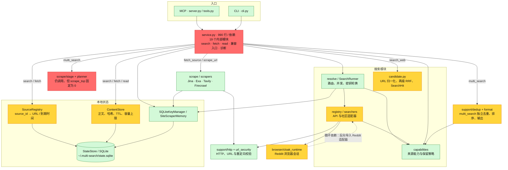

# 架构审查 · 2026-09-05

> 后续状态：本报告保留初次审查快照。第 2、3、5 项已完成修复并复测，第 4 项按用户要求延期，第 1 项待确认最终契约。详见[修复复测记录](../.scratch/architecture-audit-20260905/verification.md)。

评价：一般。单进程、MCP/CLI 共用核心、搜索与正文读取分开的方向合理；当前主要问题是契约分散和执行边界没有落实，已经造成可复现的行为错误。适合在现有结构内收敛职责，不需要引入微服务、消息队列或另一套框架。

模式：Architecture Audit。范围：当前工作区（包含已有未提交修改），61 个 Python 模块的静态导入分析，主调用链源码，全部 262 项现有 unittest，以及离线定向复现。图中实线表示调用或依赖，红色表示兼容性阻塞，黄色表示已确认问题所在路径；绿色仅表示本次未发现同等级问题。省略叶子适配器、外部 API 节点及部分辅助依赖。



Mermaid 源码：[architecture-review-2026-09-05.mmd](./architecture-review-2026-09-05.mmd)。这是当前实现，不是建议架构。旧的 `current-architecture.*` 描绘了仍可批量抓取的兼容流程，与本次工作区实现已有差异，原文件保持不动。

## 发现

### 1. [P1] 两条搜索编排并行演进，兼容入口已悄悄失效

- 位置：[service.py:559](D:/0-code-project/multi-search-skill/multi_search_mcp/src/service.py:559)、[server.py:92](D:/0-code-project/multi-search-skill/multi_search_mcp/server.py:92)、[Skill:32](D:/0-code-project/multi-search-skill/skills/multi-search/SKILL.md:32)。
- 现象：`multi_search(scrape_top=3)` 仍被接口接受，文档仍承诺批量抓取，但执行时固定 `scrape_top=0`，正文别名也被删除。定向复现得到 `stage_scrape_top=0`、`scrapes=[]`。
- 根因：`run_search_web` 与 `run_multi_search` 分别组装配置、状态、来源集合、多查询执行和错误处理；同时各有一套 URL 去重/排序规则。共享了底层 Runner，却没有共享完整的搜索执行契约。route 默认值、MCP 描述、Skill 和 service 常量之间没有统一生效关系。
- 后果：依赖旧入口的调用方得到成功响应，却拿不到明确请求的正文。现有测试把显式配置抓取数的断言也改成了 0，因此全绿无法证明向后兼容。
- 最小调整：共享搜索执行与结果标准化，把旧排序及旧输出留在兼容层。若保留兼容承诺，继续执行显式抓取请求；若决定废弃，则显式拒绝或提供版本化迁移，同时更新 MCP 描述、Skill、README。不要静默吞参数。不要在重构中顺便把旧排序换成 RRF。

### 2. [P2] 输出长度限制进入存储层，截断被误当完整正文

- 位置：[service.py:227](D:/0-code-project/multi-search-skill/multi_search_mcp/src/service.py:227)、[service.py:251](D:/0-code-project/multi-search-skill/multi_search_mcp/src/service.py:251)、[service.py:676](D:/0-code-project/multi-search-skill/multi_search_mcp/src/service.py:676)。
- 现象：上游返回 1000 字符，首次 `fetch_source(max_chars=10)` 经过 `run_scrape` 的输出裁剪后才写缓存。此后用同一 `source_id` 请求 1000 字符，命中缓存仍只有 10 字符；第一次还报告 `truncated=false`，`read_source` 认为总长度就是 10。
- 根因：`run_fetch_source` 复用了已经为公开接口格式化的 `run_scrape` 响应，把展示投影当作存储数据。ContentStore 本身有 TTL 和容量控制，这个问题发生在进入 ContentStore 之前。
- 后果：用户先看短预览，就无法再通过分页读到剩余正文；缓存哈希也只代表截断后的前缀。
- 最小调整：抓取核心返回有界原始正文及完整性信息；存储层保存该结果，公开输出最后裁剪。把“上游获取长度”“缓存对象容量”“本次返回长度”分开。上游已截断时必须保存并返回相应标记。

### 3. [P2] 同一个 content_kind 同时描述摘要与正文，造成两种内容丢失

- 位置：[twitter.py:121](D:/0-code-project/multi-search-skill/multi_search_mcp/src/search/searchers/twitter.py:121)、[service.py:397](D:/0-code-project/multi-search-skill/multi_search_mcp/src/service.py:397)、[candidate.py:140](D:/0-code-project/multi-search-skill/multi_search_mcp/src/search/candidate.py:140)。
- 现象 A：Twitter 把帖子及回复放进 `scraped_content`，类型是 `content`；缓存逻辑只接受 `body`。按真实字段结构复现后，搜索输出只剩互动计数，`body_available=false`，缓存没有帖子正文。
- 现象 B：Baidu 同一行既有 `description` 摘要又有 `scraped_content` 正文，类型是 `body`；候选输出直接排除整个 body 行的文本。复现得到空的 `content`，即使原行存在可用摘要。正文缓存成功也不能补回候选摘要。
- 根因：一个字符串枚举同时承担“行是什么”“哪个字段有什么”“能否缓存/抓取”三个职责。各 provider、候选投影、旧抓取规划器各自解释它。
- 最小调整：在适配器出口统一独立的 `snippet`、可选 `body` 及其来源/完整性；候选列表投影 snippet，正文缓存读取 body。旧字段只在兼容输出处映射。无需让普通搜索默认抓全文。

### 4. [P2] 浏览器层反向依赖业务适配器，且未执行请求预算

- 位置：[reddit_browser.py:140](D:/0-code-project/multi-search-skill/multi_search_mcp/src/search/searchers/reddit_browser.py:140)、[cloak_runtime.py:49](D:/0-code-project/multi-search-skill/multi_search_mcp/src/browser/cloak_runtime.py:49)、[cloak_runtime.py:55](D:/0-code-project/multi-search-skill/multi_search_mcp/src/browser/cloak_runtime.py:55)、[cloak_runtime.py:94](D:/0-code-project/multi-search-skill/multi_search_mcp/src/browser/cloak_runtime.py:94)。
- 现象：AST 找到 `reddit_browser → cloak_runtime → reddit_browser` 循环；后者懒加载业务 URL/拦截判断。运行时收到 `want_content=False` 仍逐帖执行 `_fetch_post`；`deadline` 从同步层进入后没有传给异步会话，等待全局锁也没有期限。
- 复现：使用假浏览器上下文，传已过期 deadline 与 `want_content=False`，仍启动一次会话并抓取一次帖子。没有打开真实浏览器或网站。
- 后果：候选查询仍支付逐页抓正文的成本，外层返回超时后，内部任务仍可能占用会话锁并拖延其他查询。懒加载避免了启动阶段导入错误，却没有消除架构环。
- 最小调整：把 Reddit 页面逻辑集中在 Reddit 模块，浏览器运行时仅管理上下文与生命周期；所有等待/页面请求沿用同一剩余时间。候选模式在拿到可用搜索卡片后结束，正文操作再读取帖子与回复。

### 5. [P2] SourceRegistry 有到期字段，却没有常规清理入口

- 位置：[source_registry.py:31](D:/0-code-project/multi-search-skill/multi_search_mcp/src/state/source_registry.py:31)、[source_registry.py:58](D:/0-code-project/multi-search-skill/multi_search_mcp/src/state/source_registry.py:58)、[source_registry.py:78](D:/0-code-project/multi-search-skill/multi_search_mcp/src/state/source_registry.py:78)、[service.py:378](D:/0-code-project/multi-search-skill/multi_search_mcp/src/service.py:378)。
- 现象：`purge_expired()` 存在但生产调用路径没有调用。只有按旧 source_id 查询时，才会删除那一行。加入已经到期的注册记录，再执行一次正常搜索，旧行仍在。
- 后果：每次搜索生成新 response_id/source_id，未被再次访问的 URL/摘要记录会持续累积。“到期不可读”并不等于“到期清除”。ContentStore 的 5 MiB 限制不约束 search_sources 表。
- 最小调整：在注册批次中执行到期清理，并为 expires_at 加索引；必要时限制注册记录数。不需要单独的缓存服务或后台调度系统。

## 架构判断与调整顺序

保留：MCP/CLI 共用业务函数、按需 fetch/read、provider 适配器、capability 元数据、SQLite 本地状态、ContentStore 的哈希去重与容量上限、URL 安全校验、有界线程池。没有证据要求换技术栈。

优先修兼容入口和缓存截断，再统一结果契约，随后处理浏览器预算与到期清理。最后沿职责整理 service：共享搜索执行、正文获取与缓存、公开响应投影。不要只把 990 行移动到多个文件，保留两份业务规则。

结构依据：service.py 直接依赖 19 个内部模块，涵盖请求、配置/密钥、查询并发、融合、持久化、格式化与诊断；这是修改传播的主要热点。registry 的 18 个内部依赖主要是组装适配器，属于组合入口的正常成本，不仅凭高 fan-out 判错。两种 URL 身份规则（candidate 保留 HTTP/HTTPS 与尾斜杠，legacy `_norm_url` 合并）需要明确兼容边界，不宜直接互换。

可测试性：新 search/fetch/read 已提供 provider、scraper、store、resolver 注入点；旧 `run_multi_search` 仍直接读取配置/密钥、创建状态和 registry，测试需要 patch 多个模块符号。统一执行核心时复用现有注入点即可。

团队边界未知，本次不推断 Conway's Law 的组织问题。所有 provider 在线可用性、真实浏览器登录态、额度及远端部署均不在本次验证范围。

## 验证

现有测试命令（262 项全部通过）：

```powershell
.\.venv\Scripts\python.exe -m unittest discover -s . -p 'test_*.py' -q
```

定向复现命令（全部使用假 provider / scraper / browser 与临时 SQLite）：

```powershell
.\.venv\Scripts\python.exe .scratch\architecture-audit-20260905\probe.py
```

结果保存在 `.scratch/architecture-audit-20260905/evidence.json`。现有测试缺少的边界是：小预览后继续读取、带正文行的摘要保留、Twitter 正文进入缓存、browser session 实际执行预算、注册表日常到期清理，以及旧接口显式抓取参数的兼容语义。

本次仅增加审查材料与离线复现脚本，未修改业务代码或已有架构图。

