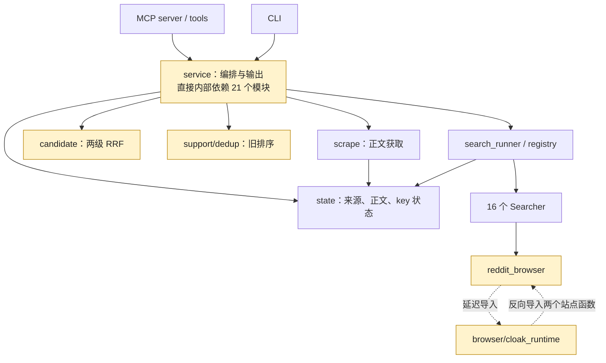

# 当前架构审查（2026-09-07）

Mode: Architecture Audit

范围：当前工作树，包含已有未提交修改；扫描 63 个 Python 模块的静态导入，重点检查 MCP/CLI、service、搜索融合、浏览器和正文缓存。未调用真实搜索 API、登录态浏览器或部署服务。brooks-audit 的三个共享参考文件缺失，因此不提供其健康评分。团队所有权信息缺失，跳过 Conway 检查。

## 模块依赖

实线表示导入依赖；循环包含函数内延迟导入，不表示已发生模块初始化失败。图中省略部分直接状态访问和公共工具依赖。

## 发现

### 1. [P1] Reddit 超时没有贯穿浏览器生命周期

- 位置：`multi_search_mcp/src/browser/cloak_runtime.py:49`、`:55`。
- 证据：`with _SESSION_LOCK` 没有截止时间；`_run_reddit_session` 接收 `deadline`，却没有传入异步会话。页面各自的 30 秒超时无法替代整次搜索的截止时间。
- 复现：传入已经过期的 deadline，并注入记录调用的 `_run`，仍得到 `session_started`。
- 后果：外层 SearchRunner 已经返回超时，排队线程仍可能随后启动浏览器；继续占用共享搜索池的工作线程。延迟多久和真实浏览器是否滞留未做在线测量。
- 最小方向：锁等待、获得锁后的启动检查、整个异步会话共用剩余时间；超时退出仍执行 context.close。测试覆盖等锁时过期、启动前过期、运行中超时与清理。

### 2. [P2] Reddit 候选模式仍逐帖抓取正文

- 位置：`multi_search_mcp/src/browser/cloak_runtime.py:91`、`:100`。
- 证据：`_reddit_session_async` 无条件对所有 links 执行 `_fetch_post`，`want_content` 未参与执行分支。正文只在 searcher 的 `shape_result` 中被省略。
- 复现：模拟一个搜索结果，传入 `want_content=False`，`_fetch_post` 仍被 await 一次。
- 后果：响应虽然短，网络和浏览器工作量并未随候选模式下降；这与候选优先、按需读正文的架构目标不一致。
- 最小方向：从搜索卡片提取 title/url/snippet，候选模式到此返回。须用同一固定页面样本确认字段可用，避免改变 title/content 语义。本次仅提出问题，没有改动 Reddit 实现。

### 3. [P2] MCP / Skill 仍承诺已被禁用的批量抓正文

- 位置：`multi_search_mcp/server.py:82`、`skills/multi-search/SKILL.md:59`、`multi_search_mcp/src/service.py:594`。
- 证据：工具描述与 Skill 要求深度研究使用 `multi_search(scrape_top=N)`；实现却无条件传 `scrape_top=0`，并从搜索输出剥离正文。
- 复现：传 `scrape_top=2`，执行诊断中的 scrape_top 为 0。预取正文还可能留下 `scrapes` 条目，其 length 为 500，但 markdown 为空。
- 后果：Agent 依照官方工具描述调用，仍拿不到承诺的正文；接受参数却忽略执行，使调用方难以区分成功和未执行。
- 最小方向：按当前已选择的候选优先契约更新 MCP/Skill 描述，明确用 fetch_source/read_source 获取正文；过渡期显式说明旧参数不再生效，避免静默行为。不要为了修文档又恢复批量抓正文。

### 4. [P2] 两个公开搜索入口维护两套排序和查询规划

- 位置：`multi_search_mcp/src/service.py:393`、`:577`、`:608`；`multi_search_mcp/src/support/dedup.py:184`。
- 证据：search_web 使用 query_plan 和两级 RRF；multi_search 直接拼接 expand，按正文有无、跨源次数、正文长度、stars 排序。
- 复现：同一源返回 A（第 1 名，无正文）、B（第 2 名，500 字正文），search_web 排 A→B，multi_search 排 B→A。
- 后果：这不只是输出格式兼容；相同查询会因工具选择而改变排序。新入口的查询去重、权重和确定性修复也不会自动覆盖旧入口。
- 最小方向：保留两个公开接口的兼容外形，逐步共用查询规划、召回与融合；旧接口只承担输出适配。排序变化属于行为变更，应有明确迁移说明及跨入口测试，不能直接改成别名。

### 5. [P2] 固定 RRF 窗口与返回 count 混在一起

- 位置：`multi_search_mcp/src/search/candidate.py:12`、`:226`、`:261`。
- 证据：源内只纳入前 15 名；跨源融合后每个查询又只保留 15 个 URL，再按用户 count 截取。
- 复现：单查询请求 count=30，模拟 Exa 确实返回 30 个不同 URL，最终只有 15 条。
- 后果：多取到的结果被静默丢弃；单查询无法返回超过 15 条，多查询也无法恢复任何查询中已被裁掉的候选。固定窗口是现有策略，不代表已证明真实检索质量下降。
- 最小方向：分清源召回量、参与融合的候选窗口、最终返回量。先明确 count 的契约，再让候选窗口至少覆盖所需返回量，或公开并校验硬上限；无需增加语义模型调用。

## 结构判断与验证边界

- 评价：一般，方向可保留。MCP/CLI 共用 Core，搜索与显式读正文分离，Searcher 有统一 registry/capabilities，正文缓存具备容量和 TTL，均有明确职责。
- 最大结构问题是新旧行为并存。service 约千行、直接内部依赖 21 个模块是热点，但拆文件本身解决不了上述行为分叉；先收敛共同执行流程。
- 静态扫描发现一个 Python 模块依赖环：reddit_browser ↔ cloak_runtime。两边都是延迟导入；这是站点职责分布的问题，当前没有证据表明会导致启动失败。后续碰到相关代码时，可把两个纯站点函数放到单向依赖的位置，不必专门启动大重构。
- search_web 支持 providers/keys/config/state_store 注入，fetch/read 有抓取器、时钟或存储替换点，离线测试可控。旧 multi_search 仍需 monkeypatch 内部构造；共用执行流程可顺带缩小测试差异，无需引入容器框架。
- 重新运行根目录 unittest：323 项通过，耗时约 14 秒；默认 SQLite 路径被替换为临时目录。另用模拟 provider、scraper/browser helpers 复现以上行为，不访问真实账号。
- 测试通过不能证明 16 个外部搜索源当前都可用，也不能证明真实召回质量或浏览器耗时。现有测试主要验证各自接口内部行为，缺少跨入口一致性、count/window 边界和浏览器截止时间约束。
- 本次仅新增审查记录，没有修改业务代码或配置。
