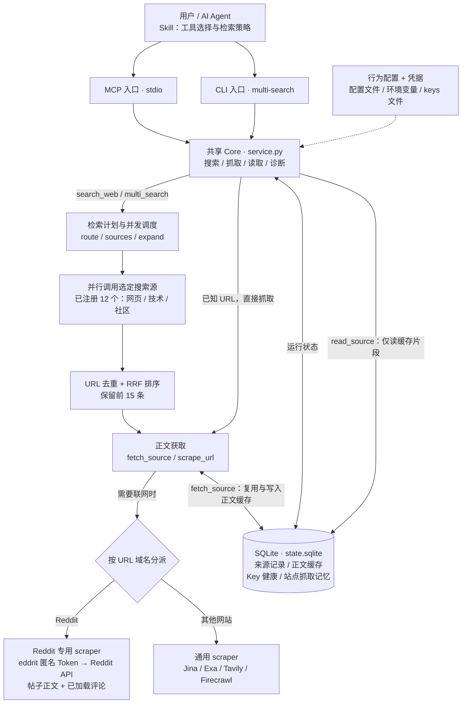

# 当前项目简易架构

按 2026-09-09 当前工作区代码核对。箭头表示主要调用或数据流；MCP 和 CLI 共用同一个 Core。

## 搜索源

| 分组 | 注册源 |
|---|---|
| 网页 | Brave、Parallel、Baidu、Tavily、Exa、SerpAPI、Firecrawl |
| 技术 | GitHub Repos、Hacker News、Stack Overflow |
| 社交与社区 | Twitter/X、V2EX |

`route` 或 `sources` 决定本次调用哪些源；`all` 包含全部 12 个搜索源。全局禁用配置仍会进一步过滤。

## 关键边界

- 搜索先排序，再为最终最多 15 条结果获取正文；可以复用已有正文或缓存，正文失败不会改变排名。结果包含摘要、正文预览及明确错误，MCP/CLI 按各自接口输出 JSON 或 Markdown。
- Reddit 仅位于正文抓取层，不是搜索源。`reddit.com` 及子域、`redd.it` 进入专用适配器；不支持的链接或请求失败明确报错。匿名 Token 保存在进程内，不写入 SQLite，也不需要账号 Cookie。
- `fetch_source` 可留存取得的正文，预览长度不截断缓存，仍受大小和保留期限约束；`read_source` 只读缓存。`scrape_url` 是直接抓取入口，不负责建立 `source_id` 正文缓存。
- URL 安全校验、超时与并发控制、凭据脱敏由共享支持模块提供。SQLite 保存运行状态，明文凭据由环境变量或 keys 文件提供。
- 辅助工具在 `scripts/` 和根目录 `test_*.py`：快照回放、查询融合评估、来源追踪验证及回归测试。查询加权是显式实验选项，默认仍使用等权融合。

## 代码入口

- [Skill](../skills/multi-search/SKILL.md)、[MCP](../multi_search_mcp/server.py)、[CLI](../multi_search_mcp/cli.py)
- [共享 Core](../multi_search_mcp/src/service.py)、[搜索源注册](../multi_search_mcp/src/search/registry.py)
- [正文域名分派](../multi_search_mcp/src/scrape/scrape.py)、[Reddit 适配器](../multi_search_mcp/src/scrape/scrapers/reddit.py)
- [SQLite 状态](../multi_search_mcp/src/state/state_store.py)
