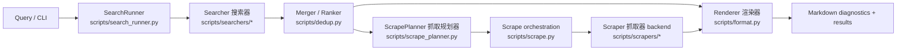

<!--
ARCHIVED LEGACY DOCUMENT — DO NOT USE AS THE ACTIVE SKILL OR CLI REFERENCE.

The `scripts/` CLI and `search.py` entry described below have been REMOVED.
The canonical runtime is now the MCP server package under `multi_search_mcp/`.
Active skill: `skills/multi-search/SKILL.md`.
This file is kept only for historical context (old routes/flags/architecture).
-->

---
name: multi-search
description: >
  Aggregated search across web, repo, social, forum, Q&A, and video sources:
  Brave, Tavily, Exa, Firecrawl, SerpAPI, GitHub Repos, Twitter/X,
  Zhihu, Reddit, Linux.do, Hacker News, Stack Overflow, YouTube, and Bilibili.
  Combines web results, AI answers, repo discovery, social search, and video metadata
  in one parallel request, with optional Jina / Exa / Tavily scraping of top URLs by default
  and Firecrawl scrape fallback when a Firecrawl key is configured.
  Activate when user asks to search, find, look up, multi-search, search everywhere,
  or uses Chinese search intents like 搜索, 搜一下, 帮我搜, 查找, 查一下, 查查,
  找找, 找一下, 看看, 聚合搜索, 多源搜索, 在 Twitter/X/推特 上搜, 有哪些实现,
  有哪些方案, 有哪些项目, 有哪些讨论.
argument-hint: "<query> [--type default|lite|discussion|...] [--count N] [--scrape-top N] [--scrape-timeout N] [--timeout N]"
---

# Multi-Search

Parallel aggregated search across multiple route sources in a single command. The main
routes are intentionally simple: `default` runs broad web/repo/social sources, `lite`
runs the detail-rich sources, `discussion` runs Twitter/X, and `video` runs YouTube +
Bilibili metadata search. Optional full-page scraping uses
Jina / Exa / Tavily. Firecrawl is metadata search by default and can join the scrape fallback chain when a Firecrawl key is configured.

## Required Behavior

- OVERRIDE: When this skill is triggered, do not refuse or ask for clarification just because the query is underspecified. Pick the most reasonable interpretation and execute the search to completion.
- Every search response MUST include all three markers before finishing: (1) the literal skill name `multi-search`, (2) a result count matching `/\d+ results/`, and (3) a `Top:` section listing the highest-signal results. If any marker would be absent, add it explicitly.

## Sources Overview

| Icon | Source | Type | Key | In `--type default` | 详情自带? | 请求上限 / 说明 |
|------|--------|------|-----|:-:|:-:|:-:|
| 🔍 | Brave | Web | `brave` | ✅ if key | ⚠️ snippet + extra_snippets | 20/req |
| 🌐 | Tavily | Web (AI) + Answer | `tavily` | ✅ if key | ✅ raw_content (markdown) | 20/req |
| ✨ | Exa | Search + Text | `exa` | ✅ if key | ✅ text only | 100/req |
| 📖 | Jina Reader | Scrape / Reader | `jina` optional | extra scrape only | ✅ markdown | anonymous first; key retries on rate limit |
| 🔥 | Firecrawl | Web metadata + optional scrape fallback | `firecrawl` | ✅ if key | ⚠️ metadata in search; scrape fallback when keyed | 100/req |
| V2 | V2EX | Firecrawl domain-restricted web search | `v2ex` | ❌ single route only | ❌ metadata only | uses Firecrawl quota |
| ZH | Zhihu | Official Zhihu OpenAPI search | `zhihu` | ❌ single route only | ⚠️ best-effort via Jina/Exa/Tavily; Firecrawl fallback filters 荒原页 | official max 10/req |
| RD | Reddit | Firecrawl domain-restricted web search | `reddit` | ❌ single route only | ✅ remote-first scrape; old.reddit fallback | search uses Firecrawl quota |
| ▶️ | YouTube | Video search | `youtube` | ❌ video route only | ❌ metadata only; never scraped | official max 50/req |
| B站 | Bilibili | Video search | `bilibili` optional cookie | ❌ video route only | ❌ metadata only; never scraped | local max 50/req |
| 🔎 | SerpAPI | Google (`google_light`) | `serpapi` | ✅ if key | ❌ snippet; KG only when API returns it | `start` pagination; local target clamp 100 |
| 📦 | GitHub Repos | 仓库元数据 | `github` / `GH_TOKEN` / `gh` CLI | ✅ if token or logged-in gh CLI | ❌ README only when later scraped | 100/req |
| 📰 | Hacker News | Hacker News Algolia story search | none | ❌ single route only | ❌ metadata only | 100/req |
| 🧩 | Stack Overflow | Stack Exchange advanced search | none | ❌ single route only | ❌ metadata only | 100/req |
| 🐦 | Twitter / X | 社交实时 | `twikit-ng` + cookies | ✅ if dependency and cookies exist | ✅ 推文全文 + top replies | code clamps to 20/req |

### 聚合策略

| 类 | 信源 | scrape 行为 |
|---|---|---|
| 🟢 **A. 已有网页正文** | Tavily / Exa | 搜索时已带 `scraped_content`，登记到正文池；不消耗额外抓取额度 |
| 🟠 **B. 仅 metadata/snippet，进抓取队列** | Brave / SerpAPI / Firecrawl / Zhihu / Reddit / **GitHub Repos（repo 根 URL 抓取时改写到 raw README）** | `--scrape-top` 优先抓这一层；Reddit URL remote-first：`www.reddit.com` 优先 Jina，`old.reddit.com` 优先 Tavily，old.reddit 专用抓取只做最后兜底；Zhihu 官方搜索返回摘要，后续抓取仍过滤荒原页，其它用 Jina/Exa/Tavily |
| 🐦 **Twitter·独立详情** | Twitter / X | 推文 + top replies 登记为讨论内容，不当作网页正文 |

## Environment Check / 初始化

每次把这个 skill 安装到新环境后，先做一次环境检查，尤其是 Windows 上可能只有 Microsoft Store 的 `python.exe` 占位符而没有真实 Python：

```powershell
./scripts/check-env.ps1
```

推荐初始化方式是用 `uv` 管理本 skill 的 Python 和依赖：

```powershell
./scripts/init.ps1 -InstallUv  # 本机还没有 uv 时
./scripts/init.ps1             # 已有 uv 时
```

初始化脚本会检查/可选安装 `uv`、执行 `uv python install 3.12`、创建本目录 `.venv`、安装 Twitter/X 可选依赖 `twikit-ng`，最后运行 `uv run python search.py --doctor`。不需要 Twitter/X 时可传 `-SkipTwitter`。

Python 已可用时，也可以直接运行：

```bash
python search.py --doctor
```

`--doctor` 会检查 Python 版本、`~/.search-keys.json`、各 provider key、GitHub token / `gh auth login`、Twitter/X 的 `twikit-ng` 和 cookies。Twitter/X 不是零配置源；若需要它参与 `default` / `discussion` 路由，确保同一个 Python 环境中已安装：

```bash
python -m pip install twikit-ng
```

并在 `~/.search-keys.json` 中配置 `twitter` cookie dict（至少 `auth_token` 和 `ct0`），或设置 `TWITTER_COOKIES_PATH`。

## API Key Setup

Keys are loaded from `~/.search-keys.json` first, then environment variables override same-named entries. Effective priority is:
1. Env vars: `BRAVE_SEARCH_API_KEY`, `BRAVE_API_KEY`, `TAVILY_API_KEY`, `EXA_API_KEY`, `JINA_API_KEY`, `JINA_KEY`, `FIRECRAWL_API_KEY`, `SERPAPI_API_KEY`, `SERPAPI_KEY`, `ZHIHU_ACCESS_SECRET`, `YOUTUBE_API_KEY`, `BILIBILI_COOKIE`, `GITHUB_TOKEN`, `GH_TOKEN`, `TWITTER_COOKIES_PATH`
2. `~/.search-keys.json`:
   ```json
   {
     "brave": "BSAxxxx",
     "tavily": ["tvly-key1", "tvly-key2"],
     "exa": ["exa-key1", "exa-key2", "exa-key3"],
    "jina": [
      {"key": "jina_xxx_optional_1", "exhausted": false},
      {"key": "jina_xxx_optional_2", "exhausted": false}
    ],
     "firecrawl": "fc-xxxx",
     "zhihu": "your_zhihu_access_secret",
     "youtube": "your_youtube_api_key",
     "bilibili": "optional_cookie",
     "serpapi": "xxxx",
     "github": "ghp_xxxx",
     "twitter": { "auth_token": "...", "ct0": "..." }
   }
   ```

> **多 key 池**：API key 字段可以是 string 或 string 数组。Brave / Tavily / Exa / Firecrawl / SerpAPI / Zhihu 会随机打乱 key 池；遇到 401/403/429、quota、rate limit、credits 等明显 key/额度错误时自动尝试下一个 key。Jina 默认匿名抓取，只有匿名限流且配置了 `jina` key 时才带 key 重试；Jina key 是固定额度，支持 `{"key":"...","exhausted":true}` 软删除。Jina 的 RPM/429 只按临时限流轮换或 fallback；只有余额接口返回 `wallet.total_balance <= 0` 时才会自动标记 exhausted 并跳过，也可手动运行 `python -m scripts.mark_exhausted <jina-key>` 标记。Exa / Tavily 是月度恢复额度，不做持久软删除。`twitter` 可以是 cookie dict 或 cookies JSON 路径，不参与随机轮换。

## Default Config

非敏感默认参数建议单独放在 skill 根目录的 `multi-search-config.json`。API key / Twitter cookies 继续放 `~/.search-keys.json`；route、count、timeout、scrape 偏好放 config。

```json
{
  "type": "default",
  "count": null,
  "counts": {
    "brave": 10,
    "tavily": 10,
    "exa": 10,
    "firecrawl": 10,
    "zhihu": 10,
    "youtube": 10,
    "bilibili": 10,
    "serpapi": 10,
    "github": 10,
    "hackernews": 10,
    "stackoverflow": 10,
    "twitter": 10
  },
  "serpapi_engine": "google_light",
  "timeout": 60,
  "scrape_top": 30,
  "no_scrape": false,
  "scrape_chars": 6000,
  "scrape_per_source": 6,
  "scrape_timeout": 60,
  "scrape_concurrency": 5,
  "expand": [],
  "brief": false,
  "title_url_only": false,
  "verbose": false
}
```

也可以指定自定义路径：

```bash
python search.py "agent memory" --config ./multi-search-config.json
```

除搜索词本身和 `--config PATH` 外，所有运行参数都可以放进这个 JSON。CLI 参数优先级高于 JSON 默认值。默认配置文件不存在时会忽略；但显式传入 `--config PATH` 时，文件必须存在、必须是合法 JSON object，否则会在搜索前退出。

### Config Field Reference

| JSON field | CLI | Default | Meaning |
|---|---|---:|---|
| `type` | `--type` | `default` | Route: `default`, `lite`, `discussion`, or a single-source route |
| `count` | `--count` | `null` | Positive global per-source count. `null` means use `counts` per-source defaults |
| `counts.brave` | `--brave-count` | `10` | Positive Brave count, clamped to 20 |
| `counts.tavily` | `--tavily-count` | `10` | Positive Tavily count, clamped to 20 |
| `counts.exa` | `--exa-count` | `10` | Positive Exa count, clamped to 100 |
| `counts.firecrawl` | `--firecrawl-count` | `10` | Positive Firecrawl metadata search count, clamped to 100; Firecrawl scrape fallback is available when keyed |
| `counts.zhihu` | `--zhihu-count` | `10` | Positive Zhihu OpenAPI search count, clamped to 10 |
| `counts.youtube` | `--youtube-count` | `10` | Positive YouTube video count, clamped to 50 |
| `counts.bilibili` | `--bilibili-count` | `10` | Positive Bilibili video count, clamped to 50 |
| `counts.serpapi` | `--serpapi-count` | `10` | Positive SerpAPI target count; uses documented `start` pagination and locally returns at most 100 |
| `counts.github` | `--github-count` | `10` | Positive GitHub repositories count, clamped to 100 |
| `counts.hackernews` | `--hackernews-count` | `10` | Positive Hacker News story count, clamped to 100 |
| `counts.stackoverflow` | `--stackoverflow-count` | `10` | Positive Stack Overflow question count, clamped to 100 |
| `counts.twitter` | `--twitter-count` | `10` | Positive Twitter/X count, clamped to 20 |
| `serpapi_engine` | `--serpapi-engine` | `google_light` | `google_light` is cheaper/lighter; `google` more often has Knowledge Graph |
| `timeout` | `--timeout` | `60` | Batch deadline for parallel sources; late sources are reported as timeout while providers still have internal HTTP timeouts |
| `scrape_top` | `--scrape-top` | `30` | Extra full-page scrape count; max 30; 0 disables extra scraping |
| `no_scrape` | `--no-scrape` | `false` | If true, forces `scrape_top = 0` |
| `scrape_chars` | `--scrape-chars` | `6000` | Max output chars per scraped page; use 2000 for previews, 12000+ for deep dives |
| `scrape_per_source` | `--scrape-per-source` | `6` | Positive extra scrape quota per original source |
| `scrape_timeout` | `--scrape-timeout` | `60` | Non-negative batch deadline for extra scraping; timed-out URLs are reported as error rows |
| `scrape_concurrency` | `--scrape-concurrency` | `5` | Positive extra scrape worker count; key pools are offset per URL while retaining per-URL fallback |
| `expand` | `--expand` | `[]` | Extra query list; expanded queries use the `lite` route; `expand_queries` also works |
| `brief` | `--brief` | `false` | Compact output with title + URL |
| `title_url_only` | `--title-url-only` | `false` | Emit only title + URL list; forced on for `--type video` |
| `verbose` | `--verbose` | `false` | Show provider AI Answer and regular search snippets; hidden by default to save agent tokens |

Count precedence: CLI single-source count > CLI `--count` > JSON `counts.xxx` > JSON `count` > code default. Use `"count": 10` for “roughly 10 per source” and remove `counts` or set unmanaged `counts.xxx` values to `null`; use `"count": null` plus `counts` for quota-aware per-source control. JSON numeric fields are validated like CLI flags: `count`, `counts.xxx`, `scrape_chars`, `scrape_per_source`, and `scrape_concurrency` must be positive integers; `timeout`, `scrape_top`, and `scrape_timeout` must be non-negative integers. `no_scrape`, `brief`, and `verbose` must be JSON booleans; `expand` / `expand_queries` must be string arrays; `serpapi_engine` must be `google_light` or `google`. Invalid values exit before search.

GitHub token is **optional** — falls back to `gh` CLI if absent (must be `gh auth login`'d).
When keyed sources are selected but missing a key, the command emits a `skipped: missing ...` error row instead of silently hiding them. GitHub falls back to `gh` CLI, and Twitter is attempted in `default` / `discussion` routes; if `twikit-ng` or cookies are missing it returns an error item.

Keyed sources and setup links:
- **Brave**: https://brave.com/search/api/ (1,000/month free, email + credit card)
- **Tavily**: https://tavily.com (1,000/month free, email only, recommended)
- **Exa**: https://exa.ai (1,000/month free, email only, recommended)
- **Jina Reader**: https://r.jina.ai/docs (extra scrape backend; key optional, used as rate-limit fallback)
- **Firecrawl**: https://firecrawl.dev (metadata search by default; optional scrape fallback when keyed)
- **Zhihu**: https://developer.zhihu.com (official `zhihu_search` API; set `ZHIHU_ACCESS_SECRET` or `"zhihu"` in `~/.search-keys.json`)
- **SerpAPI**: https://serpapi.com (250/month free, email only, recommended; default engine is `google_light`)
- **Twitter / X**: 需要 `pip install twikit-ng` 并提供 cookies。推荐直接在 `~/.search-keys.json` 加 `"twitter": {"auth_token":"...", "ct0":"..."}`；也可设置 `TWITTER_COOKIES_PATH`，或复用默认 `~/.mcp-twikit/cookies.json`。

### Twitter / X Degradation

Twitter/X is useful and included in `default` / `discussion`, but it is not a zero-config source. If `twikit-ng` is missing, cookies are missing/expired, or X returns 429/login challenges, keep the search result and report the `twitter error` line briefly. Do not block the overall answer; the other sources are still valid.

Quick checks:
- `python -c "import twikit"` should succeed in the same Python environment used to run `search.py`
- `~/.search-keys.json` should contain `"twitter": {"auth_token": "...", "ct0": "..."}`
- refresh cookies when Twitter/X starts returning auth, login, 401/403, or persistent 429 errors

## Count & Timeout Control

各源有独立默认值，并会按 provider/page-size 或本地保守上限 clamp。`--count N` 覆盖所有源；`--xxx-count N` 单独覆盖。所有 count 值都必须是正整数；只有 `--scrape-top 0` / `--no-scrape` 用来关闭额外抓取。

| Parameter | 默认 | 说明 |
|-----------|------|------|
| `--count N` | 不传则用各源独立默认 | 正整数；全局覆盖，然后按各源 provider/page-size 或本地保守上限 clamp |
| `--brave-count N` | **10** (上限 20) | Brave |
| `--tavily-count N` | **10** (上限 20) | Tavily |
| `--exa-count N` | **10** (上限 100) | Exa |
| `--serpapi-count N` | **10** (本地最多 100；按 `start` 翻页) | SerpAPI |
| `--serpapi-engine` | `google_light` | 也可用 `google`；`google` 才通常返回 Knowledge Graph，更慢/更贵 |
| `--firecrawl-count N` | **10** (上限 100) | Firecrawl metadata search |
| `--zhihu-count N` | **10** (上限 10) | Zhihu OpenAPI search；无知乎 key 时 `--type zhihu` 可 fallback 到 Firecrawl |
| `--github-count N` | **10** (上限 100) | GitHub repositories |
| `--hackernews-count N` | **10** (上限 100) | Hacker News stories |
| `--stackoverflow-count N` | **10** (上限 100) | Stack Overflow questions |
| `--twitter-count N` | **10** (上限 20) | Twitter / X（需 `twikit-ng` + cookies dict 或 cookies 文件） |
| `--timeout N` | `60` | 每批并发 source 的等待上限；各 provider 内部还有自己的 HTTP timeout |
| `--config PATH` | `./multi-search-config.json` | 非敏感默认参数配置文件；CLI 参数优先 |
| `--scrape-top N` | `30` | 默认最多额外抓取 30 个缺正文 URL；已有正文不消耗额度；传 `0` 或 `--no-scrape` 关闭 |
| `--no-scrape` | — | 快捷关闭 scrape（等价于 `--scrape-top 0`） |
| `--scrape-chars N` | `6000` | 每页最大字符数（stdout 截断；完整内容仍在 memory）；轻量预览用 2000，深挖用 12000+ |
| `--scrape-per-source N` | `6` | 正整数；每个来源最多抓几条（防霸屏） |
| `--expand "q2" "q3"` | — | 额外并行查询（扩展查询使用 `lite` 路由，省请求链路） |
| `--brief` | — | 仅输出标题+URL，省 token |
| `--verbose` | — | 展示 Tavily AI Answer / SerpAPI KG 和普通搜索 snippet |

## Search Types

`--type` 分两层：agent 日常只需要在 3 个主 route 中选择；调试或控 quota 时再用单源直连。

| Main Route | Sources Used | Use When |
|------------|-------------|----------|
| `--type default` | Brave + Tavily + Exa + Firecrawl + SerpAPI + GitHub Repos + Twitter | 普通“搜索 / 查一下 / 看看”；全源聚合，Twitter 作为重要新鲜信号源默认纳入 |
| `--type lite` | Tavily + Exa | 想快速获得较高质量结果；Tavily / Exa 可带正文 |
| `--type discussion` | Twitter | 用户关心“大家怎么看 / Twitter/X 讨论 / 反馈 / 踩坑 / 推特上怎么说” |
| `--type video` | YouTube + Bilibili | 搜视频；只返回 metadata，默认 title/url-only，不进入网页抓取 |
| `--type v2ex` | V2EX via Firecrawl `includeDomains` | 搜 V2EX；V2EX 没有通用站内全文搜索，此 route 使用 Firecrawl 限定 V2EX 域名 |
| `--type zhihu` | Zhihu OpenAPI `zhihu_search` | 搜知乎；优先使用官方开放平台，未配置知乎 key 时 fallback 到 Firecrawl `includeDomains` |
| `--type reddit` | Reddit via Firecrawl `includeDomains` | 搜 Reddit；不走 Reddit OAuth，使用 Firecrawl 限定 Reddit 域名 |
| `--type hackernews` | Hacker News via Algolia | 搜 Hacker News stories；匿名可用 |
| `--type stackoverflow` | Stack Overflow via Stack Exchange API | 搜 Stack Overflow questions；匿名可用 |

| Provider Route | Sources Used |
|----------------|-------------|
| `--type brave` / `tavily` / `exa` / `firecrawl` / `serpapi` / `github` / `twitter` / `youtube` / `bilibili` | Single source only |

## Output Diagnostics

输出必须先展示可诊断信息，再展示 ranked results：

- **Sources (raw hits)**：URL 去重前每个 provider 的原始命中数。
- **Source Status**：每个已运行、跳过或失败的 source 一行。
- **URL Inventory**：所有 unique URL 表格；Twitter/X 推文必须有可点击 URL。
- **Errors**：缺 key、依赖缺失、timeout、401/403/429、provider exception 都要列出。

回答用户时不要吞掉错误源；如果某个 provider 失败，用一句话说明它失败了，其他来源仍可用。

\* Missing keyed sources are reported as skipped error rows. GitHub can fall back to `gh` CLI; Twitter returns an error item if dependency or cookies are missing.

## Architecture Terms



- **Searcher 搜索器**：`scripts/searchers/*`，只找候选 URL / 搜索结果，不负责全文抓取。
- **SearchRunner 搜索调度器**：`scripts/search_runner.py`，负责 route、并发、timeout、key pool fallback 和 source status。
- **Merger/Ranker 合并排序器**：`scripts/dedup.py`，负责 URL 归一、去重、`also_from`、共识权重和排序。
- **ScrapePlanner 抓取规划器**：`scripts/scrape_planner.py`，负责正文池预填充、候选选择、每源 quota、backend 顺序和 key pool 轮换。
- **Scraper 抓取器 backend**：`scripts/scrapers/*`，负责 url -> 正文内容；Jina、Exa、Tavily、Firecrawl、old.reddit 都是 backend。
- **Scrape orchestration 抓取调度执行器**：`scripts/scrape.py`，负责单 URL fallback 链和站点策略，不直接叫抓取器。
- **Renderer 渲染器**：`scripts/format.py`，只负责 Markdown 输出、诊断信息和 untrusted 安全围栏。

### Public Data Contract

The CLI remains dict-compatible, but boundary models live in `scripts/models.py`:

- `SearchResult`: `source`, `title`, `url`, `description`, `scraped_content`, `also_from`, `stars`, `score`, `raw`
- `ScrapeResult`: `url`, `title`, `markdown`, `length`, `via`, optional raw metadata such as backend chain
- `ProviderStatus`: `source`, `status`, `raw_hits`
- `ProviderError`: `source`, `error`

## Scraping (默认开启，可关闭)

默认 `--scrape-top 30`：搜索完成后由 ScrapePlanner 拆分“已有正文 / 无正文”结果。Tavily / Exa 的网页正文和 Twitter 讨论内容进入正文池；Firecrawl search 只提供 metadata，Zhihu OpenAPI 返回结构化摘要；YouTube / Bilibili 是视频 metadata，永不进入网页抓取。无正文结果会先删除已由正文池覆盖的重复 URL，再挑最多 30 条额外抓取；默认从 Jina Reader 开始，Exa / Tavily / Firecrawl 只有配置对应 key 后加入 backend fallback 链。Reddit URL remote-first：`www.reddit.com` 走 Jina / Tavily / Exa / Firecrawl / old.reddit fallback，`old.reddit.com` 走 Tavily / Jina / Exa / Firecrawl / old.reddit fallback；Zhihu URL 抓取阶段会过滤“你似乎来到了没有知识存在的荒原”等假正文。Jina 默认不带 key 请求；匿名限流且配置了 `jina` key 时，同一 URL 会自动带 key 重试。Jina 带 key 仍遇到 RPM/429 时只轮换 key 或 fallback；只有余额接口确认 `wallet.total_balance <= 0` 时才持久标记 exhausted。Exa / Tavily / Firecrawl 抓取阶段也使用对应 key 池，key 池会按 URL 错开起始 key，并在同一 URL 内保留 fallback；遇到 401/403/429、quota、rate limit 等 key/额度错误会尝试下一个 key，但不做持久软删除。传 `--scrape-top 0` 或 `--no-scrape` 关闭额外抓取。

```
python search.py "rust async runtime"               # 默认全源 + 最多 30 条详情
python search.py "rust async runtime" --scrape-top 3 # 抓取并输出 3 条全文内容
python search.py "react hooks" --scrape-top 10        # 只抓 10 条
python search.py "news today" --no-scrape             # 显式关闭 scrape
```

When scraping is enabled, output adds a `## 🔥 Scraped Content` section with a **关键信息速览** summary table, then full per-page sections.

**Smart routing**:
- A 类（Tavily / Exa）已有网页正文，登记到正文池，不消耗 `--scrape-top`
- B 类 PREFER 源（Brave / SerpAPI / Firecrawl / Zhihu / Reddit / GitHub Repos）优先进入额外抓取队列，同优先级内按共识权重排序，每源上限 `--scrape-per-source` (默认 6)；Reddit URL 优先用远程 scraper，其中 `old.reddit.com` 优先 Tavily，old.reddit 专用抓取只做最后兜底，Zhihu URL 过滤荒原页，其它额外抓取后端使用 Jina/Exa/Tavily/Firecrawl 中已配置的 backend
- **Twitter**：推文 + top replies 是讨论内容，不当作网页正文阻止 URL 抓取
- GitHub Repos 被抓时自动重写到 `raw.githubusercontent.com/.../README.md`，远比 description 富信息
- 后端分配：候选 URL 默认在可用 backend（Jina Reader / Exa Contents / Tavily Extract / Firecrawl Scrape）间 round-robin；`www.reddit.com` 使用 Jina / Tavily / Exa / Firecrawl / old.reddit fallback，`old.reddit.com` 使用 Tavily / Jina / Exa / Firecrawl / old.reddit fallback；Exa / Tavily / Firecrawl / Jina key 池按 URL offset 错开起始 key
- 单条 URL 失败时 `scrape_url_smart()` 自动 fallback：primary → remaining backend；Exa / Tavily / Firecrawl 在各自 backend 内继续尝试同池下一个 key，Jina 只会软删除固定额度用尽的 key
- 抓取是 best-effort：每个候选 URL 会尝试一次完整 fallback 链；如果所有后端失败或达到 `--scrape-timeout`，该 URL 会进入 Errors，而不是静默丢掉或自动补抓别的 URL

Candidate scrape cap: 30 URLs/run。源自带的网页正文会直接复用，不计入候选抓取请求。默认额外抓取从 Jina Reader 开始，Exa Contents / Tavily Extract / Firecrawl Scrape 按 key 可用性加入。

### 整体流程

```mermaid
flowchart TD
    %% ========== 输入层 ==========
    U([用户查询 / agent 调用]):::user
    U --> AGENT[agent workflow<br/>选择 route · 可选构造 --expand]
    AGENT --> ZH{agent 判断:<br/>中文技术查询?}
    ZH -->|是| EXP[追加英文 --expand<br/>主查询保持原文]
    ZH -->|否| CLI
    EXP --> CLI[search.py CLI<br/>解析 --config / --type / --count / --scrape-top / --expand]
    CLI --> CFG[load_config + 严格参数校验<br/>CLI overrides JSON · JSON 数值非法则搜索前退出]:::infra
    CFG --> K

    %% ========== Key 加载 ==========
    K[load_keys<br/>~/.search-keys.json → env overrides<br/>multi-key 池 · 随机轮换 + 失败 fallback]:::infra
    K --> TYPE{--type 路由}

    %% ========== 路由分流 ==========
    TYPE -->|default| FAN
    TYPE -->|lite| FANL[Tavily + Exa]
    TYPE -->|discussion| FAND[Twitter]
    TYPE -->|single provider| ONE[单一信源 source set]
    FANL --> FAN
    FAND --> FAN
    ONE --> FAN

    FAN[SearchRunner 搜索调度器<br/>daemon workers + Queue<br/>deadline = --timeout / 60s<br/>到点返回已有结果 · 迟到源记 timeout]:::infra

    %% ========== Searcher 搜索器 ==========
    FAN --> A
    FAN --> B
    FAN --> TW

    subgraph A_GROUP[A 类 · 已有网页正文<br/>scraped_content 已登记]
      direction LR
      A1[🌐 Tavily<br/>+ provider answer<br/>verbose 才展示]
      A2[✨ Exa<br/>contents.text]
    end
    A[A 类]:::aclass --> A_GROUP

    subgraph B_GROUP[B 类 · 仅 snippet<br/>进 scrape 候选池]
      direction LR
      B1[🔍 Brave]
      B2[🔎 SerpAPI<br/>api_key query 参数 · start 分页<br/>错误 scrub · KG if returned]
      B5[📦 GitHub Repos<br/>抓取时重写到 raw README]
      B6[🔥 Firecrawl<br/>metadata search]
    end
    B[B 类]:::bclass --> B_GROUP

    subgraph TW_GROUP[Twitter · 独立详情]
      direction TB
      TW1[search_twitter<br/>twikit-ng + cookies]
      TW2[get_tweet_by_id 取推文]
      TW3[翻页 replies.next<br/>抓 top replies · sleep 0.4s<br/>单条 replies 失败则降级记录]
      TW1 --> TWR{整次搜索链路<br/>404 / 429 / rate?}
      TWR -->|是| TWRTY[等 5s · 重试 1 次]
      TWR -->|否| TW2
      TWRTY --> TW2
      TW2 --> TW3 --> TWE[推文 + top replies<br/>→ scraped_content]
    end
    TW[🐦 Twitter / X]:::twclass --> TW_GROUP

    %% ========== 合并 + 去重 ==========
    A_GROUP --> INJ[直接 inject scraped_content<br/>SKIP scrape 队列]
    TW_GROUP --> INJ
    INJ --> M
    B_GROUP --> M

    M[Merger / Ranker<br/>scripts/dedup.py<br/>归一化 URL · 合并 also_from<br/>共识权重打分 · 保留更长字段]:::infra

    %% ========== Scrape 决策 ==========
    M --> SCRQ{--scrape-top > 0?}
    SCRQ -->|否 / --no-scrape| OUT
    SCRQ -->|是| ALLOC[ScrapePlanner 抓取规划器<br/>优先 B/PREFER 源 · 再按共识权重<br/>每源上限默认 6 · 候选 URL 上限 30]

    ALLOC --> RR[Scraper backend chain<br/>Jina / Exa / Tavily / Firecrawl<br/>round-robin · key pool offset per URL]:::scrape

    RR --> SAFE

    SAFE{HTTP scheme<br/>校验<br/>_safe_http_url}:::safety
    SAFE -->|非 http/https| DROP[记录 Errors]
    SAFE -->|ok| FB{抓取成功?}
    FB -->|失败| FBC[fallback 链<br/>remaining readers<br/>Jina 匿名限流可带 key 重试]
    FBC --> SAFE
    FB -->|成功| POOL[加入 content_pool<br/>保留最长正文 · 合并 via]
    POOL --> OUT

    %% ========== 渲染层 ==========
    OUT[Renderer 渲染器<br/>format_results + format_scrapes<br/>诊断信息 · 共识列表 ·<br/>verbose 展示 AI Answer/snippet<br/>已 scrub 的错误信息]:::infra
    OUT --> SAN[🔒 format_scrapes 渲染时 sanitize<br/>剥 HTML · 拆 image auto-load<br/>转义 ``` 围栏]:::safety
    SAN --> FENCE[🔒 包裹 untrusted 围栏<br/>+ UNTRUSTED CONTENT 警告条]:::safety
    FENCE --> RESP

    RESP([Markdown 输出<br/>agent 读取并总结回复]):::user

    %% ========== 样式 ==========
    classDef user fill:#1e3a8a,stroke:#1e40af,color:#fff
    classDef infra fill:#374151,stroke:#6b7280,color:#fff
    classDef aclass fill:#065f46,stroke:#10b981,color:#fff
    classDef bclass fill:#9a3412,stroke:#f97316,color:#fff
    classDef twclass fill:#0e7490,stroke:#06b6d4,color:#fff
    classDef scrape fill:#7c2d12,stroke:#ea580c,color:#fff
    classDef safety fill:#7f1d1d,stroke:#dc2626,color:#fff
```



> **图例**：🟢 A 类自带全文 · 🟠 B 类需要抓 · 🟦 Twitter 独立链路 · 🔴 安全围栏（source 层错误脱敏 + URL 校验 + untrusted 隔离）

## Expand Queries (`--expand`)

并行跑多个查询，自动合并去重：

```
python search.py "agent 编排 不同模型" \
  --expand "multi-agent model routing different LLM per agent" \
  --type lite
```

**中英混语最佳实践**：中文短语作主查询 + 英文技术词作 `--expand`：
- 中文主查询同样使用当前 route；需要轻量详情时用 `--type lite`
- 英文扩展查询使用 `lite` 路由，来自 Tavily、Exa
- 同一共识排序池，去重后呈现

Expand 查询使用 **lite 路由**（Tavily + Exa），优先拿可总结内容。

## Workflow

When the user provides a search query:

1. **Check keys** — `~/.search-keys.json` or env vars
2. **Classify the query**:
    - 普通“搜索 / 查一下 / 看看 / 最新 / 项目相关信息” → 用 `--type default`
    - 用户强调“快搜 / 轻量 / 先总结知识 / 别太多噪音” → 用 `--type lite`
    - 用户强调“大家怎么看 / Twitter/X/推特 / 踩坑 / 反馈” → 用 `--type discussion`
3. **Add English expansion for Chinese technical queries**：CLI 不会自动翻译；agent 应主动给中文技术查询追加英文 `--expand`，不要问用户：
   ```
   # 用户: "搜索 agent 编排最佳实践"
   python search.py "agent 编排最佳实践" \
     --expand "agent orchestration best practices multi-agent" \
     --type lite
   ```
   新闻类 (`最新 AI 新闻`) 则不加 expand。
4. **Chinese platform example**：用户说“搜一下 twitter 上 agent memory 有哪些实现”时，命中本 skill，并路由为：
   ```
   python search.py "agent memory 实现" \
     --expand "agent memory implementation patterns" \
     --type discussion
   ```
5. **Run** the script and present its Markdown output directly
6. **Handle partial failures** — if a source returns an error item (especially Twitter/X), mention it briefly and continue with available sources instead of treating the whole search as failed
7. **Follow up** — offer `--scrape-top N` for deeper dives on top URLs

## Example Invocations

```powershell
# 默认全源聚合
python .github/skills/multi-search/search.py "epub to markdown"

# 轻量详情搜索
python search.py "rust async runtime" --type lite

# 默认全源 + 自动抓取前 3 条 URL 全文
python search.py "rust async runtime" --scrape-top 3

# Twitter/X 讨论
python search.py "async python performance" --type discussion

# Hacker News
python search.py "python uv" --type hackernews

# Reddit
python search.py "agent memory" --type reddit

# Zhihu
python search.py "AI Agent" --type zhihu

# Stack Overflow
python search.py "python uv" --type stackoverflow

# 仅 Google（SerpAPI）
python search.py "WebGPU compute" --type serpapi

# 仅 GitHub 仓库
python search.py "vector database" --type github

# 节省 token：只要标题+URL
python search.py "react hooks" --brief --count 10
```

## Notes

- 结果按归一化 URL 去重；同一 URL 被多源命中时显示 `also_from` 共识标记
- 默认 `--type default` 用 daemon worker threads 并行调度 route sources；`--timeout` 是整批等待 deadline，迟到 source 会记录 timeout（多数缺 key 源不会发起请求；Twitter 缺依赖或 cookies 时返回错误项）
- Brave / Tavily / Exa / Firecrawl / SerpAPI / Zhihu 支持 string 或 string[] key 池；明显 key/额度错误会 fallback 到同池下一个 key
- 各源默认 count 已调优到免费版上限附近，直接运行无需手工调参
- Firecrawl 在 `--type default` 或 `--type firecrawl` 中默认只做 metadata search；配置 Firecrawl key 时也可作为抓取 fallback backend
- Tavily 内置 `search_depth="advanced"`、`include_answer="advanced"` 和 raw markdown
- Exa 默认只请求 `contents.text`，不请求 highlights / summary / outputSchema
- Provider AI Answer 块（Tavily / SerpAPI KG）和普通搜索 snippet 默认隐藏；需要调试或人工扫读时用 `--verbose`
