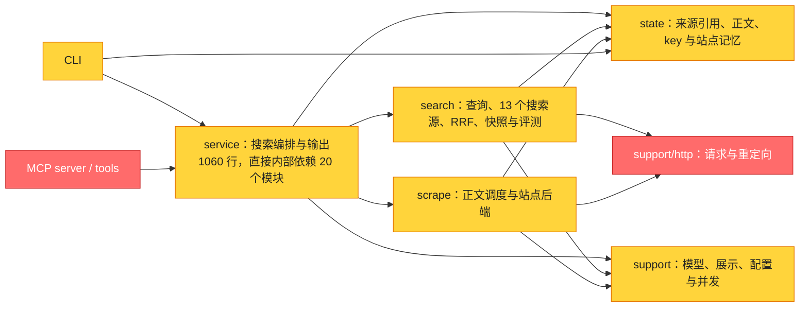

# 当前项目全面审查（2026-09-10）

> 下文保留修复前证据。后续修复和验收见 [修复记录](audit-fixes-2026-09-10.md)。

Mode: Architecture Audit / Current-tree Code Review

范围：`HEAD 4783889` 加当前未提交的 0.3.0 版本、锁文件和说明更新。扫描 61 个受版本控制的 Python 模块、9140 行业务代码；分路检查搜索、正文/状态/安全、CLI/MCP/配置及相应测试，并核对本机独立工具安装。`.scratch/` 历史实验、`build/` 生成副本和第三方库源码不算本项目业务代码。独立研究脚本仅作静态危险调用筛查，未执行登录态浏览器。

本次只审查，不修改业务代码、依赖约束、已安装工具或个人 Skill。问题复现使用模拟 HTTP/provider、合成凭据和临时 SQLite；没有向外部站点发送测试凭据。联网活动用于查询依赖漏洞公告及审计数据库。

## 模块依赖



静态导入图未发现循环依赖，包含函数内延迟导入。内部 fan-out 较高的模块依次为 service 20、registry 15、scrape 12、snapshots 10。registry 的大量依赖主要来自注册 provider，不能单凭数字判定结构错误。架构可保留；当前主要成本来自具体行为缺陷，不是目录划分。

Brooks 技能的 `common.md`、`source-coverage.md`、`decay-risks.md` 三份共享参考文件缺失，故不提供其健康评分或完整书目覆盖声明。团队所有权信息缺失，跳过 Conway 检查。用户要求审查当前整个项目，因此不把范围限定为某个历史提交之后的 diff，也不把已过时的 candidate-only 票据作为当前规范。

## 已确认的问题

共 15 项：2 项 P1、11 项 P2、2 项 P3。P1 应在下一次发布前优先解决；P2 是有具体触发条件的正确性、可靠性或性能问题；P3 是元数据和交付缺口。下方顺序按严重程度与处理价值排列。

### F01 · P1 · 普通安装可装入不兼容的 MCP 2.x

- **位置：** [pyproject.toml](../pyproject.toml) 第 7 行；[server.py](../multi_search_mcp/server.py) 第 5 行。
- **证据：** 声明为 `mcp>=1.0`，代码仍导入 `mcp.server.fastmcp.FastMCP`。项目锁定环境为 MCP 1.28.0，396 项测试通过；独立 `uv tool install` 环境实际解析到 MCP 2.2.0，该导入直接抛出 `ModuleNotFoundError`。从仓库以外目录执行已安装的 `multi-search-mcp.exe --help` 也退出 1。
- **影响：** 新用户按普通安装流程得到的 MCP 服务不能启动。已安装 CLI 可以运行，不能把此问题扩大为 CLI 不可用。项目锁文件不会自动约束 `uv tool install` 的依赖解析。
- **最小方向：** 先约束已支持的 MCP 主版本，例如保留 v1 API 并限制 `<2`，再选取经测试的 v1 修订版更新锁文件。若要迁移 v2，应单独处理全部接口变化。
- **验收：** 在全新、非 editable、未使用项目锁文件的安装环境中运行 CLI 和 MCP 注册工具/stdio 握手检查；不能只在开发虚拟环境内跑测试。

### F02 · P1 · 跨域重定向会转发凭据，并允许 HTTPS 降级到 HTTP

- **位置：** [support/http.py](../multi_search_mcp/src/support/http.py) 第 19–25 行；例如 [searchers/parallel.py](../multi_search_mcp/src/search/searchers/parallel.py) 第 32–42 行发送 `x-api-key`。
- **证据：** 安全重定向处理器只校验目标是否为公网地址，然后调用 urllib 父类。离线构造 `https://93.184.216.34/start` 到 `http://151.101.1.69/collect` 的 302，生成的新 Request 保留模拟 `Authorization` 和 `x-api-key`；完整 fake opener 两跳复现结果相同。
- **影响：** 当带凭据的后端响应跨域重定向时，凭据会被发给另一 origin；降级跳转还会转成明文 HTTP。未声称已经发生真实凭据泄漏。
- **最小方向：** 对携带凭据的请求拒绝跨 origin 跳转，拒绝 HTTPS→HTTP。若确实允许跨域跳转，应去除所有凭据类 header，并保留当前公网目标检查。
- **验收：** 模拟跨域、降级、同域重定向，检查最终 Request 的 headers，测试只使用合成凭据。

### F03 · P2 · CLI 把搜索失败展示成“没有结果”，全源失败仍 exit 0

- **位置：** [cli.py](../multi_search_mcp/cli.py) 第 114–116、229–278 行。
- **证据：** provider 返回 `missing API key` 时，真实 service 的 JSON 保留 `errors`；human 只显示 `results: none`，Markdown 只显示 `_No results_`。三种格式均退出 0，stderr 为空。主审查另用相同结构的错误 payload 复核展示路径，结果一致。
- **影响：** 人看不出搜索失败，shell/自动化也会误判成功。正常的零匹配结果必须与全部来源执行失败区分。
- **最小方向：** human/markdown 渲染 provider 失败；明确“全部活动源失败”的非零退出码，保留部分成功结果及其错误说明。
- **验收：** 覆盖无匹配、全源失败、部分成功三种状态和三种格式。退出码变化需记录给 CLI 调用方。

### F04 · P2 · 搜索池饱和时丢掉已成功完成的来源结果

- **位置：** [search_runner.py](../multi_search_mcp/src/search/search_runner.py) 第 296–328 行。
- **证据：** 先阻塞提交全部任务，再收集 Future。后面的提交耗尽 deadline 后，第 303 行直接退出收集。两次独立离线复现均让 fast 已成功、slow 占槽、后续任务提交等待到 deadline，最终连 fast 一起报 timeout。
- **影响：** 扩展查询共享全局搜索池、多客户端并发或前次慢任务仍占槽时，已取得的有效候选会丢失。
- **最小方向：** 提交与收集协同进行，至少在 deadline 分支非阻塞收集已完成结果，只将未完成/未提交任务记为超时。保留现有线程数量上限。
- **验收：** 饱和状态下分别覆盖完成成功、完成异常、正常空结果。若要求严格区分截止前后完成，需要记录完成时间。

### F05 · P2 · 扩展查询重新分配 timeout，突破搜索整批预算

- **位置：** [service.py](../multi_search_mcp/src/service.py) 第 376–380 行；[search_runner.py](../multi_search_mcp/src/search/search_runner.py) 第 249 行。规范：[README](../README.md) 第 333 行“搜索阶段整批 deadline”。
- **证据：** 扩展查询最大并发为 5，每个排队查询开始时又获得完整 timeout。主查询加 5 个变体、阻塞 provider、`timeout=1`，实际耗时 2.011 秒，第 6 个查询在 1.007 秒才开始执行。
- **影响：** 调用时限随排队批次数增长，过期后仍会发起新请求。
- **最小方向：** 搜索阶段创建唯一绝对 deadline，排队时间计入预算，过期 query 不再执行。不能仅扩大线程池掩盖问题。
- **验收：** 查询数超过 `MAX_EXPAND_CONCURRENCY` 时，总耗时仍遵守同一预算，已完成结果仍保留。

### F06 · P2 · SSL 重试重复使用原始 timeout

- **位置：** [support/http.py](../multi_search_mcp/src/support/http.py) 第 63–73 行。
- **证据：** 真实 `run_fetch_source(timeout=1, backends=["jina"], use_state=False)` 配合离线 opener：每次等待给定 timeout 后抛 `SSLEOFError`，三次尝试均获得约 1 秒，实际约 3 秒。
- **影响：** 直接 CLI/MCP fetch 没有搜索 batch 的外层截止保护；一次 60 秒请求在该场景可接近 180 秒。搜索外层即使返回，工作线程仍可能继续占槽。
- **最小方向：** 重试沿用绝对 deadline，每次只传剩余预算；响应体读取也需要计入时限。
- **验收：** 确定性模拟连续 SSL 错误和慢响应体读取，验证总时间与后台任务收尾。

### F07 · P2 · 冷却中的失败抓取后端排在未尝试后端前面

- **位置：** [site_memory.py](../multi_search_mcp/src/state/site_memory.py) 第 75–85 行；[scrape.py](../multi_search_mcp/src/scrape/scrape.py) 第 316 行使用该顺序。
- **证据：** 无历史记录的排序首项为 2，冷却中的后端首项为 1。临时数据库记录 Jina timeout、进入一小时 cooldown 后，`reorder_backends(..., ["jina", "exa"])` 仍返回 `["jina", "exa"]`。
- **影响：** 已知超时/受阻后端持续消耗前面的请求预算，后续可用后端可能没有执行机会。
- **最小方向：** 明确冷却后端低于未尝试且可用后端；人工 pinned 的语义单独定义并保持可见。
- **验收：** 冷却失败后端、无记录后端、成功后端和人工 pinned 的组合排序。

### F08 · P2 · 重复 URL 只能重复抓取，无法跨响应复用正文缓存

- **位置：** [service.py](../multi_search_mcp/src/service.py) 第 204–226、407 行；[content_store.py](../multi_search_mcp/src/state/content_store.py) 第 129 行。
- **证据：** 每次生成新的 response/source ID，缓存仅按本次 source ID 查询。同一临时库对同一 URL direct fetch 两次，再以相同 query search 两次，实际 `scraper_calls=4`、两个 direct 请求均 `cache_hit=false`，最终只有一个 content object。
- **影响：** 哈希去重只节约写入后的存储，不节约网络请求。只有继续读同一 source ID 才能命中。README 宣称此前 URL 的有效正文可复用，与当前实现不符。
- **最小方向：** 在保留响应级 source ID 的前提下，查找同 canonical URL 的有效正文并关联新 ID。不能把 source ID 改成永久 URL 身份；旧到期时间、当前来源 retention 和权限/内容差异必须继续约束复用。
- **验收：** 同 URL 的 direct/search 跨响应复用、TTL 过期重抓、禁止持久化来源不复用、不同 URL 不误复用。

### F09 · P2 · 同一 source ID 并发写会留下孤立正文

- **位置：** [content_store.py](../multi_search_mcp/src/state/content_store.py) 第 62–91 行；并发删除还涉及第 113 行起。
- **证据：** 两个 writer 的 `previous` SELECT 都发生在真正开始写事务前。Barrier 固定调度后，同 source ID 写不同正文得到 2 objects / 1 source；删除该 source 后仍为 1 object / 0 source。主审查之外另一次独立复现结果一致。
- **影响：** 孤立正文绕过按引用进行的 TTL/删除清理，挤占缓存空间。不是无限增长：5 MiB 总容量淘汰仍生效。
- **最小方向：** 在 put 的首次读取前启动写事务，将旧引用读取、替换与清理放在同一 `BEGIN IMMEDIATE` 事务中；同时检查 put/delete 竞争。不要让所有纯读取都抢写锁。
- **验收：** 确定性的双写、写/删竞争与到期清理，断言无孤立对象。

### F10 · P2 · 显式环境配置路径错误时静默恢复默认配置

- **位置：** [support/config.py](../multi_search_mcp/src/support/config.py) 第 40–45 行。
- **证据：** `MULTI_SEARCH_CONFIG` 指向不存在文件时，路径解析得到用户指定值，但 `load_config()` 返回 `{}`；只有函数参数 path 被视为 explicit。
- **影响：** 路径拼错或挂载遗漏会令禁用源、超时、查询策略等设置悄悄失效。
- **最小方向：** 环境变量指定路径同样视为显式配置，缺失时抛 `ConfigError`；仅完全未指定配置且默认文件缺失时采用内置默认值。
- **验收：** 显式参数路径、环境路径、默认路径分别覆盖存在/缺失/坏 JSON。

### F11 · P2 · doctor 把未执行的检查标成成功

- **位置：** [service.py](../multi_search_mcp/src/service.py) 第 819–831 行；[cli.py](../multi_search_mcp/cli.py) 第 80–83 行。
- **证据：** `config_loaded` 只是 `exists()`；`network_checked` 只是传入参数的 bool。使用非法 JSON 配置、`include_network=True`，实际仍返回两个 True，函数没有网络探针。
- **影响：** 排障命令给出错误的就绪判断。
- **最小方向：** 真正解析并校验配置；网络检查未实现时明确返回未检查/不支持，或移除虚假选项。若实现探针，应明确目标、失败与超时，不能把开始检查当检查通过。
- **验收：** 坏配置、网络未执行、网络失败、部分成功分别得到诚实状态。

### F12 · P2 · Twitter 回复阶段超时会丢弃已搜索到的全部推文

- **位置：** [twitter.py](../multi_search_mcp/src/search/searchers/twitter.py) 第 57–89 行。
- **证据：** 候选搜索、逐条详情、回复分页和每条固定 `sleep(0.6)` 都在同一个 `wait_for` 中。假的搜索/详情调用立即成功、两条推文、`timeout=1`，仍因固定等待在 1.012 秒后仅返回 `TimeoutError()`。
- **影响：** 回复获取失败变成整个搜索失败；social 仅此一个源，会直接没有候选。请求 20 条时，仅固定等待已占 12 秒，尚未计算真实网络时间。
- **最小方向：** 先保留已取得推文，回复作为可部分失败的增强；按所选结果和剩余时间处理，避免把详情失败传播成搜索失败。
- **验收：** 搜索成功、详情慢、回复分页失败时保留已有候选与正文，并明确逐条缺口。

### F13 · P2 · URL 去重会改变重复业务参数的顺序

- **位置：** [candidate.py](../multi_search_mcp/src/search/candidate.py) 第 50–57 行。
- **证据：** query 按 `(key, value)` 排序，使 `/read?id=1&id=2` 与 `/read?id=2&id=1` 的 canonical URL 完全相同。
- **影响：** 对取首值或末值的站点，这两个 URL 可以代表不同资源，却被 RRF、来源身份和正文关联误合并。属于具体输入边界，不是所有带参数 URL 都有问题。
- **最小方向：** 保留同名参数之间的原始次序，仅做可证明等价的归一化。
- **验收：** 重复参数有序语义、空值、追踪参数去除，以及现有安全归一化用例。

### F14 · P3 · Parallel 的发布日期在公共结果和快照中丢失

- **位置：** [searchers/parallel.py](../multi_search_mcp/src/search/searchers/parallel.py) 第 74–75 行；[candidate.py](../multi_search_mcp/src/search/candidate.py) 第 180–185 行；[snapshots.py](../multi_search_mcp/src/search/snapshots.py) 第 29 行起。
- **证据：** adapter 写入 `publish_date`，融合只读取 `published_at/published_date/date/created_at`。输入日期 `2026-09-09`，融合后的 `published_at=None`，快照白名单同样没有该字段。
- **影响：** 选读时丢失可用的时间依据，回放也不能恢复。
- **最小方向：** adapter 边界统一写公共 `published_at`，让输出和快照共用同一字段。
- **验收：** adapter → RRF → snapshot 的日期贯通检查。

### F15 · P3 · Skill 与安装使用说明没有随 0.3.0 完成交付

- **位置：** [仓库 Skill](../skills/multi-search/SKILL.md) 第 70–83 行；[README](../README.md) 第 20–31 行。本机个人文件 `C:\Users\zhiyu_liu\.agents\skills\multi-search\SKILL.md` 第 26–40 行。
- **证据：** 个人 Skill 仍说明 fast 不额外抓正文、用 scrape_top 控制数量，并列出已不存在的 cn-community/video route。仓库 Skill 有接口总述和一条全文 fetch 示例，但缺完整 CLI 安装、search/expand/source、read 指导。README 已写项目内 uv run，独立 uv tool/GitHub 安装仍只存在于对话中。
- **影响：** 工具已升级，实际 Agent 却仍可能按旧契约调用；新用户不能仅依赖项目文档完成 CLI-only 安装与使用。
- **最小方向：** 补齐单一权威的 CLI 安装/工作流说明，提供显式的个人 Skill 同步步骤；保留用户既有定制，核对版本或文件 hash 后再同步。
- **验收：** 干净终端的安装→help→search→fetch→read；让实际 Agent 按交付的 Skill 运行并记录调用轨迹。

## 已验证内容与不能据此推断的内容

| 检查 | 当前结果 | 边界 |
|---|---|---|
| 开发虚拟环境全量 unittest | 396 项通过，21.336 秒；MCP 1.28.0 / Pydantic 2.13.4 | SQLite 指向临时目录；不证明普通安装环境 |
| 独立工具环境解释器运行同一套仓库测试 | 392 项计数，2 个 error，20.941 秒；MCP 2.2.0 / Pydantic 2.13.5 | 一个测试模块导入失败，故计数低于 396；不是只有两条失败断言 |
| 已安装 MCP 入口，仓库外启动 | exit 1，FastMCP 导入失败 | 验证了 F01，未启动或更改任何 MCP 配置 |
| 离线缺陷复现 | 合成 HTTP/provider、临时 DB，多项经主审查再次复核 | 非真实 API 的吞吐/延迟基准 |
| 全部业务 Python 的 3.10 语法解析 | 61 模块通过 | 不等于完整 Python 3.10 运行时矩阵 |
| 静态导入图 | 61 模块、无循环依赖 | 未把动态插件/第三方库依赖穷举为图 |
| git diff --check | 通过 | 原有未提交工作保留 |
| npm audit --package-lock-only --ignore-scripts | 7 个依赖，已知漏洞 0 命中 | 不证明浏览器集成/E2E 或无未知漏洞 |
| pip-audit：当前 Windows/Python 适用锁依赖 | 46 个依赖，2 个已知公告命中 | 需按下节核查可达性，不能直接称本项目可利用漏洞 |
| pip-audit：独立安装环境 | 47 个第三方依赖无命中；本项目 0.3.0 不在 PyPI，跳过公共漏洞库审计 | 无漏洞命中与 MCP 兼容性是不同问题 |

全量测试使用下面的隔离方式，分别以项目 `.venv\Scripts\python.exe` 和独立工具环境 `...\uv\tools\multi-search-mcp\Scripts\python.exe` 执行；均从仓库根目录加载相同测试。实际已安装代码另外通过仓库外启动核对。

```python
import tempfile
import unittest
from pathlib import Path
from unittest.mock import patch

with tempfile.TemporaryDirectory() as temp:
    with patch(
        "multi_search_mcp.src.state.state_store.DEFAULT_STATE_PATH",
        Path(temp) / "state.sqlite",
    ):
        suite = unittest.defaultTestLoader.discover(".", pattern="test_*.py")
        result = unittest.TextTestRunner().run(suite)
        raise SystemExit(not result.wasSuccessful())
```

依赖审计使用 `uv export --locked --no-hashes --no-emit-project` 导出带环境标记的精确依赖，再执行 `pip-audit --no-deps --disable-pip`；没有修改项目依赖。最初简单展开锁文件会产生跨平台重复版本，已改用 uv 正式导出后才记录上面的有效结果。

### 依赖公告的实际适用范围

- 锁定 `mcp==1.28.0` 命中 CVE-2026-59950，修订版为 1.28.1。公告明确仅影响手动暴露的旧 WebSocket transport，stdio 不受影响；本项目当前使用 stdio，也未调用该 WebSocket transport。因此列为依赖维护项，不冒充已证实的远程漏洞。[上游公告](https://github.com/advisories/GHSA-vj7q-gjh5-988w)
- 锁定 `cryptography==49.0.0` 命中 CVE-2026-69247，修复版本为 50.0.0。问题涉及对不可信 PKCS#7 EnvelopedData 解密的可区分错误/时间侧信道；本项目第一方代码未发现受影响解密 API 的调用。可以在兼容性检查后更新锁文件，本次没有证明该攻击路径可达。[上游公告](https://github.com/advisories/GHSA-g6cj-pr64-35w5)

## 值得做的优化

1. **先减少重复请求与无效等待。** F07/F08 的冷却顺序与跨响应缓存有直接数据流依据；修复后再测冷/热请求的真实耗时、后端调用数和错误率，不能把缓存命中的 0.36 秒当网页冷抓性能。
2. **把截止时间贯穿一次请求。** F04/F05/F06 属于同一类资源与预算管理问题；用一个总预算保留部分成功，比增加并发数更有价值。搜索、正文和客户端外层超时的关系应明确可见。
3. **提高正文状态的可解释性。** `full_content` 当前保证输出全部已取得文本，不保证原网页无缺段。这不是既定契约的 bug；但 [twitter.py](../multi_search_mcp/src/search/searchers/twitter.py) 第 72 行明确把每条已取得回复裁成 200 字符，后续全文读取也无法恢复。可先传播确定知道的上游截断/未展开原因；对未知完整性保持 unknown，不引入猜测性的“完整率”。
4. **补安装与运行边界的自动检查。** 仓库未发现 CI 配置。优先加入一次干净安装的 CLI/MCP smoke、受支持 Python 版本运行检查，以及本文复现对应的边界测试；不需要为纯版本文案写测试。
5. **逐步降低 service 的修改影响面。** 当前 1060 行同时承担查询编排、抓取、公共投影、兼容展示和诊断。修复时先把公共错误/诊断投影和请求预算的职责理顺，保持共享 Core；不为减少行数单独造框架或大规模拆分。
6. **补真实 Agent 验收。** 现有单个 Hacker News/Jina/Reddit 样例和受控 fixture 不代表 13 个源全可用，也不代表引用准确率。当前版本应使用未参与调参的新问题，记录 source 选择、正文读取、引用支持程度、冷/热耗时和失败原因，再决定是否调整 query 权重。旧版留出结果不能当作今天版本的分数。

## 建议执行顺序

1. F01、F02：修安装兼容性和凭据重定向，补干净安装及安全回归。
2. F03、F04、F05、F06、F10、F11：让错误、诊断和时限符合真实行为。
3. F07、F08、F09、F12、F13、F14：改善缓存、抓取成本、并发一致性与来源信息质量。
4. F15：交付 CLI-only 指导、同步 Skill，再做真实 Agent 全链路验收与版本发布。

这次没有重新抓取所有 provider、使用登录态浏览器、改变真实 key/代理、做远端部署或对外发布。报告给出当前已证实的缺陷和验证范围，不声称穷尽所有输入或不存在未知问题。
