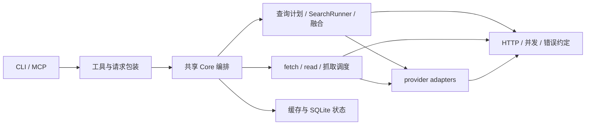

# 第二轮全仓审查：2026-09-12

审查基线：`9b4049142e5fbdbb7eb498a4e7c82a7b880d70a4`。以下保留该基线的审查发现和失败证据。8 项缺陷现已修复并合并，见[集成验收记录](audit-round2-integration-2026-09-12.md)；审查阶段只新增材料，后续实施情况以该验收记录为准。

**评价：一般。核心分层可以继续使用；主要问题在 provider 协议、错误信息传递、请求参数语义和任务生命周期。建议局部修复，不值得整体重写。**

确认 **6 个 P2、2 个 P3**；本次范围内未发现有充分证据的 P0/P1。P2 应安排修复；P3 是影响范围较窄的正确性或资源回收问题。架构建议与已确认缺陷分别列出。

## 已确认缺陷

### R2-01 · P2：Stack Overflow 未解压正常 API 响应

- 位置：[stackoverflow.py:26](../multi_search_mcp/src/search/searchers/stackoverflow.py#L26)。
- 触发：API 返回 gzip 或 deflate 压缩正文。代码直接把 `resp.read()` 的压缩字节交给 `json.loads()`，产生解码错误，整个来源返回 error。
- 证据：同一份 JSON，identity 返回 1 条结果，gzip 和 deflate 均返回 0 条并报告 `UnicodeDecodeError`。Stack Exchange 官方明确说明正常响应使用压缩，不能假设未发送 `Accept-Encoding` 就得到明文。[官方压缩协议](https://api.stackexchange.com/docs/compression)
- 影响：显式选择 `stackoverflow` 以及 `dev`、`all` 中的该来源。
- 最小方向：在该 adapter 按官方协议解码响应；复用标准库解压，不能把解码失败静默转成成功空结果。
- 验收：gzip、deflate、官方规定的缺少编码头场景；压缩损坏时显式失败。成功场景应保留相同字段与结果顺序。

### R2-02 · P2：Tavily 目标网页错误污染 API key 状态

- 位置：[scrapers/tavily.py:49–52](../multi_search_mcp/src/scrape/scrapers/tavily.py#L49)，合并错误也丢失来源语义（76–79 行）。
- 触发：Tavily `/extract` 返回 HTTP 200，但 `failed_results` 中目标页面的错误包含 `403`。
- 根因：adapter 只拼接错误字符串，没有保留 `error_origin="target"`；共享 key 分类器把目标站点拒绝访问误认成 API 凭据认证失败。
- 证据：真实 `scrape_url_smart` 调度、模拟 HTTP 与临时 SQLite；两个有效测试 key 因同一目标错误产生 4 次 HTTP 调用，全部进入 `transient_invalid`，可选 key 数变为 0。
- 影响：失败页面会暂时影响后续无关页面的 Tavily 抓取。上一轮 Exa 的目标错误修复没有覆盖这个 adapter。
- 最小方向：沿用已有的结构化目标错误标记，贯穿解析和 advanced/basic 错误合并；目标错误不轮换 key、不修改 key 健康状态。
- 验收：目标 401/403 对 key 状态中立；真正的 API 认证错误仍按原有策略轮换和计数；并发请求已记录的认证失败不能被目标错误清除。

### R2-03 · P2：成功换 key 后丢弃已有分页结果

- 位置：[search_runner.py:224–228](../multi_search_mcp/src/search/search_runner.py#L224)。
- 触发：key A 第一页返回有效候选，第二页配额耗尽；换到 key B 后请求成功，但结果为空或不完整。
- 根因：已收集的 `partial_rows` 仅在部分错误分支合并，成功分支直接 `return results`。
- 证据：真实 SerpAPI adapter → registry → SearchRunner，共 3 次模拟 HTTP；key A 已取得 10 条候选，最终输出却是 `status="ok", raw_hits=0`。
- 影响：多 key 与分页组合下静默丢结果；成功但更少的重试结果同样可能覆盖已有候选。
- 最小方向：将已取得的候选纳入最终结果；沿用候选去重边界，并保留 provider 原始排名，避免重复页给同一来源额外加权。
- 验收：部分成功后分别接空成功、重叠成功、完整成功及再次失败；已经获得的有效候选均不消失，排名与来源计数不膨胀。

### R2-04 · P2：Tavily 配额错误分类依赖 HTTP reason 短语

- 位置：[searchers/tavily.py:43–44](../multi_search_mcp/src/search/searchers/tavily.py#L43)、[scrapers/tavily.py:80–81](../multi_search_mcp/src/scrape/scrapers/tavily.py#L80)。
- 触发：Tavily 返回 HTTP 432 或 433，错误信息在 JSON body 中，HTTP reason 没有可供字符串分类器识别的配额关键词。
- 根因：通用异常分支只保留 `str(HTTPError)`，丢弃响应正文，也未按 HTTP code 产生配额类型。
- 证据：reason 为空的 search/extract × 432/433 四种情况全部复现；第一次错误后停止，第二个可用 key 未尝试，原 key 仍为 `active`、`quota_error_count=0`。若 reason 带其他关键词，现有字符串分类会走不同分支，因此不能推断所有真实 432/433 都不轮换。官方分别将这两个状态码定义为 key/plan limit 与 PayGo limit。[Tavily Search](https://docs.tavily.com/documentation/api-reference/endpoint/search)、[Tavily Extract](https://docs.tavily.com/documentation/api-reference/endpoint/extract)
- 最小方向：由 Tavily adapter 按 code 和结构化响应显式分类，再交给现有 key 状态与轮换机制。错误正文须经过既有脱敏处理。
- 验收：432/433 不依赖 reason 短语也能更新正确状态，并遵循已配置 key pool 的现有轮换策略；普通 400 不误轮换。

### R2-05 · P2：带网络探测的 doctor 仍阻塞 MCP 事件循环

- 位置：[server.py:174–177](../multi_search_mcp/server.py#L174)，网络操作在 [service.py:883–900](../multi_search_mcp/src/service.py#L883)。
- 触发：调用 MCP `doctor(include_network=True)`，同时调用轻量工具。
- 根因：`doctor` 仍注册为同步函数，直接执行同步 HTTP 探测；未进入其他昂贵工具已使用的有界异步分发路径。
- 证据：真实 `FastMCP.call_tool` 调用，两个模拟 HTTP 各耗时 0.2 秒；原定 0.02 秒后执行的 `list_sources` 到约 0.431 秒才完成，两次 HTTP 都运行在事件循环线程。
- 影响：诊断网络变慢时，同一 MCP 进程中的其他请求被一并延迟。
- 最小方向：复用现有异步调度设施；无需另建线程池。
- 验收：探测尚未完成时 `list_sources` 能完成；探测代码运行在线程池；取消、超时和结果结构保持约定。现有并发测试只枚举四个昂贵工具，漏了这个入口。

### R2-06 · P2：显式 `expand=[]` 无法覆盖全局扩展配置

- 位置：[tools.py:60](../multi_search_mcp/tools.py#L60)、[service.py:339–344](../multi_search_mcp/src/service.py#L339)；兼容工具包装层有相同转换。
- 触发：配置中存在 `expand`，调用方显式传空数组，意图只搜索主查询。
- 根因：包装层将 `None` 和 `[]` 合并；Core 又用 `or` 把显式空值当成“未提供”。
- 证据：`search_web_tool("primary", expand=[])`，配置为 `["configured extra"]`，最终实际执行两个查询。README 第 329 行约定 MCP tool 参数优先于配置。
- 影响：用户不能按请求关闭已配置扩展，产生额外 provider 调用并改变融合结果。
- 最小方向：请求类型与包装层保留 `None`/`[]` 区别，只在未提供时读取配置；请求解析集中完成一次。
- 验收：遗漏参数继承配置、空数组禁用扩展、非空数组覆盖配置；覆盖 `search_web` 和兼容 `multi_search` 入口。

### R2-07 · P3：空闲 worker 长期保留上一任务的对象

- 位置：[concurrency.py:110–120](../multi_search_mcp/src/support/concurrency.py#L110)。
- 触发：任务完成后 worker 空闲，调用方也已释放 Future 和任务输入。
- 根因：worker 局部变量 `future/fn/args/kwargs` 等仍引用上一任务，下一轮阻塞在 `queue.get()` 时尚未清理。
- 证据：一个 10 MB 测试对象在任务完成、调用方删除引用并运行 GC 后仍存活；该 worker 执行下一次空任务后才释放。独立审查还通过真实 `run_search_web` 与抓取池复现同样生命周期。
- 影响：长驻 MCP 在流量停止后仍可能保留正文、返回值和闭包对象。属于有界数量的对象滞留，不是无限增长泄漏；抓取池最多 30 个 worker。
- 最小方向：任务执行放进独立函数栈，或在每轮 `finally` 清理任务引用，同时保持异常、取消和 slot 释放语义。
- 验收：成功与失败任务完成后，输入、闭包和结果在调用方释放引用后可被 GC 回收，不依赖下一次请求。

### R2-08 · P3：站点身份解析导致独立 host 共享状态

- 位置：[site_memory.py:30](../multi_search_mcp/src/state/site_memory.py#L30)、[site_memory.py:40](../multi_search_mcp/src/state/site_memory.py#L40)。
- 触发：IPv6 URL，或 `evilzhihu.com` 这类仅字符串后缀相同的独立 host。
- 根因：`netloc.split(":")[0]` 截断 IPv6；`endswith("zhihu.com")` 没有域名边界。
- 证据：`2001:4860:4860::8888` 与 `2001:4860:4860::8844` 均得到 `[2001`；`evilzhihu.com` 与 `www.zhihu.com` 均得到 `zhihu.com`。对前者记录 jina 超时，会把后者的后端顺序由 `[jina, exa]` 改为 `[exa, jina]`。
- 影响：自动冷却、成功偏好与人工 pin/reset 的站点作用域错误。
- 最小方向：使用 `parsed.hostname`；知乎判断使用精确 host 或 `.zhihu.com` 子域边界。
- 验收：IPv6、端口、userinfo、真正子域和伪后缀域名；保留既有 GitHub 路径分组规则。历史错误聚合数据不能可靠反推原 host，修复时应明确重置相关错误键的策略。

## 架构与代码质量判断

审查覆盖 CLI/MCP、共享 Core、查询计划与融合、provider 注册与适配、抓取链、缓存与 SQLite 状态、线程池、配置、打包与 CI。AST 静态检查覆盖 59 个第一方 Python 模块，包含相对导入和函数内导入，未发现模块级导入循环；动态导入不在该结论范围内。



这是职责概图；候选、正文缓存和离线评测快照仍是不同数据，不应合并为一种存储。

| 方面 | 判断与依据 | 最小改进方向 |
| --- | --- | --- |
| 分层与依赖 | CLI/MCP 共用 Core，provider 是叶子适配层，未发现循环依赖；现有规模不需要拆成独立服务 | 保留当前边界与注入接口；修复明确的跨层信息丢失 |
| 编排复杂度 | `service.py` 1089 行、依赖 21 个第一方模块；`_run_search_candidates` 206 行，兼顾配置、并发、融合和结果整理 | 后续修改相关逻辑时，将诊断或请求解析按独立职责抽出；不为缩短文件移动代码 |
| 错误模型 | 现有 `error_origin`、`KeyOutcome` 可复用，但 adapter 仍把结构化错误压成字符串；R2-02/04 是实际后果 | 先统一受影响 adapter 的来源、HTTP code、配额语义，保持现有外部错误格式与脱敏 |
| 请求模型 | 包装层与 Core 重复解释空值、默认值；R2-06 说明信息在进入 Core 前已丢失 | 保留未提供/显式空值的区别，在一个解析步骤确定最终请求 |
| 并发与生命周期 | 有界池方向合理，未完成工作数量受限；入口覆盖和任务完成后的引用清理不完整 | 复用已有池，补 doctor 分发与引用释放，无需重写调度器 |
| 状态与存储 | 本次没有确认新的缓存原子性、容量控制或 key 原子计数缺陷；站点分组有确定错误 | 修复 host identity；另行明确 `scrape_attempts` 明细保留时间/条数，聚合统计可独立保留 |
| 测试质量 | 538 项测试通过，但 8 组失败探针仍成立；缺口集中在真实协议形态和跨组件组合 | 补压缩字节、HTTPError body/code、分页后轮换、事件循环、对象生命周期测试，不以增加数量为目标 |
| 安全与敏感信息 | URL 拒绝策略与脱敏已有共享实现；未证实新增 SSRF、凭据泄露或授权绕过 | 保持错误正文脱敏；状态明细中的完整 URL 留存规则作为后续设计问题明确 |
| 打包与 CI | 配置有非 editable 安装、仓库外 CLI/MCP smoke、Windows/Linux × Python 3.10/3.14 测试矩阵 | 未发现本轮阻塞问题；本次未远程核查矩阵执行结果，不把配置存在视为已通过 |
| 文档与接口 | 现有候选/正文/短期 source_id 约定清楚；空 expand 行为违背参数优先级约定 | 修代码恢复约定；避免用文档改写掩盖兼容性问题 |

`service.py` 大、依赖多本身不是 bug。值得降低的是：一个新 provider 错误类型需要跨多个分支猜测字符串，一种参数同时在多层决定默认值。这两类重复决策已经造成实际回归。

`scrape_attempts` 明细目前追加完整 URL，仅人工 reset 清理。尚未做长期磁盘增长测量，也没有明确的保留协议违例，因此只列为生命周期建议，不升级为缺陷。

## 验证与证据边界

本轮分三个独立只读方向审查，再由主线程复现并校准严重程度。探针使用真实 adapter、调度与状态实现，仅替换网络响应、凭据和状态位置；全局禁止探针访问真实 `urllib` 网络。

```powershell
.\.venv\Scripts\python.exe -B -X utf8 .scratch/audit-round2-20260912/reproduce_findings.py
.\.venv\Scripts\python.exe -B -X utf8 scripts/run_tests.py
```

- [复现脚本](../.scratch/audit-round2-20260912/reproduce_findings.py)：8 组断言全部确认当前缺陷存在。这些是历史失败探针，不能当作修复后的正确性测试。
- [结果数据](../.scratch/audit-round2-20260912/results.json)：包含 HTTP 次数、key 状态、候选数量、线程与对象回收结果。两个文件保存在本地忽略目录，未纳入版本控制。
- [静态依赖检查](../.scratch/audit-round2-20260912/architecture.json)：模块数量、导入循环与 Core 规模的当前快照，同样仅保存在本地。
- 当前完整回归：**538 tests，27.105 秒，OK**。
- Python 3.13 本地环境；未调用真实 provider、未用真实密钥、未做生产负载或实时搜索质量评估。本轮官方资料只用于核对 Stack Exchange 压缩与 Tavily 状态码协议。
- 没有修改、提交或推送修复；上述 8 项仍存在于审查基线中。

修复顺序建议：先 R2-01/02/03/04 的协议与结果正确性，再 R2-05/06 的入口行为，最后 R2-07/08。Tavily 两项共用文件，执行时应由同一负责人合并处理；其他独立项可以并行，主线程验证 key 状态、重试结果与入口组合。
