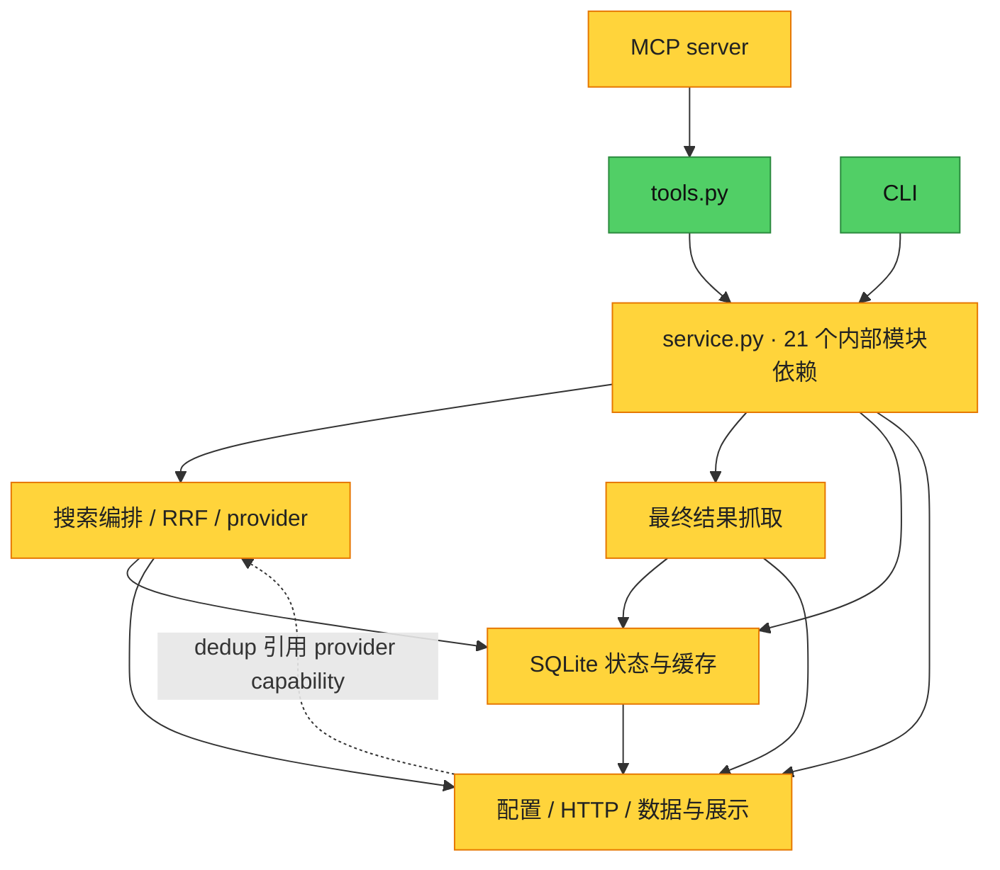

# 全仓审查 · 2026-09-12

审查基准：`19323b0`（0.4.0），开始时工作区干净。覆盖共享 Core、CLI/MCP、搜索适配器、抓取、SQLite 状态、配置、测试、安装配置与当前架构文档。与 9 月 10 日报告及修复记录交叉核对，以下不重复已经修复的问题。

评价：**一般。架构方向合理，但模块边界仍有真实缺陷；值得局部修正，不需要整体重构。** 本次确认 6 项 P2、2 项 P3；P2 表示应安排修复的功能/可靠性问题，P3 表示影响较窄的正确性问题。以下均为当前代码的离线复现，不是线上事故记录。

## 确定发现

### F01 · P2 · 目标网页的 403 会误停用整个 Exa key 池

- **位置：** [scrapers/exa.py](../multi_search_mcp/src/scrape/scrapers/exa.py) 第 34–45 行；[scrape.py](../multi_search_mcp/src/scrape/scrape.py) 第 115–128 行；[key_state.py](../multi_search_mcp/src/state/key_state.py) 第 269–272 行。
- **触发：** Exa `/contents` 本身返回 HTTP 200，但某个 URL 的 `statuses[].error` 为 `SOURCE_NOT_AVAILABLE`、`httpStatusCode=403`。仓库 [Exa 接口文档](exa/contents-api-guide-for-coding-agents.md) 第 212–221 行将它定义为逐 URL 抓取错误。
- **根因与影响：** adapter 将结构化错误压成字符串；轮换策略和 key 状态机看到字符串中的 `403` 就当成凭据失效。一次网页访问失败会依次尝试并冷却全部 key。搜索与抓取共享这些状态，之后 Exa 搜索也没有可用 key，冷却持续 15 分钟。
- **复现：** 临时 SQLite、两把模拟 key、模拟 Exa 响应，实际得到 `calls=2`、`usable=0`、两条状态均为 `transient_invalid`，`last_error_type=invalid`。
- **最小修改：** adapter 保留错误来源和类别；目标抓取失败不触发凭据轮换或凭据失效状态。不要通过删掉错误字符串中的 `403` 修补。
- **验收：** 目标 URL 的 403 只请求一次、key 仍可用；Exa API 自身的认证失败仍正确记录和轮换。

### F02 · P2 · 慢 MCP 工具调用阻塞服务事件循环

- **位置：** [server.py](../multi_search_mcp/server.py) 第 33–62 行；同类同步注册还包括 `fetch_source`、`multi_search`、`scrape_url`。
- **触发：** 在同一个 MCP 服务中，一次搜索尚未结束时调用另一个工具。
- **根因与影响：** 注册函数为同步 `def`，本地锁定环境的 MCP 1.30.0 在异步调用链内直接执行它，未自动转移至线程。Core 虽然并行请求 provider，等待这些任务的入口仍阻塞事件循环，其他请求及取消消息的处理会被延迟。
- **复现：** 通过真实 `mcp.call_tool` 调度，把搜索 Core 替换为耗时 0.3 秒的同步函数；另一个协程计划 0.02 秒后调用 `list_sources`。实测 `search_start=0.001s`、`search_end=0.301s`、`list_sources_end=0.301s`。
- **最小修改：** 将耗时工具入口改为异步，在可控线程执行资源中调用同步 Core，保留工具 schema 和返回协议。异步转交本身不等于取消底层工作，仍需保留现有 Core deadline。
- **验收：** 慢搜索进行期间，`list_sources` 等轻量调用可以及时完成；验证取消消息可被及时接收，并单独说明底层任务的终止边界。

### F03 · P2 · GitHub 多 key 配置被拼成一个非法 Authorization

- **位置：** [registry.py](../multi_search_mcp/src/search/registry.py) 第 113–117 行；[github.py](../multi_search_mcp/src/search/searchers/github.py) 第 35 行。
- **触发：** keys 文件配置 `{"github":["fixture-one","fixture-two"]}`。
- **根因与影响：** `load_keys` 正常保留数组，但 GitHub 可选认证路径没有进入统一 key pool，而是把 `cfg.keys.get("github")` 整体交给只接受单个 token 的 adapter。即使数组内每把 token 都有效，该请求也无法正常认证，同时绕过了统一的 key 轮换和健康状态。
- **复现：** 临时 JSON 经真实 `load_keys(..., environ={})`、registry 和 SearchRunner，模拟 HTTP 捕获到单次请求头：`Bearer ['fixture-one', 'fixture-two']`。
- **最小修改：** 分开表达“没配置 key 时是否允许运行”和“已配置 key 时如何执行”。有 key 时复用统一 key manager；无 token 时保留既有 `gh` 使用方式。
- **验收：** 单值/数组都只发送一把 token；第一把失败时按分类尝试下一把；禁用或冷却 key 被跳过；无 token 的既有路径保持。

### F04 · P2 · gh 重试在请求超时后仍启动新进程

- **位置：** [github.py](../multi_search_mcp/src/search/searchers/github.py) 第 12–19 行。
- **触发：** 没配置 GitHub token，使用 `gh api`；子进程连续返回含 `EOF` 的错误。
- **根因与影响：** 每次重试复用完整 `timeout`，没有接收或检查请求的绝对 deadline。SearchRunner 可以按时返回超时，但后台 worker 仍启动后续请求并继续占用全局搜索池。
- **复现：** Runner 预算 0.12 秒，模拟每次子进程执行 0.08 秒后返回 EOF。Runner 在 0.128 秒返回；三次进程启动于 0.000、0.081、0.162 秒，每次仍收到约 0.12 秒 timeout。第三次发生在调用方返回之后。
- **最小修改：** 将同一绝对 deadline 传到 `_run_gh`，每次启动前计算剩余时间，预算耗尽后不启动新进程。
- **验收：** 重试的 timeout 逐次减少；deadline 后没有新的 `subprocess.run`；正常 EOF 重试及进程超时结果仍可见。

### F05 · P2 · 并发 key 失败计数丢更新

- **位置：** [key_state.py](../multi_search_mcp/src/state/key_state.py) 第 188–191 行，后续第 207–220 行写入。
- **触发：** 并发扩展查询或抓取使用同一 key，同时记录认证失败。
- **根因与影响：** `_invalid_strikes()` 在一个连接中读取，随后在另一个连接中写回计算出的固定值；多个线程会覆盖彼此的累加结果。实际失败次数与停用策略不一致。
- **复现：** 用 Barrier 固定三个线程都先读旧值，再记录 HTTP 401。最终 `failure_count=3`，但 `invalid_strikes=1`、`status=transient_invalid`，没有按三次连续失败的规则变为 `invalid`。
- **最小修改：** 使用单条 SQL 原子递增并计算状态，或用 `BEGIN IMMEDIATE` 把读取和状态写入包在同一事务里。
- **验收：** 并发三次失败正确累加；串行失败、成功重置，以及并发成功/失败时的状态转换也有明确规则。

### F06 · P2 · 显式坏配置被静默忽略，doctor 仍报告正常

- **位置：** [resolve.py](../multi_search_mcp/src/search/resolve.py) 第 160–170 行；`counts` 的同类问题在第 89 行。
- **根因与影响：** `_int_or_default` 吞掉数值转换异常；非对象的 `counts` 被替换为空配置。配置拼错后，实际预算、并发或召回数恢复默认，但诊断称配置正常。9 月 10 日修复了缺失路径和部分配置诊断，这个语义校验缺口仍在。
- **复现：** 分别输入 `{"timeout":"typo"}`、`{"scrape_timeout":[]}`、`{"scrape_concurrency":"oops"}`、`{"counts":"bad"}`，实际恢复默认值；`doctor` 全部返回 `config_status=ok`，没有 `config_error`。
- **最小修改：** 缺失字段才采用默认值；显式错误类型和值应抛出带字段名的配置错误。请求执行和 `doctor` 共用同一套校验。
- **验收：** 上述输入在实际请求中被拒绝、在 doctor 中标错；未配置字段仍使用原有默认值。

### F07 · P3 · Unicode 大小写转换造成 read_source 原文偏移错误

- **位置：** [service.py](../multi_search_mcp/src/service.py) 第 149–155 行。
- **触发：** 关键词之前存在小写转换后长度改变的字符，例如 `İ`。
- **根因与影响：** 在 `body.lower()` 中查找，却把所得下标用于原始 `body` 切片，导致 `match_offset` 和正文片段错位。
- **复现：** 原文为 `İ target evidence`，查询 `keyword=target, limit=6`。原文目标位置应为 2，实际返回 `start=3`、`content="arget "`。
- **最小修改：** 在原文上做忽略大小写的匹配并使用原文 match span，或维护明确的下标映射。需保留关键词按字面值匹配的行为。
- **验收：** 非 ASCII 文本的匹配位置、切片及继续读取偏移保持一致，包含正则特殊字符的关键词仍按字面查询。

### F08 · P3 · 相同输入的正文选择随 use_state 改变

- **位置：** [service.py](../multi_search_mcp/src/service.py) 第 477–479 行和第 614–622 行。
- **触发：** 同一 URL 在多个查询或 provider 中返回不同但等长的正文，缓存初始为空。
- **根因与影响：** 候选阶段写缓存时按 `(-长度, provider, 正文)` 取最小值；后续抓取阶段重新收集时按 `(长度, 正文)` 取最大值。同一份输入，仅开启状态缓存就改变正文，状态开关不再只是影响持久化。
- **复现：** 同一个模拟 Twitter URL 在两个 query 返回等长的 `Alpha` 和 `Omega`。`use_state=false` 返回 `Omega`；全新临时 DB 下 `use_state=true` 返回 `Alpha`，两者均无错误。
- **最小修改：** 原始结果只选择一次正文，把同一个选择结果用于响应和可选持久化。保留已有最长正文优先策略，统一平局规则。
- **验收：** 同一组输入在有/无状态、空缓存/预取缓存下选择一致；验证同 provider 跨 query 和跨 provider 两种平局。

## 架构与结构判断

静态 AST 检查覆盖 `multi_search_mcp/` 下 60 个 Python 模块，共 9,523 行，包含局部 import，**没有发现模块级循环导入**。当前生产主流程是两个公共搜索入口共享 RRF 和最终正文获取；CLI/MCP 共享 Core 的方向应保留。



图按职责聚合，不是每个 Python 文件一节点。包级 `search → support → search` 的回边不等于 Python 模块循环；它说明 `support/dedup.py` 包含领域策略。快照采集还在 `search/snapshots.py:93` 局部调用 service，属于开发/采集路径，图中未作为生产请求边绘制。

**优先收敛两个真实的数据边界。** F01/F03/F05 指向认证、错误分类和状态转换的责任不一致；adapter 最清楚失败来自目标网页还是 provider 凭据，应该在这里形成明确类别，key manager 负责执行状态转换。F08 则证明正文选择存在两个所有者。修正这两处比批量把所有 dict 改为类、增加抽象层更有价值。

**清理已退出生产主流程的旧抓取路径。** `service.py:21` 仍导入 `_run_scrape_stage`，但当前生产入口不调用它；`scrape/stage.py:127` 的旧阶段和 `scrape_planner.py:114` 的旧规划器主要由测试调用。与之配套的旧抓取数量参数、旧去重/正文回写规则仍在，增加了理解成本，也容易把修复加到无效路径上。先核对公开承诺，再删除无生产调用的内部代码及专属测试；公共兼容入口继续作为共享流程的展示包装。`support/dedup.py` 中的 `rank_results` 仍被格式化调用，不能整文件删除。

**service 的问题是职责重复，不只是 1,130 行。** 它同时承担查询计划、候选注册、正文选择、缓存、预览、兼容展示和诊断。先移走没有生产调用的旧辅助函数，消除两份正文选择；只有修改影响仍明显时，再把诊断/展示职责独立出去。当前可注入 provider、scraper、keys、state、resolver 的边界已经支持有效离线测试，应保留。

**“当前架构”图已过时。** `docs/current-architecture.mmd` 仍描绘候选搜索、按需正文、独立 `multi_search` 重型路径；实际 `service.py:691–707` 已让 `multi_search` 调用 `run_search_web`。应同步当前架构图及其派生文件；历史审查文件可以保留原日期语境。不要让过期图继续充当实现导航。

团队所有权信息不足，未判断 Conway's Law 问题。

## 测试、质量与验证范围

| 检查 | 本次结果 | 可以证明的范围 |
|---|---|---|
| 全量回归 | **475 项通过，23.133 秒** | 本地 Windows / Python 3.13.13 / MCP 1.30.0，临时 SQLite |
| 静态导入图 | 60 模块，无模块循环 | 第一方 Python import，包括局部 import；不包括第三方内部图 |
| F01–F08 离线复现 | 全部得到上述错误行为 | 模拟网络/进程和输入，验证实际代码路径；并非真实 API 性能基准 |
| CI 配置检查 | 已有 Windows/Linux × Python 3.10/3.14，非 editable 安装、stdio smoke 和回归 | 本轮未查询远端 Actions 执行结果，也未重跑四种环境 |
| `git diff --check` | 审查前后通过 | 本次仅新增报告，业务代码未修改 |

全量测试命令：

```powershell
.\.venv\Scripts\python.exe scripts/run_tests.py
```

状态/抓取的复现脚本保存在本地忽略目录，可重复运行；脚本只使用模拟网络和临时 DB：

```powershell
.\.venv\Scripts\python.exe .scratch/review-state-scrape-20260912-offline.py
```

现有测试数量和覆盖面已经可观，新增测试应集中在**跨模块边界**：MCP 同时调用、目标错误与认证错误、可选认证的多 key、子进程重试预算、并发状态转换、显式坏配置、Unicode 原文偏移、状态开关下的正文一致性。仅继续增加单个 helper 的成功用例，难以捕获这些问题。

本轮没有进行真实全 provider 验收、最新依赖漏洞扫描、生产压测或完整支持平台复测。因此没有声称所有上游可用、依赖没有漏洞或不存在其他缺陷。没有修改真实 key、个人配置、代理或运行状态，也没有提交、发布代码。

建议顺序：先 F01/F02，避免局部失败影响整个 provider 或 MCP 服务；再修 F03–F06 的认证、预算、事务和配置；最后合并正文选择、修复原文偏移、删除旧内部路径并更新当前架构文档。
